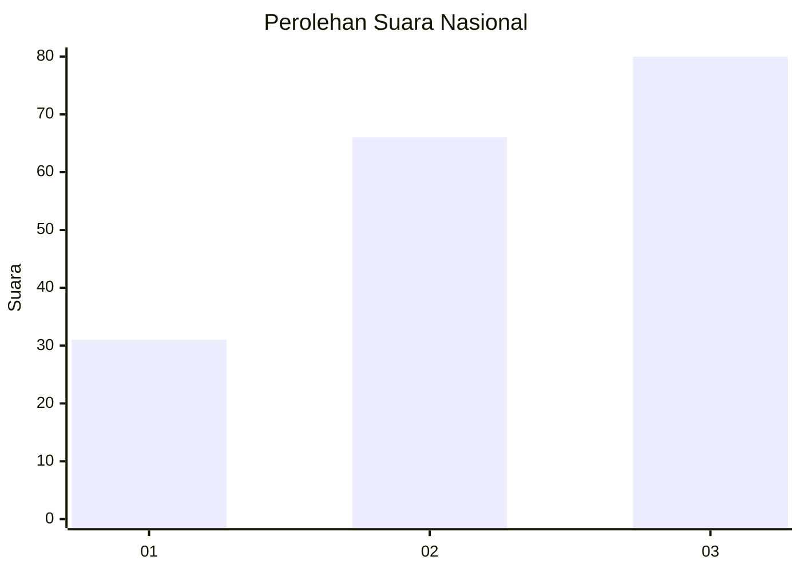
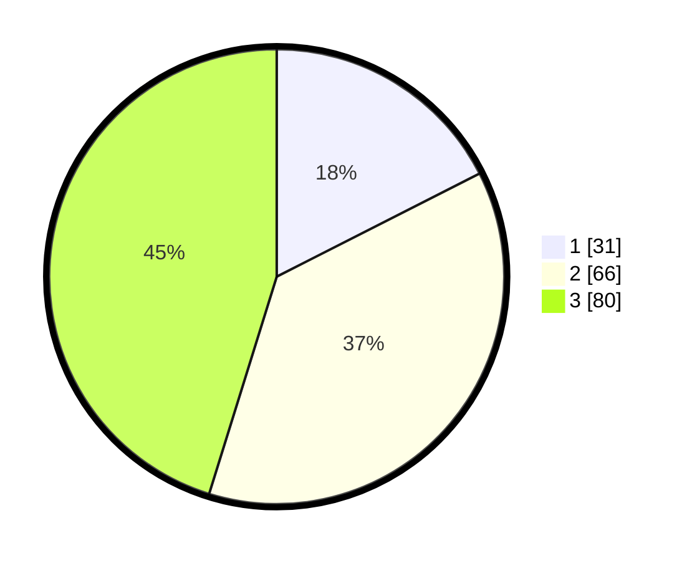

# Hasil

## Grafik

## Tabel

| No. | Nama Paslon    | Suara | Suara (raw) | Persentase |
|:--- |:-------------- | -----:| -----------:| ----------:|
| 1   | ANIES MUHAIMIN | 31    | [31][p-1]   | 17,51      |
| 2   | PRABOWO GIBRAN | 66    | [66][p-2]   | 37,29      |
| 3   | GANJAR MAHFUD  | 80    | [80][p-3]   | 45,20      |

[p-1]: https://github.com/gigit-pemilu/pemilu-2024/blob/main/pilpres/hitung-suara/sub/34-di-yogyakarta/sub/02-bantul/sub/15-sewon/sub/2001-pendowoharjo/sub/018-tps/sub/paslon-1.txt
[p-2]: https://github.com/gigit-pemilu/pemilu-2024/blob/main/pilpres/hitung-suara/sub/34-di-yogyakarta/sub/02-bantul/sub/15-sewon/sub/2001-pendowoharjo/sub/018-tps/sub/paslon-2.txt
[p-3]: https://github.com/gigit-pemilu/pemilu-2024/blob/main/pilpres/hitung-suara/sub/34-di-yogyakarta/sub/02-bantul/sub/15-sewon/sub/2001-pendowoharjo/sub/018-tps/sub/paslon-3.txt

## Foto C Plano

https://sirekap-obj-formc.kpu.go.id/8076/pemilu/ppwp/34/02/15/20/01/3402152001018-20240214-223946--efc4dd62-405f-4e3b-82f1-3cac598cb010.jpg

https://sirekap-obj-formc.kpu.go.id/8076/pemilu/ppwp/34/02/15/20/01/3402152001018-20240214-224038--e51fb4d1-f5b8-41bb-bf00-aaec4826b236.jpg

https://sirekap-obj-formc.kpu.go.id/8076/pemilu/ppwp/34/02/15/20/01/3402152001018-20240214-224125--190c8790-0280-489e-86b6-0aa30d8c70bb.jpg

## Metadata

| Key        | Value               |
| ---------- | ------------------- |
| Time Stamp | 2024-02-24 22:31:28 |

