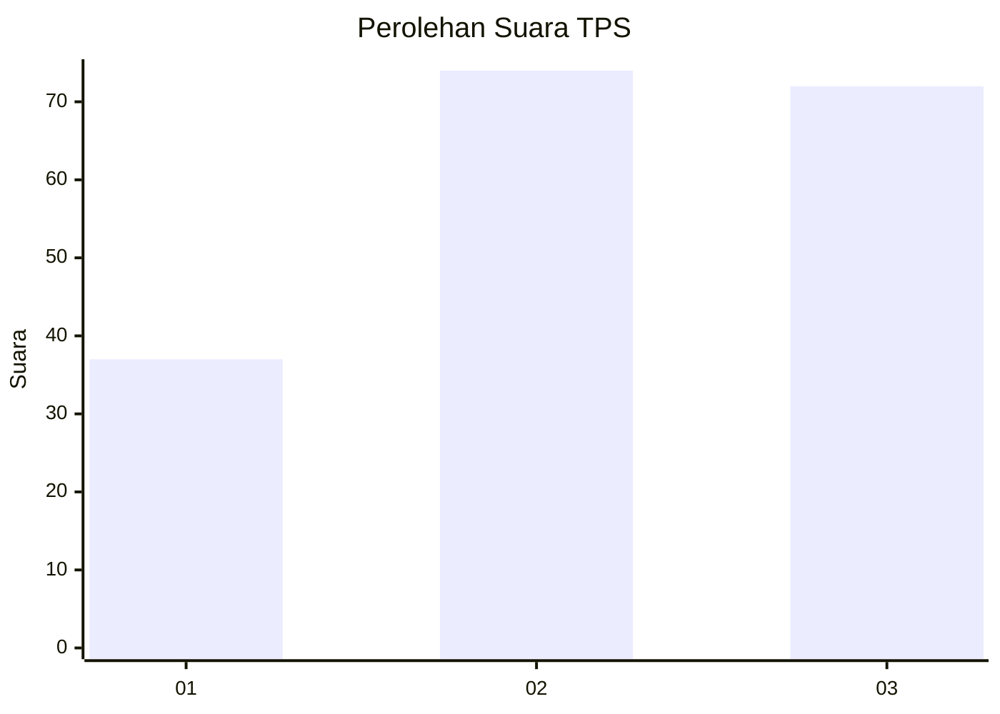
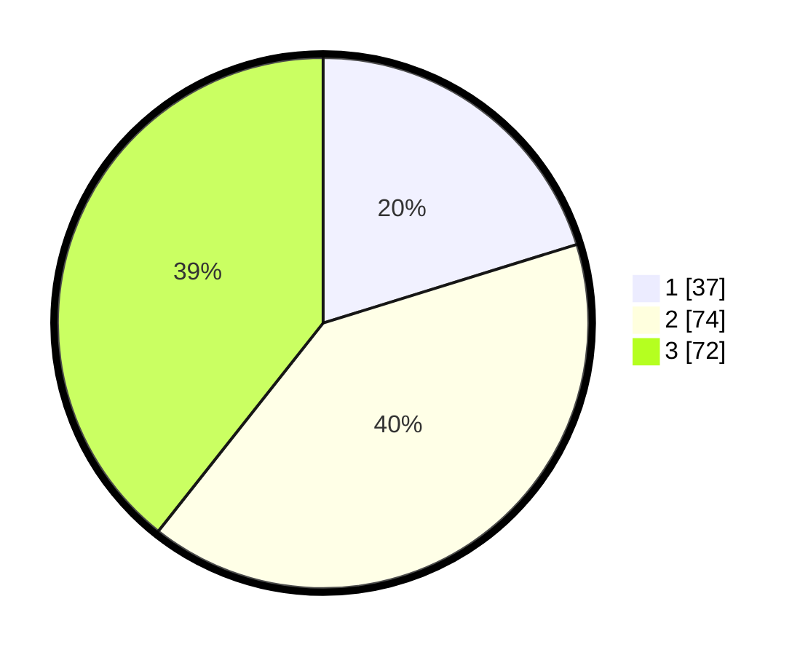

# Hasil

## Grafik

## Tabel

| No. | Nama Paslon    | Suara | Suara (raw) | Persentase |
|:--- |:-------------- | -----:| -----------:| ----------:|
| 1   | ANIES MUHAIMIN | 37    | [37][p-1]   | 20,22      |
| 2   | PRABOWO GIBRAN | 74    | [74][p-2]   | 40,44      |
| 3   | GANJAR MAHFUD  | 72    | [72][p-3]   | 39,34      |

[p-1]: https://github.com/gigit-pemilu/pemilu-2024-34-di-yogyakarta/blob/main/pilpres/hitung-suara/sub/34-di-yogyakarta/sub/02-bantul/sub/15-sewon/sub/2001-pendowoharjo/sub/019-tps/sub/paslon-1.txt
[p-2]: https://github.com/gigit-pemilu/pemilu-2024-34-di-yogyakarta/blob/main/pilpres/hitung-suara/sub/34-di-yogyakarta/sub/02-bantul/sub/15-sewon/sub/2001-pendowoharjo/sub/019-tps/sub/paslon-2.txt
[p-3]: https://github.com/gigit-pemilu/pemilu-2024-34-di-yogyakarta/blob/main/pilpres/hitung-suara/sub/34-di-yogyakarta/sub/02-bantul/sub/15-sewon/sub/2001-pendowoharjo/sub/019-tps/sub/paslon-3.txt

## Foto C Plano

https://sirekap-obj-formc.kpu.go.id/7c36/pemilu/ppwp/34/02/15/20/01/3402152001019-20240214-222317--7481c626-d8b3-4963-ab8b-7fc08d524e04.jpg

https://sirekap-obj-formc.kpu.go.id/7c36/pemilu/ppwp/34/02/15/20/01/3402152001019-20240214-203121--76a4c5de-580d-449f-80aa-45396b3d6b98.jpg

https://sirekap-obj-formc.kpu.go.id/7c36/pemilu/ppwp/34/02/15/20/01/3402152001019-20240214-203126--42685e1e-1562-4a67-bc42-7f2c85a6178e.jpg

## Metadata

| Key        | Value               |
| ---------- | ------------------- |
| Time Stamp | 2024-02-15 00:41:44 |

