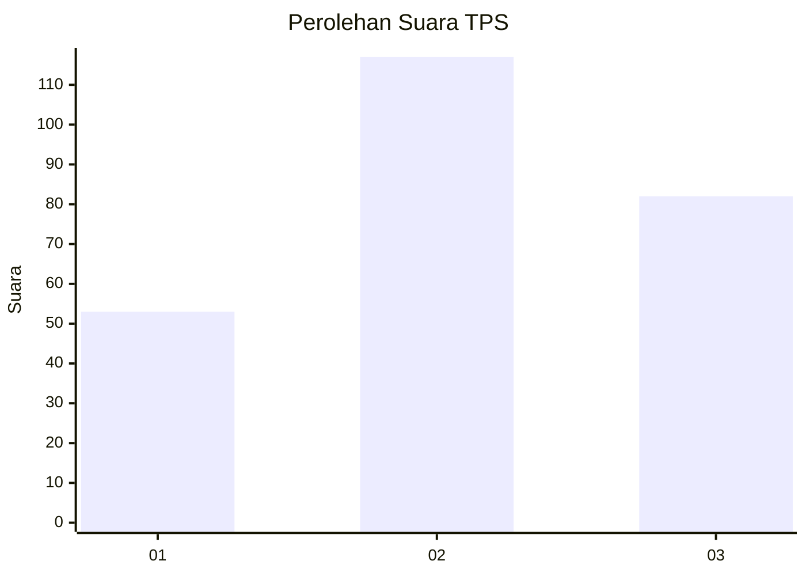
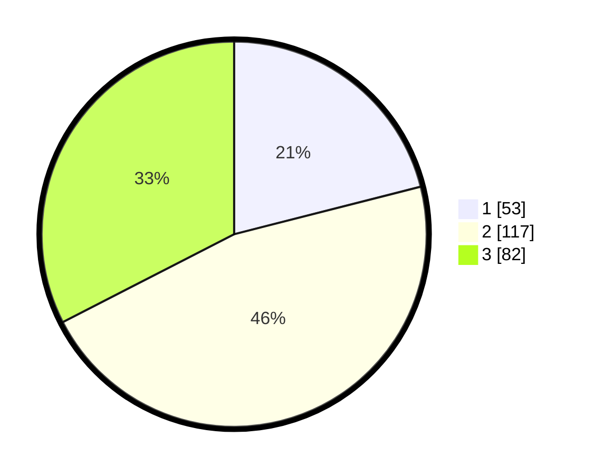

# Hasil

## Grafik

## Tabel

| No. | Nama Paslon    | Suara | Suara (raw) | Persentase |
|:--- |:-------------- | -----:| -----------:| ----------:|
| 1   | ANIES MUHAIMIN | 53    | [53][p-1]   | 21,03      |
| 2   | PRABOWO GIBRAN | 117   | [117][p-2]  | 46,43      |
| 3   | GANJAR MAHFUD  | 82    | [82][p-3]   | 32,54      |

[p-1]: https://github.com/gigit-pemilu/pemilu-2024-34-di-yogyakarta/blob/main/pilpres/hitung-suara/sub/34-di-yogyakarta/sub/02-bantul/sub/15-sewon/sub/2001-pendowoharjo/sub/020-tps/sub/paslon-1.txt
[p-2]: https://github.com/gigit-pemilu/pemilu-2024-34-di-yogyakarta/blob/main/pilpres/hitung-suara/sub/34-di-yogyakarta/sub/02-bantul/sub/15-sewon/sub/2001-pendowoharjo/sub/020-tps/sub/paslon-2.txt
[p-3]: https://github.com/gigit-pemilu/pemilu-2024-34-di-yogyakarta/blob/main/pilpres/hitung-suara/sub/34-di-yogyakarta/sub/02-bantul/sub/15-sewon/sub/2001-pendowoharjo/sub/020-tps/sub/paslon-3.txt

## Foto C Plano

https://sirekap-obj-formc.kpu.go.id/b2e1/pemilu/ppwp/34/02/15/20/01/3402152001020-20240215-012133--5ab3ede1-e262-4934-ab7c-cbd3f0c0677f.jpg

https://sirekap-obj-formc.kpu.go.id/b2e1/pemilu/ppwp/34/02/15/20/01/3402152001020-20240215-011926--d1e2f570-f775-4b5e-9051-6902a7a65bc0.jpg

https://sirekap-obj-formc.kpu.go.id/b2e1/pemilu/ppwp/34/02/15/20/01/3402152001020-20240215-011833--e78bd13d-60ba-473c-90f1-2773a282304f.jpg

## Metadata

| Key        | Value               |
| ---------- | ------------------- |
| Time Stamp | 2024-02-26 12:00:00 |

