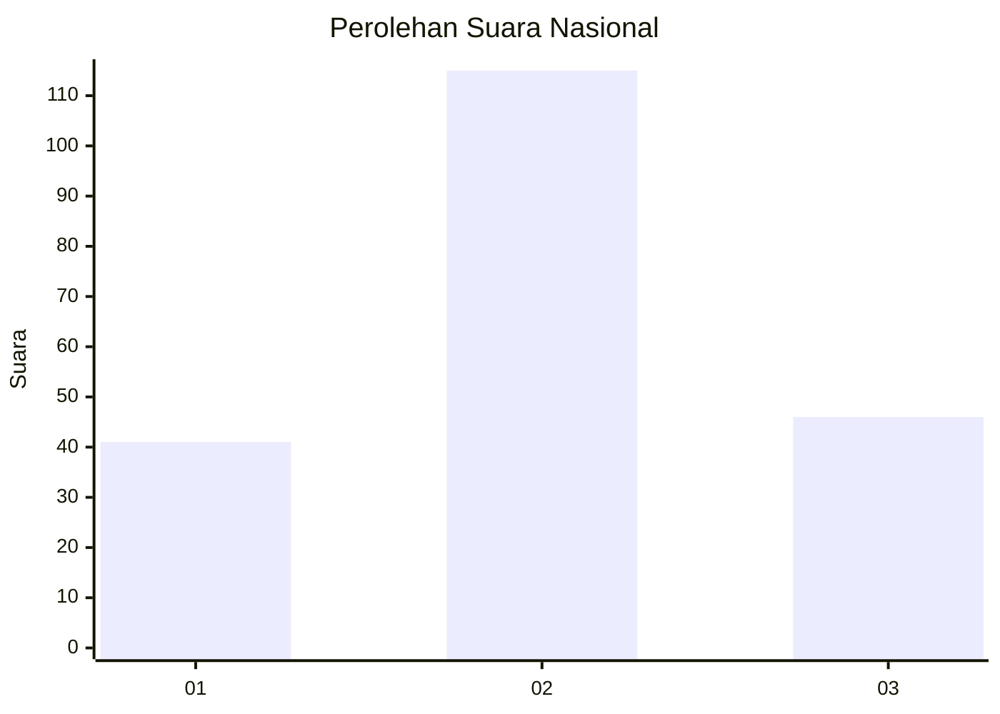
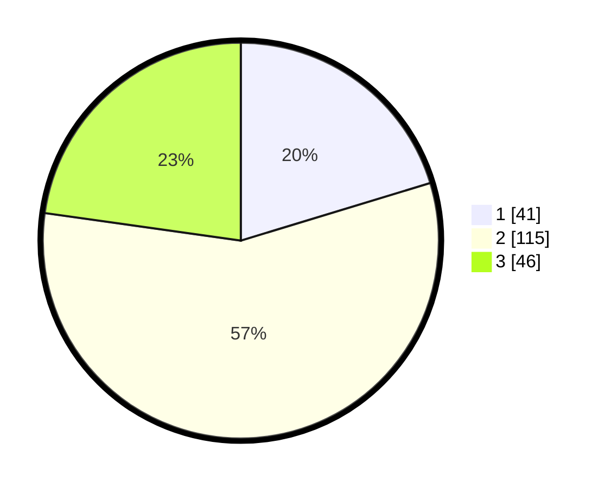

# Hasil

## Grafik

## Tabel

| No. | Nama Paslon    | Suara | Suara (raw) | Persentase |
|:--- |:-------------- | -----:| -----------:| ----------:|
| 1   | ANIES MUHAIMIN | 41    | [41][p-1]   | 20,30      |
| 2   | PRABOWO GIBRAN | 115   | [115][p-2]  | 56,93      |
| 3   | GANJAR MAHFUD  | 46    | [46][p-3]   | 22,77      |

[p-1]: https://github.com/gigit-pemilu/pemilu-2024/blob/main/pilpres/hitung-suara/sub/34-di-yogyakarta/sub/02-bantul/sub/15-sewon/sub/2001-pendowoharjo/sub/023-tps/sub/paslon-1.txt
[p-2]: https://github.com/gigit-pemilu/pemilu-2024/blob/main/pilpres/hitung-suara/sub/34-di-yogyakarta/sub/02-bantul/sub/15-sewon/sub/2001-pendowoharjo/sub/023-tps/sub/paslon-2.txt
[p-3]: https://github.com/gigit-pemilu/pemilu-2024/blob/main/pilpres/hitung-suara/sub/34-di-yogyakarta/sub/02-bantul/sub/15-sewon/sub/2001-pendowoharjo/sub/023-tps/sub/paslon-3.txt

## Foto C Plano

https://sirekap-obj-formc.kpu.go.id/c13f/pemilu/ppwp/34/02/15/20/01/3402152001023-20240214-230633--ebece5bb-9b81-491e-9406-67a54d579448.jpg

https://sirekap-obj-formc.kpu.go.id/c13f/pemilu/ppwp/34/02/15/20/01/3402152001023-20240214-230738--398082c7-7afe-4146-a4e4-a028e489c904.jpg

https://sirekap-obj-formc.kpu.go.id/c13f/pemilu/ppwp/34/02/15/20/01/3402152001023-20240214-230955--12dabd20-bac0-4d6b-930a-71649ddab6a9.jpg

## Metadata

| Key        | Value               |
| ---------- | ------------------- |
| Time Stamp | 2024-02-15 15:00:29 |

