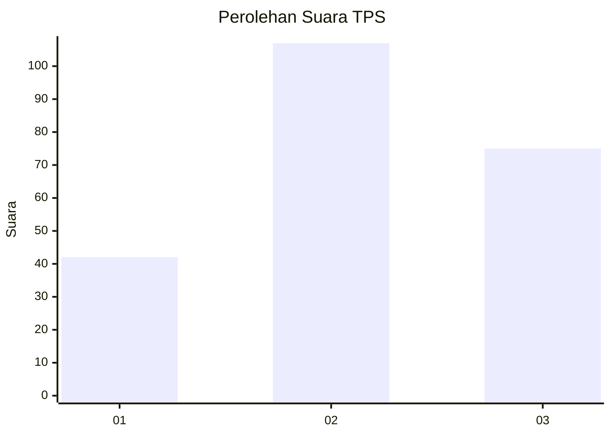
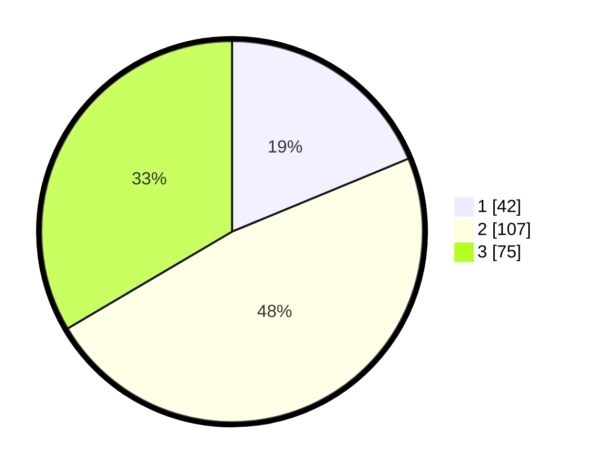

# Hasil

## Grafik

## Tabel

| No. | Nama Paslon    | Suara | Suara (raw) | Persentase |
|:--- |:-------------- | -----:| -----------:| ----------:|
| 1   | ANIES MUHAIMIN | 42    | [42][p-1]   | 18,75      |
| 2   | PRABOWO GIBRAN | 107   | [107][p-2]  | 47,77      |
| 3   | GANJAR MAHFUD  | 75    | [75][p-3]   | 33,48      |

[p-1]: https://github.com/gigit-pemilu/pemilu-2024-34-di-yogyakarta/blob/main/pilpres/hitung-suara/sub/34-di-yogyakarta/sub/02-bantul/sub/15-sewon/sub/2001-pendowoharjo/sub/024-tps/sub/paslon-1.txt
[p-2]: https://github.com/gigit-pemilu/pemilu-2024-34-di-yogyakarta/blob/main/pilpres/hitung-suara/sub/34-di-yogyakarta/sub/02-bantul/sub/15-sewon/sub/2001-pendowoharjo/sub/024-tps/sub/paslon-2.txt
[p-3]: https://github.com/gigit-pemilu/pemilu-2024-34-di-yogyakarta/blob/main/pilpres/hitung-suara/sub/34-di-yogyakarta/sub/02-bantul/sub/15-sewon/sub/2001-pendowoharjo/sub/024-tps/sub/paslon-3.txt

## Foto C Plano

https://sirekap-obj-formc.kpu.go.id/e921/pemilu/ppwp/34/02/15/20/01/3402152001024-20240214-234300--ec313f2f-8690-42ed-a0ad-bcbdb36a83aa.jpg

https://sirekap-obj-formc.kpu.go.id/e921/pemilu/ppwp/34/02/15/20/01/3402152001024-20240214-234533--a1e416fb-e97e-4e32-ade1-f568352a0a71.jpg

https://sirekap-obj-formc.kpu.go.id/e921/pemilu/ppwp/34/02/15/20/01/3402152001024-20240214-234901--06f4f209-48d9-4185-9724-308fc8e2a278.jpg

## Metadata

| Key        | Value               |
| ---------- | ------------------- |
| Time Stamp | 2024-02-24 22:31:28 |

