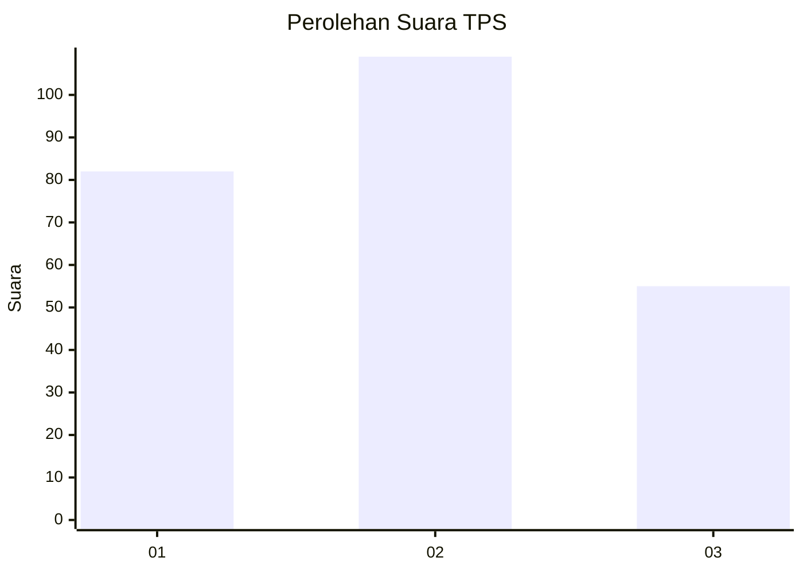
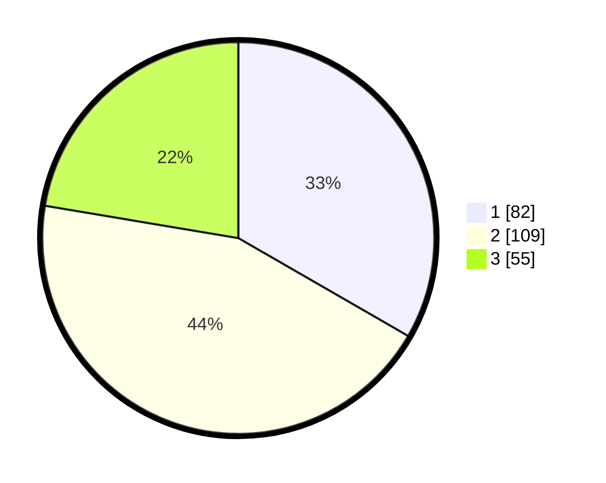

# Hasil

## Grafik

## Tabel

| No. | Nama Paslon    | Suara | Suara (raw) | Persentase |
|:--- |:-------------- | -----:| -----------:| ----------:|
| 1   | ANIES MUHAIMIN | 82    | [82][p-1]   | 33,33      |
| 2   | PRABOWO GIBRAN | 109   | [109][p-2]  | 44,31      |
| 3   | GANJAR MAHFUD  | 55    | [55][p-3]   | 22,36      |

[p-1]: https://github.com/gigit-pemilu/pemilu-2024-34-di-yogyakarta/blob/main/pilpres/hitung-suara/sub/34-di-yogyakarta/sub/02-bantul/sub/15-sewon/sub/2001-pendowoharjo/sub/028-tps/sub/paslon-1.txt
[p-2]: https://github.com/gigit-pemilu/pemilu-2024-34-di-yogyakarta/blob/main/pilpres/hitung-suara/sub/34-di-yogyakarta/sub/02-bantul/sub/15-sewon/sub/2001-pendowoharjo/sub/028-tps/sub/paslon-2.txt
[p-3]: https://github.com/gigit-pemilu/pemilu-2024-34-di-yogyakarta/blob/main/pilpres/hitung-suara/sub/34-di-yogyakarta/sub/02-bantul/sub/15-sewon/sub/2001-pendowoharjo/sub/028-tps/sub/paslon-3.txt

## Foto C Plano

https://sirekap-obj-formc.kpu.go.id/66f1/pemilu/ppwp/34/02/15/20/01/3402152001028-20240215-010029--94513e91-3bec-45dc-aaa7-ddcbcebfbe0f.jpg

https://sirekap-obj-formc.kpu.go.id/66f1/pemilu/ppwp/34/02/15/20/01/3402152001028-20240215-005125--f7232413-05e1-41c4-a120-ffa1954724f0.jpg

https://sirekap-obj-formc.kpu.go.id/66f1/pemilu/ppwp/34/02/15/20/01/3402152001028-20240215-005411--1ad9fac9-0bf5-4657-aa36-e01ddd47eb25.jpg

## Metadata

| Key        | Value               |
| ---------- | ------------------- |
| Time Stamp | 2024-02-25 11:00:00 |

