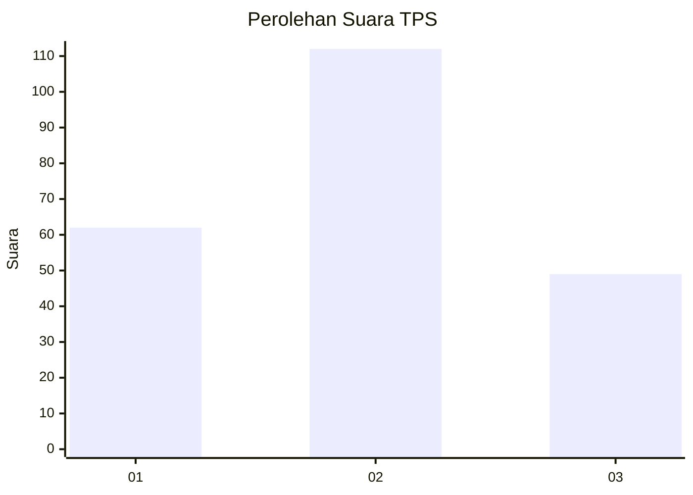
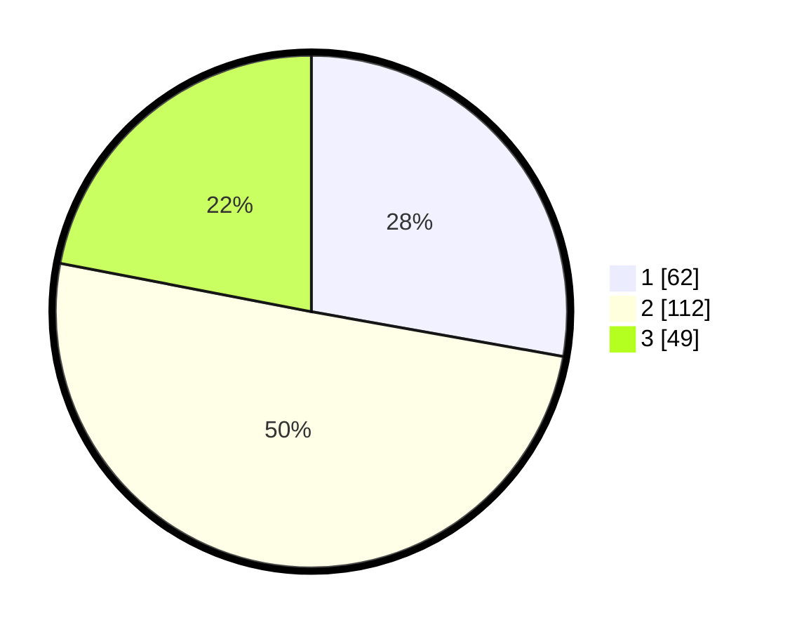

# Hasil

## Grafik

## Tabel

| No. | Nama Paslon    | Suara | Suara (raw) | Persentase |
|:--- |:-------------- | -----:| -----------:| ----------:|
| 1   | ANIES MUHAIMIN | 62    | [62][p-1]   | 27,80      |
| 2   | PRABOWO GIBRAN | 112   | [112][p-2]  | 50,22      |
| 3   | GANJAR MAHFUD  | 49    | [49][p-3]   | 21,97      |

[p-1]: https://github.com/gigit-pemilu/pemilu-2024-34-di-yogyakarta/blob/main/pilpres/hitung-suara/sub/34-di-yogyakarta/sub/02-bantul/sub/15-sewon/sub/2001-pendowoharjo/sub/029-tps/sub/paslon-1.txt
[p-2]: https://github.com/gigit-pemilu/pemilu-2024-34-di-yogyakarta/blob/main/pilpres/hitung-suara/sub/34-di-yogyakarta/sub/02-bantul/sub/15-sewon/sub/2001-pendowoharjo/sub/029-tps/sub/paslon-2.txt
[p-3]: https://github.com/gigit-pemilu/pemilu-2024-34-di-yogyakarta/blob/main/pilpres/hitung-suara/sub/34-di-yogyakarta/sub/02-bantul/sub/15-sewon/sub/2001-pendowoharjo/sub/029-tps/sub/paslon-3.txt

## Foto C Plano

https://sirekap-obj-formc.kpu.go.id/699c/pemilu/ppwp/34/02/15/20/01/3402152001029-20240214-210923--b283be1d-c4ea-415f-91f9-5fe417155036.jpg

https://sirekap-obj-formc.kpu.go.id/699c/pemilu/ppwp/34/02/15/20/01/3402152001029-20240214-211000--72e464ad-5368-47fd-9e81-fd5500115a0d.jpg

https://sirekap-obj-formc.kpu.go.id/699c/pemilu/ppwp/34/02/15/20/01/3402152001029-20240214-211140--19eda9de-35cc-4116-8759-6b41369ecec3.jpg

## Metadata

| Key        | Value               |
| ---------- | ------------------- |
| Time Stamp | 2024-02-24 22:31:28 |

