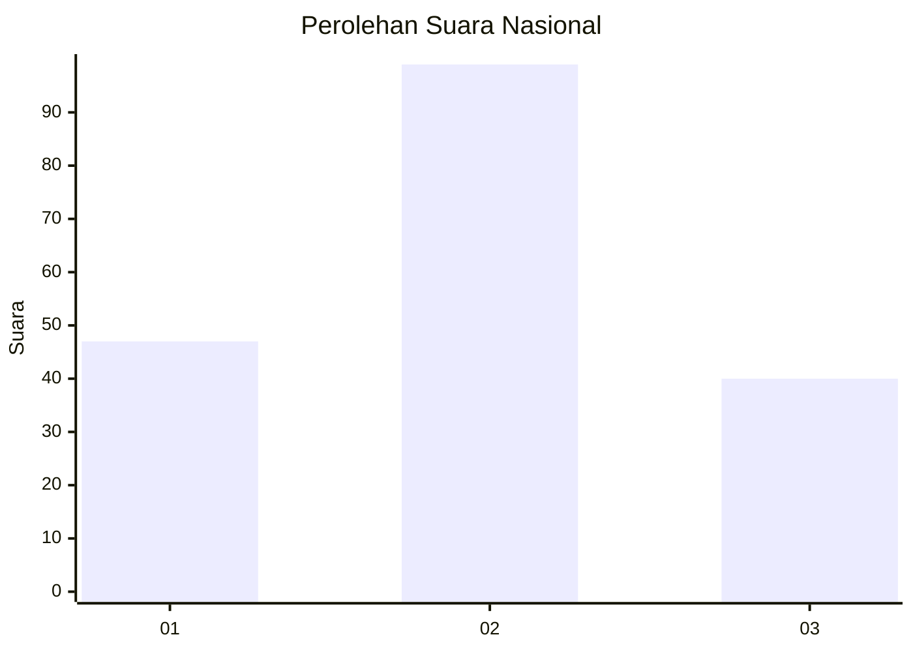
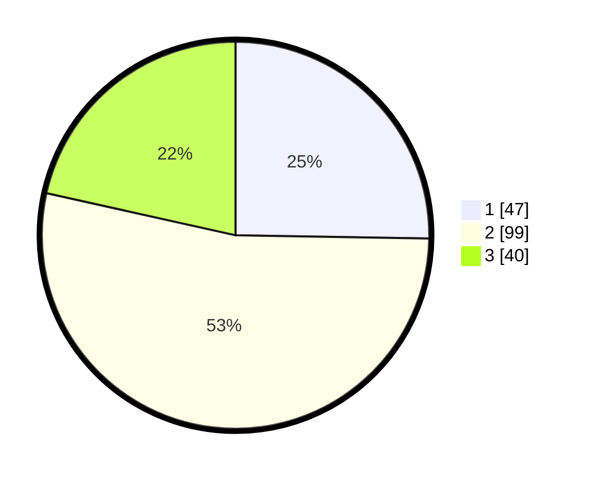

# Hasil

## Grafik

## Tabel

| No. | Nama Paslon    | Suara | Suara (raw) | Persentase |
|:--- |:-------------- | -----:| -----------:| ----------:|
| 1   | ANIES MUHAIMIN | 47    | [47][p-1]   | 25,27      |
| 2   | PRABOWO GIBRAN | 99    | [99][p-2]   | 53,23      |
| 3   | GANJAR MAHFUD  | 40    | [40][p-3]   | 21,51      |

[p-1]: https://github.com/gigit-pemilu/pemilu-2024/blob/main/pilpres/hitung-suara/sub/34-di-yogyakarta/sub/02-bantul/sub/15-sewon/sub/2001-pendowoharjo/sub/032-tps/sub/paslon-1.txt
[p-2]: https://github.com/gigit-pemilu/pemilu-2024/blob/main/pilpres/hitung-suara/sub/34-di-yogyakarta/sub/02-bantul/sub/15-sewon/sub/2001-pendowoharjo/sub/032-tps/sub/paslon-2.txt
[p-3]: https://github.com/gigit-pemilu/pemilu-2024/blob/main/pilpres/hitung-suara/sub/34-di-yogyakarta/sub/02-bantul/sub/15-sewon/sub/2001-pendowoharjo/sub/032-tps/sub/paslon-3.txt

## Foto C Plano

https://sirekap-obj-formc.kpu.go.id/2ee9/pemilu/ppwp/34/02/15/20/01/3402152001032-20240215-012930--6be45ba9-b9cf-4945-808b-86b73f62c56f.jpg

https://sirekap-obj-formc.kpu.go.id/2ee9/pemilu/ppwp/34/02/15/20/01/3402152001032-20240215-013020--260b8ed4-bcd6-4d9f-93cb-aaa1a2a1768d.jpg

https://sirekap-obj-formc.kpu.go.id/2ee9/pemilu/ppwp/34/02/15/20/01/3402152001032-20240215-013046--7fa972b8-c7d3-449e-a3c8-738014593981.jpg

## Metadata

| Key        | Value               |
| ---------- | ------------------- |
| Time Stamp | 2024-02-24 22:31:28 |

