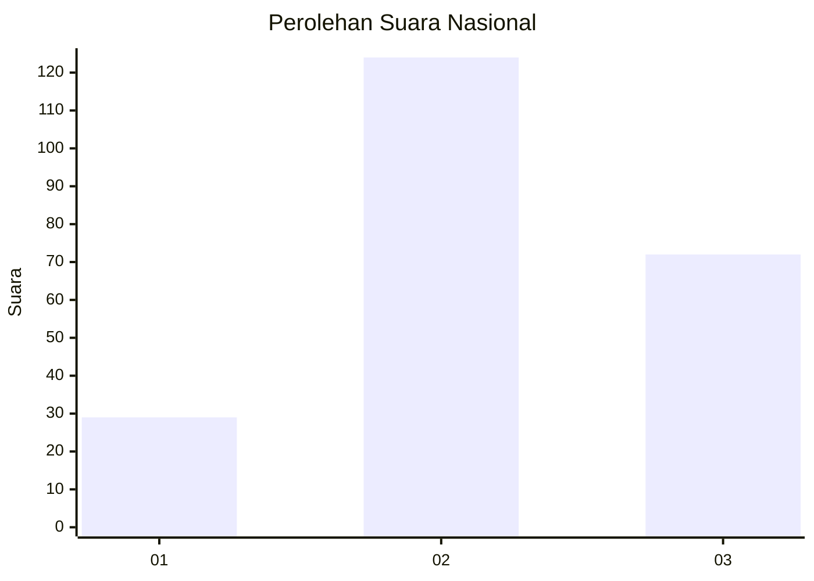
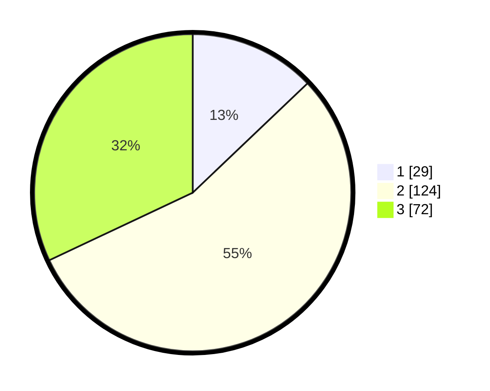

# Hasil

## Grafik

## Tabel

| No. | Nama Paslon    | Suara | Suara (raw) | Persentase |
|:--- |:-------------- | -----:| -----------:| ----------:|
| 1   | ANIES MUHAIMIN | 29    | [29][p-1]   | 12,89      |
| 2   | PRABOWO GIBRAN | 124   | [124][p-2]  | 55,11      |
| 3   | GANJAR MAHFUD  | 72    | [72][p-3]   | 32,00      |

[p-1]: https://github.com/gigit-pemilu/pemilu-2024/blob/main/pilpres/hitung-suara/sub/34-di-yogyakarta/sub/02-bantul/sub/15-sewon/sub/2001-pendowoharjo/sub/035-tps/sub/paslon-1.txt
[p-2]: https://github.com/gigit-pemilu/pemilu-2024/blob/main/pilpres/hitung-suara/sub/34-di-yogyakarta/sub/02-bantul/sub/15-sewon/sub/2001-pendowoharjo/sub/035-tps/sub/paslon-2.txt
[p-3]: https://github.com/gigit-pemilu/pemilu-2024/blob/main/pilpres/hitung-suara/sub/34-di-yogyakarta/sub/02-bantul/sub/15-sewon/sub/2001-pendowoharjo/sub/035-tps/sub/paslon-3.txt

## Foto C Plano

https://sirekap-obj-formc.kpu.go.id/17ca/pemilu/ppwp/34/02/15/20/01/3402152001035-20240214-233648--e8be2323-5d9b-4dbe-a23a-4a754c3bb399.jpg

https://sirekap-obj-formc.kpu.go.id/17ca/pemilu/ppwp/34/02/15/20/01/3402152001035-20240214-233818--0c409b5d-c37e-40cb-9093-e03433e381ee.jpg

https://sirekap-obj-formc.kpu.go.id/17ca/pemilu/ppwp/34/02/15/20/01/3402152001035-20240214-234055--91c21c8e-4d41-4939-aa35-3fcdbc062639.jpg

## Metadata

| Key        | Value               |
| ---------- | ------------------- |
| Time Stamp | 2024-02-19 06:16:00 |

