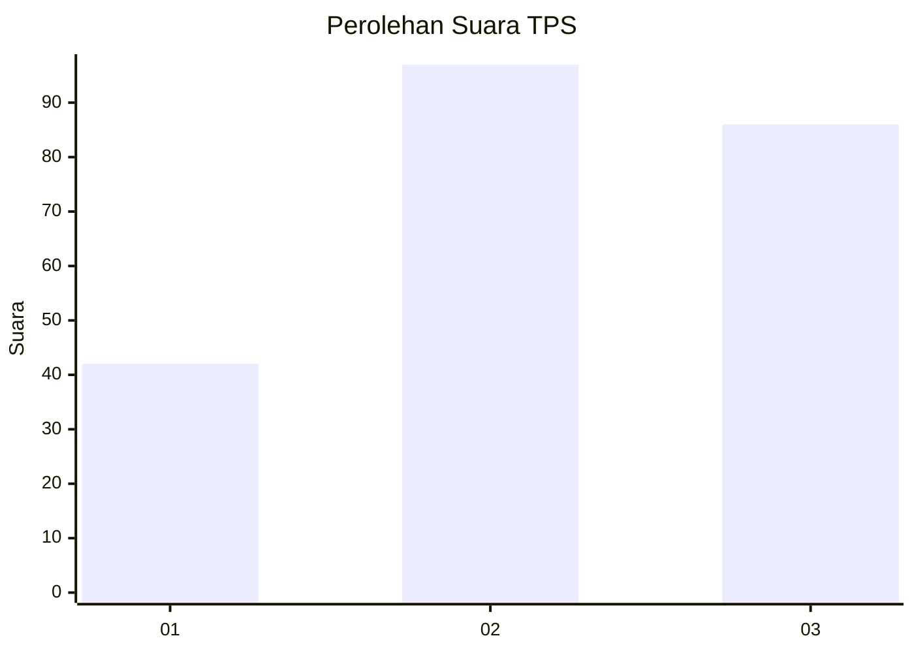
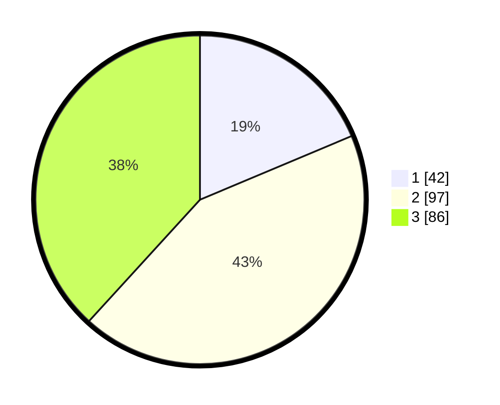

# Hasil

## Grafik

## Tabel

| No. | Nama Paslon    | Suara | Suara (raw) | Persentase |
|:--- |:-------------- | -----:| -----------:| ----------:|
| 1   | ANIES MUHAIMIN | 42    | [42][p-1]   | 18,67      |
| 2   | PRABOWO GIBRAN | 97    | [97][p-2]   | 43,11      |
| 3   | GANJAR MAHFUD  | 86    | [86][p-3]   | 38,22      |

[p-1]: https://github.com/gigit-pemilu/pemilu-2024-34-di-yogyakarta/blob/main/pilpres/hitung-suara/sub/34-di-yogyakarta/sub/02-bantul/sub/15-sewon/sub/2001-pendowoharjo/sub/037-tps/sub/paslon-1.txt
[p-2]: https://github.com/gigit-pemilu/pemilu-2024-34-di-yogyakarta/blob/main/pilpres/hitung-suara/sub/34-di-yogyakarta/sub/02-bantul/sub/15-sewon/sub/2001-pendowoharjo/sub/037-tps/sub/paslon-2.txt
[p-3]: https://github.com/gigit-pemilu/pemilu-2024-34-di-yogyakarta/blob/main/pilpres/hitung-suara/sub/34-di-yogyakarta/sub/02-bantul/sub/15-sewon/sub/2001-pendowoharjo/sub/037-tps/sub/paslon-3.txt

## Foto C Plano

https://sirekap-obj-formc.kpu.go.id/ef52/pemilu/ppwp/34/02/15/20/01/3402152001037-20240215-010852--c139f740-cb7d-4542-b145-b57d78a56458.jpg

https://sirekap-obj-formc.kpu.go.id/ef52/pemilu/ppwp/34/02/15/20/01/3402152001037-20240215-011049--8702deab-f35b-44e2-a678-6cf2e401df90.jpg

https://sirekap-obj-formc.kpu.go.id/ef52/pemilu/ppwp/34/02/15/20/01/3402152001037-20240215-011147--e396b793-1146-421f-9e1d-14e1a1b9ccca.jpg

## Metadata

| Key        | Value               |
| ---------- | ------------------- |
| Time Stamp | 2024-02-15 20:00:44 |

