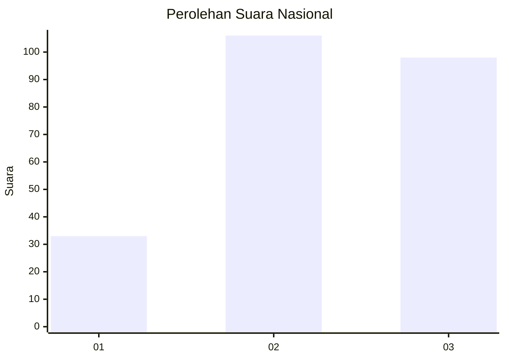
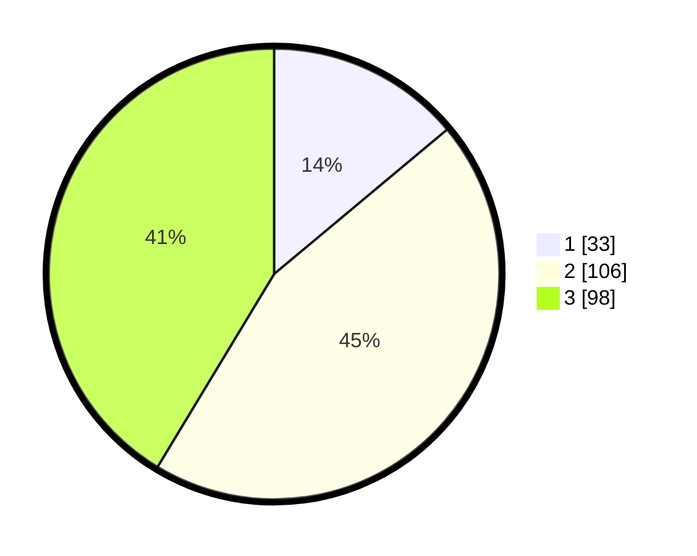

# Hasil

## Grafik

## Tabel

| No. | Nama Paslon    | Suara | Suara (raw) | Persentase |
|:--- |:-------------- | -----:| -----------:| ----------:|
| 1   | ANIES MUHAIMIN | 33    | [33][p-1]   | 13,92      |
| 2   | PRABOWO GIBRAN | 106   | [106][p-2]  | 44,73      |
| 3   | GANJAR MAHFUD  | 98    | [98][p-3]   | 41,35      |

[p-1]: https://github.com/gigit-pemilu/pemilu-2024/blob/main/pilpres/hitung-suara/sub/34-di-yogyakarta/sub/02-bantul/sub/15-sewon/sub/2001-pendowoharjo/sub/038-tps/sub/paslon-1.txt
[p-2]: https://github.com/gigit-pemilu/pemilu-2024/blob/main/pilpres/hitung-suara/sub/34-di-yogyakarta/sub/02-bantul/sub/15-sewon/sub/2001-pendowoharjo/sub/038-tps/sub/paslon-2.txt
[p-3]: https://github.com/gigit-pemilu/pemilu-2024/blob/main/pilpres/hitung-suara/sub/34-di-yogyakarta/sub/02-bantul/sub/15-sewon/sub/2001-pendowoharjo/sub/038-tps/sub/paslon-3.txt

## Foto C Plano

https://sirekap-obj-formc.kpu.go.id/52dd/pemilu/ppwp/34/02/15/20/01/3402152001038-20240215-014127--81ae3368-b034-456c-8b9c-50a5e44cfff4.jpg

https://sirekap-obj-formc.kpu.go.id/52dd/pemilu/ppwp/34/02/15/20/01/3402152001038-20240215-014136--e00d4049-0433-431b-98a1-05822e41bb6b.jpg

https://sirekap-obj-formc.kpu.go.id/52dd/pemilu/ppwp/34/02/15/20/01/3402152001038-20240215-014142--839ece25-8ed1-461b-8604-d9f4c1eb22b3.jpg

## Metadata

| Key        | Value               |
| ---------- | ------------------- |
| Time Stamp | 2024-02-15 15:00:29 |

