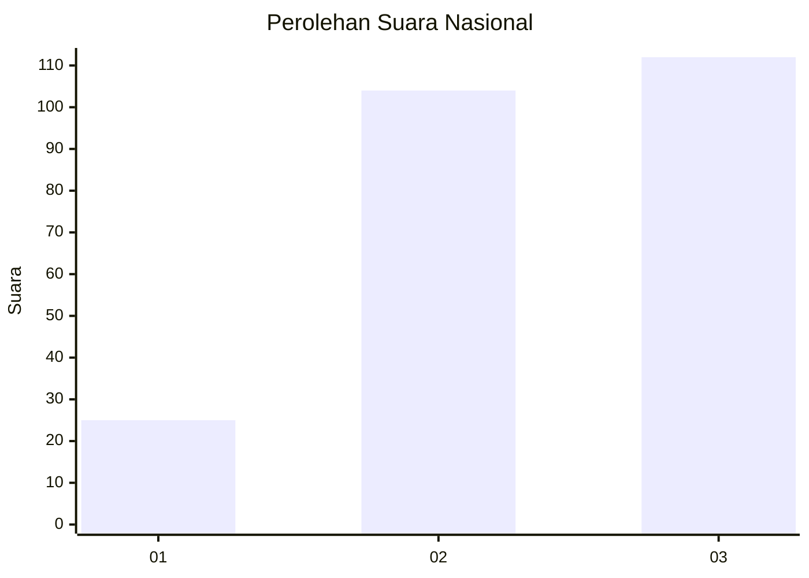
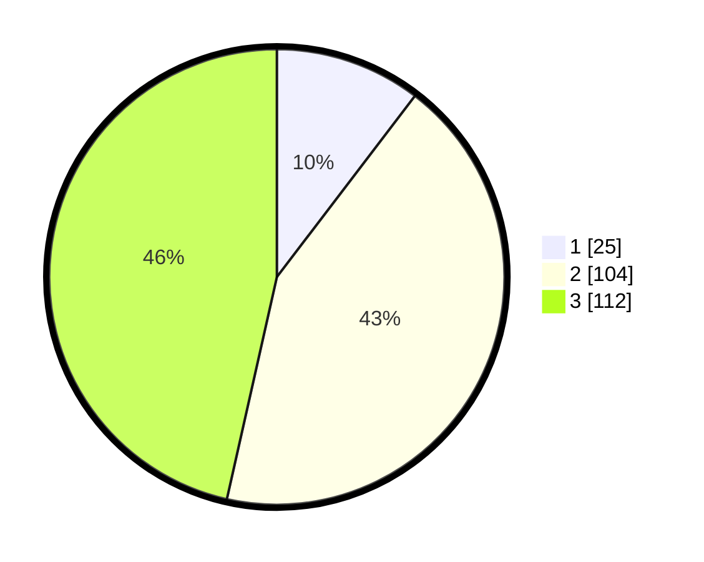

# Hasil

## Grafik

## Tabel

| No. | Nama Paslon    | Suara | Suara (raw) | Persentase |
|:--- |:-------------- | -----:| -----------:| ----------:|
| 1   | ANIES MUHAIMIN | 25    | [25][p-1]   | 10,37      |
| 2   | PRABOWO GIBRAN | 104   | [104][p-2]  | 43,15      |
| 3   | GANJAR MAHFUD  | 112   | [112][p-3]  | 46,47      |

[p-1]: https://github.com/gigit-pemilu/pemilu-2024/blob/main/pilpres/hitung-suara/sub/34-di-yogyakarta/sub/02-bantul/sub/15-sewon/sub/2001-pendowoharjo/sub/039-tps/sub/paslon-1.txt
[p-2]: https://github.com/gigit-pemilu/pemilu-2024/blob/main/pilpres/hitung-suara/sub/34-di-yogyakarta/sub/02-bantul/sub/15-sewon/sub/2001-pendowoharjo/sub/039-tps/sub/paslon-2.txt
[p-3]: https://github.com/gigit-pemilu/pemilu-2024/blob/main/pilpres/hitung-suara/sub/34-di-yogyakarta/sub/02-bantul/sub/15-sewon/sub/2001-pendowoharjo/sub/039-tps/sub/paslon-3.txt

## Foto C Plano

https://sirekap-obj-formc.kpu.go.id/6352/pemilu/ppwp/34/02/15/20/01/3402152001039-20240217-131143--53053e86-9f9c-4b38-be9d-16f924e8e2e1.jpg

https://sirekap-obj-formc.kpu.go.id/6352/pemilu/ppwp/34/02/15/20/01/3402152001039-20240217-131159--0f099a81-1e93-4821-90c6-1f3d89b416b6.jpg

https://sirekap-obj-formc.kpu.go.id/6352/pemilu/ppwp/34/02/15/20/01/3402152001039-20240217-131205--ed1998bc-ef71-4d6e-9324-a6da51a3d15f.jpg

## Metadata

| Key        | Value               |
| ---------- | ------------------- |
| Time Stamp | 2024-02-24 22:31:28 |

