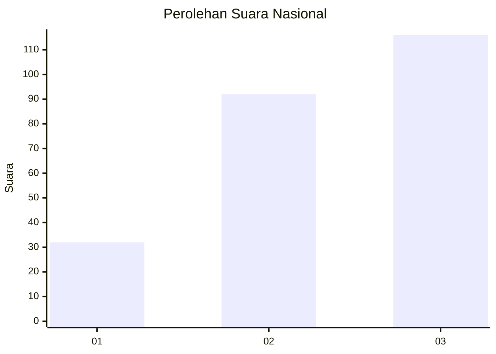
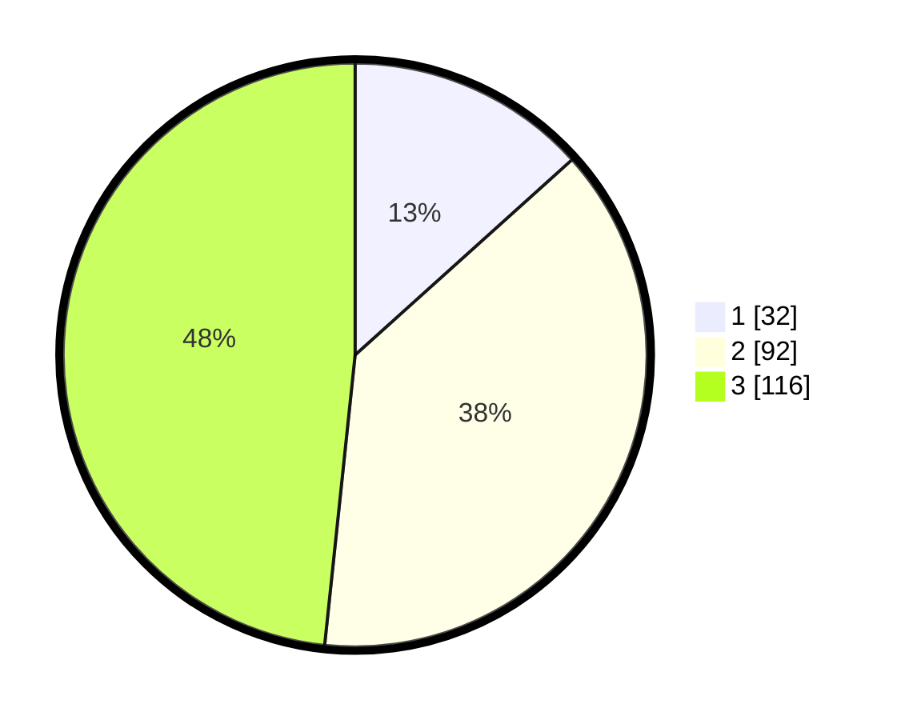

# Hasil

## Grafik

## Tabel

| No. | Nama Paslon    | Suara | Suara (raw) | Persentase |
|:--- |:-------------- | -----:| -----------:| ----------:|
| 1   | ANIES MUHAIMIN | 32    | [32][p-1]   | 13,33      |
| 2   | PRABOWO GIBRAN | 92    | [92][p-2]   | 38,33      |
| 3   | GANJAR MAHFUD  | 116   | [116][p-3]  | 48,33      |

[p-1]: https://github.com/gigit-pemilu/pemilu-2024/blob/main/pilpres/hitung-suara/sub/34-di-yogyakarta/sub/02-bantul/sub/15-sewon/sub/2001-pendowoharjo/sub/040-tps/sub/paslon-1.txt
[p-2]: https://github.com/gigit-pemilu/pemilu-2024/blob/main/pilpres/hitung-suara/sub/34-di-yogyakarta/sub/02-bantul/sub/15-sewon/sub/2001-pendowoharjo/sub/040-tps/sub/paslon-2.txt
[p-3]: https://github.com/gigit-pemilu/pemilu-2024/blob/main/pilpres/hitung-suara/sub/34-di-yogyakarta/sub/02-bantul/sub/15-sewon/sub/2001-pendowoharjo/sub/040-tps/sub/paslon-3.txt

## Foto C Plano

https://sirekap-obj-formc.kpu.go.id/7f90/pemilu/ppwp/34/02/15/20/01/3402152001040-20240215-005115--b0537c35-1491-452f-9598-5b4b763980be.jpg

https://sirekap-obj-formc.kpu.go.id/7f90/pemilu/ppwp/34/02/15/20/01/3402152001040-20240215-005210--e5de3f49-7e63-4739-b3cf-951ad91b8e50.jpg

https://sirekap-obj-formc.kpu.go.id/7f90/pemilu/ppwp/34/02/15/20/01/3402152001040-20240215-025519--6aa2f9ae-98bb-4af2-bb94-b686e8dab7a9.jpg

## Metadata

| Key        | Value               |
| ---------- | ------------------- |
| Time Stamp | 2024-02-24 22:31:28 |

