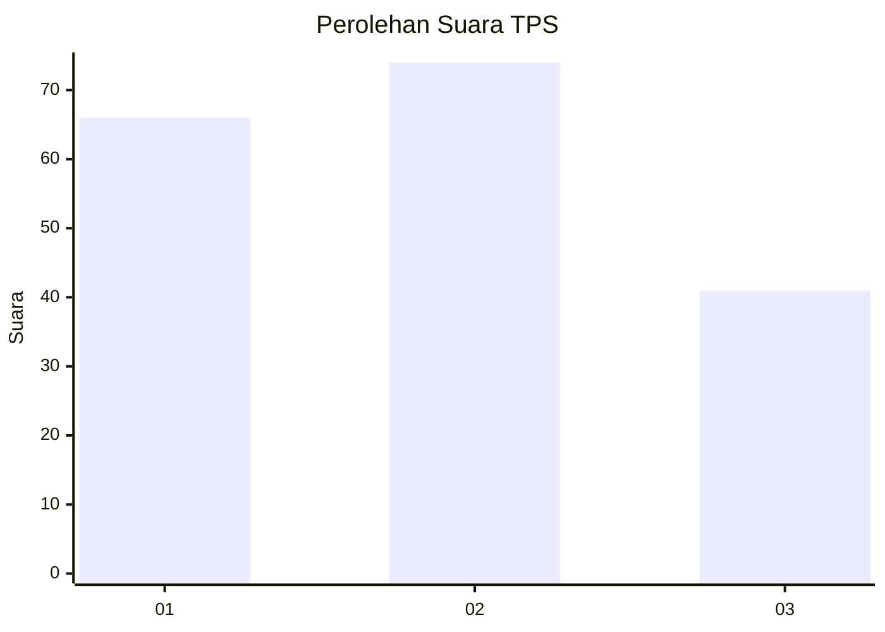
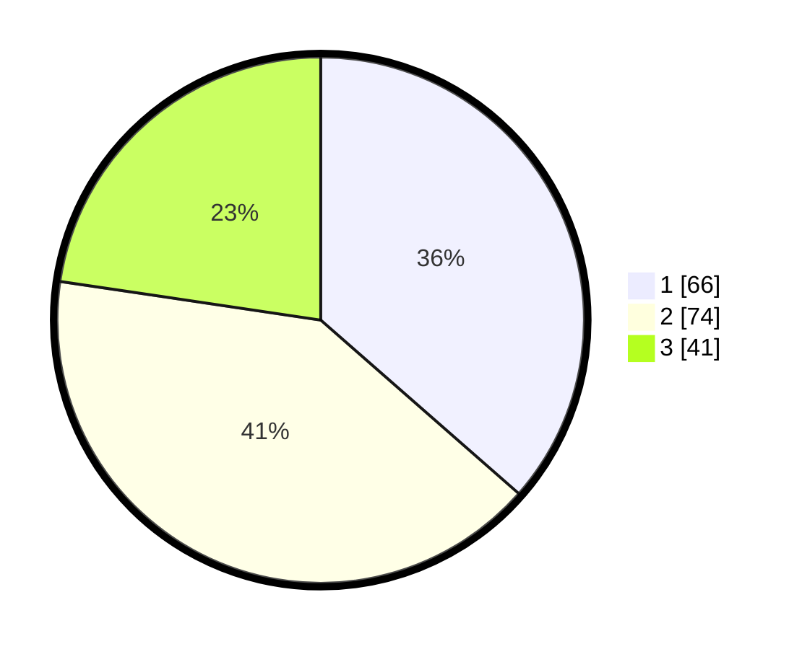

# Hasil

## Grafik

## Tabel

| No. | Nama Paslon    | Suara | Suara (raw) | Persentase |
|:--- |:-------------- | -----:| -----------:| ----------:|
| 1   | ANIES MUHAIMIN | 66    | [66][p-1]   | 36,46      |
| 2   | PRABOWO GIBRAN | 74    | [74][p-2]   | 40,88      |
| 3   | GANJAR MAHFUD  | 41    | [41][p-3]   | 22,65      |

[p-1]: https://github.com/gigit-pemilu/pemilu-2024-34-di-yogyakarta/blob/main/pilpres/hitung-suara/sub/34-di-yogyakarta/sub/02-bantul/sub/15-sewon/sub/2001-pendowoharjo/sub/041-tps/sub/paslon-1.txt
[p-2]: https://github.com/gigit-pemilu/pemilu-2024-34-di-yogyakarta/blob/main/pilpres/hitung-suara/sub/34-di-yogyakarta/sub/02-bantul/sub/15-sewon/sub/2001-pendowoharjo/sub/041-tps/sub/paslon-2.txt
[p-3]: https://github.com/gigit-pemilu/pemilu-2024-34-di-yogyakarta/blob/main/pilpres/hitung-suara/sub/34-di-yogyakarta/sub/02-bantul/sub/15-sewon/sub/2001-pendowoharjo/sub/041-tps/sub/paslon-3.txt

## Foto C Plano

https://sirekap-obj-formc.kpu.go.id/c2ec/pemilu/ppwp/34/02/15/20/01/3402152001041-20240214-232003--2a01c208-c12b-477a-98db-79b4ebaa030e.jpg

https://sirekap-obj-formc.kpu.go.id/c2ec/pemilu/ppwp/34/02/15/20/01/3402152001041-20240214-232049--e7948c1e-7c85-4d44-83e2-f8cd3f34a203.jpg

https://sirekap-obj-formc.kpu.go.id/c2ec/pemilu/ppwp/34/02/15/20/01/3402152001041-20240214-232317--d3f0eefc-9f7f-4a08-8097-aa2e895bb3bf.jpg

## Metadata

| Key        | Value               |
| ---------- | ------------------- |
| Time Stamp | 2024-02-25 17:00:00 |

