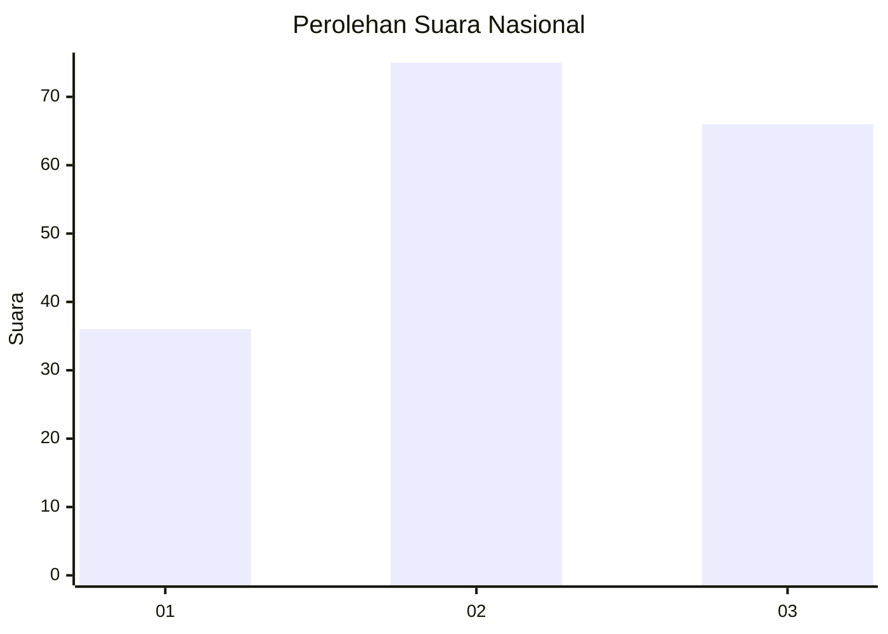
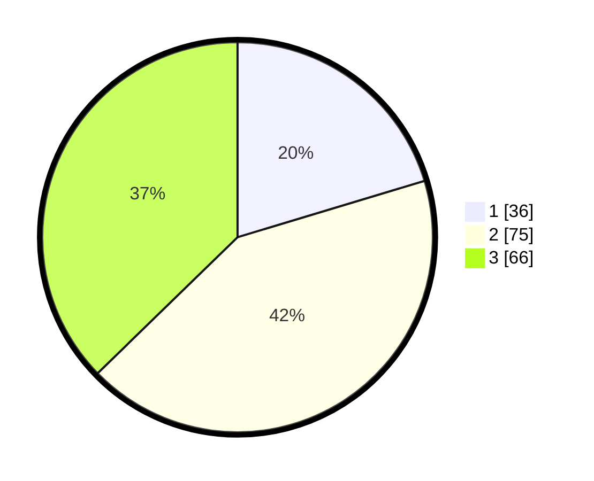

# Hasil

## Grafik

## Tabel

| No. | Nama Paslon    | Suara | Suara (raw) | Persentase |
|:--- |:-------------- | -----:| -----------:| ----------:|
| 1   | ANIES MUHAIMIN | 36    | [36][p-1]   | 20,34      |
| 2   | PRABOWO GIBRAN | 75    | [75][p-2]   | 42,37      |
| 3   | GANJAR MAHFUD  | 66    | [66][p-3]   | 37,29      |

[p-1]: https://github.com/gigit-pemilu/pemilu-2024/blob/main/pilpres/hitung-suara/sub/34-di-yogyakarta/sub/02-bantul/sub/15-sewon/sub/2001-pendowoharjo/sub/043-tps/sub/paslon-1.txt
[p-2]: https://github.com/gigit-pemilu/pemilu-2024/blob/main/pilpres/hitung-suara/sub/34-di-yogyakarta/sub/02-bantul/sub/15-sewon/sub/2001-pendowoharjo/sub/043-tps/sub/paslon-2.txt
[p-3]: https://github.com/gigit-pemilu/pemilu-2024/blob/main/pilpres/hitung-suara/sub/34-di-yogyakarta/sub/02-bantul/sub/15-sewon/sub/2001-pendowoharjo/sub/043-tps/sub/paslon-3.txt

## Foto C Plano

https://sirekap-obj-formc.kpu.go.id/a587/pemilu/ppwp/34/02/15/20/01/3402152001043-20240214-191719--7985d835-7480-4597-a929-4ff7361760e7.jpg

https://sirekap-obj-formc.kpu.go.id/a587/pemilu/ppwp/34/02/15/20/01/3402152001043-20240214-191715--879e8af4-8d0b-4ae9-bfba-d72da3e90d21.jpg

https://sirekap-obj-formc.kpu.go.id/a587/pemilu/ppwp/34/02/15/20/01/3402152001043-20240214-191709--133374f0-15a4-4f61-bde7-ac0b4268fa36.jpg

## Metadata

| Key        | Value               |
| ---------- | ------------------- |
| Time Stamp | 2024-02-24 22:31:28 |

