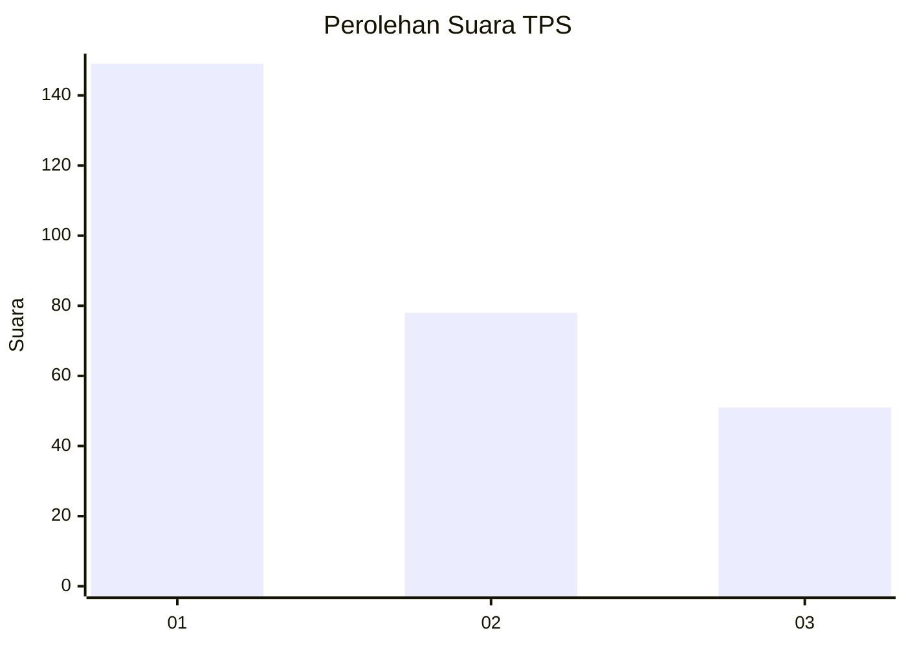
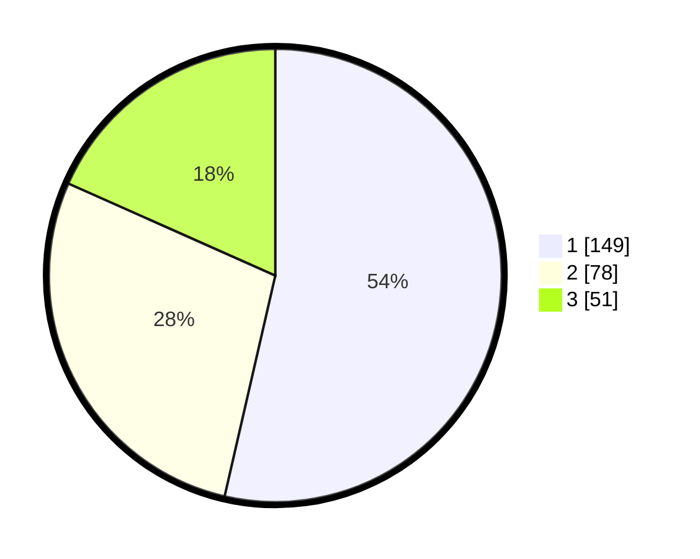

# Hasil

## Grafik

## Tabel

| No. | Nama Paslon    | Suara | Suara (raw) | Persentase |
|:--- |:-------------- | -----:| -----------:| ----------:|
| 1   | ANIES MUHAIMIN | 149   | [149][p-1]  | 53,60      |
| 2   | PRABOWO GIBRAN | 78    | [78][p-2]   | 28,06      |
| 3   | GANJAR MAHFUD  | 51    | [51][p-3]   | 18,35      |

[p-1]: https://github.com/gigit-pemilu/pemilu-2024-34-di-yogyakarta/blob/main/pilpres/hitung-suara/sub/34-di-yogyakarta/sub/02-bantul/sub/15-sewon/sub/2001-pendowoharjo/sub/044-tps/sub/paslon-1.txt
[p-2]: https://github.com/gigit-pemilu/pemilu-2024-34-di-yogyakarta/blob/main/pilpres/hitung-suara/sub/34-di-yogyakarta/sub/02-bantul/sub/15-sewon/sub/2001-pendowoharjo/sub/044-tps/sub/paslon-2.txt
[p-3]: https://github.com/gigit-pemilu/pemilu-2024-34-di-yogyakarta/blob/main/pilpres/hitung-suara/sub/34-di-yogyakarta/sub/02-bantul/sub/15-sewon/sub/2001-pendowoharjo/sub/044-tps/sub/paslon-3.txt

## Foto C Plano

https://sirekap-obj-formc.kpu.go.id/1051/pemilu/ppwp/34/02/15/20/01/3402152001044-20240215-003213--c7c7f078-0515-403e-8a46-f6c1efe385f9.jpg

https://sirekap-obj-formc.kpu.go.id/1051/pemilu/ppwp/34/02/15/20/01/3402152001044-20240215-003257--d9851a46-66c9-4835-9222-5d01cd36f3b5.jpg

https://sirekap-obj-formc.kpu.go.id/1051/pemilu/ppwp/34/02/15/20/01/3402152001044-20240215-003332--e6ffc92a-6ac8-4357-a129-11dd98476814.jpg

## Metadata

| Key        | Value               |
| ---------- | ------------------- |
| Time Stamp | 2024-02-24 22:31:28 |

