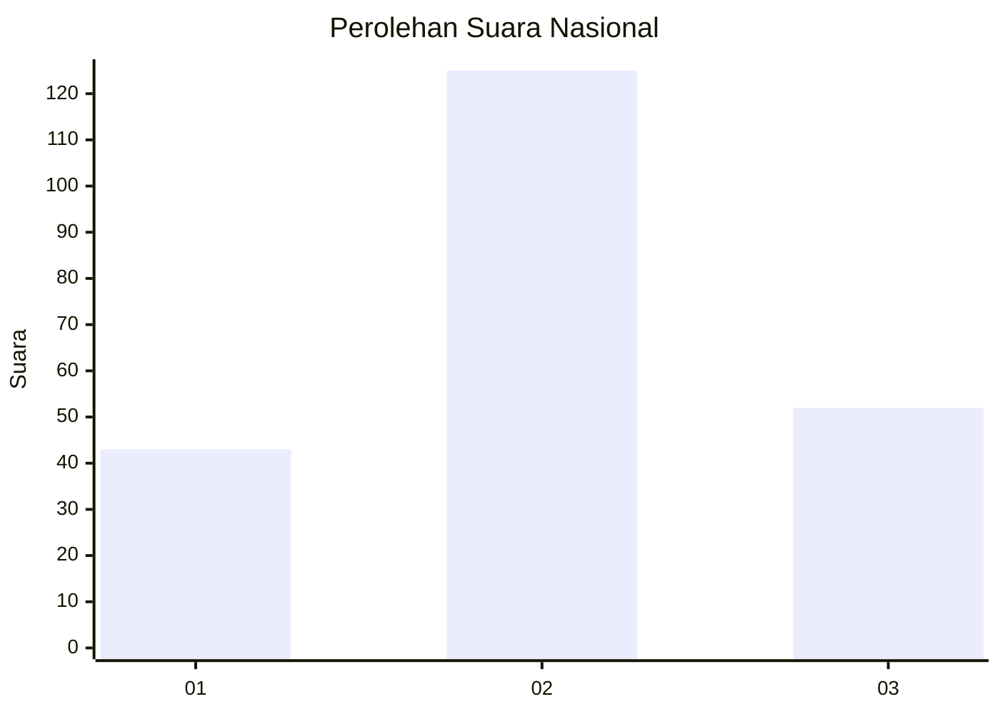
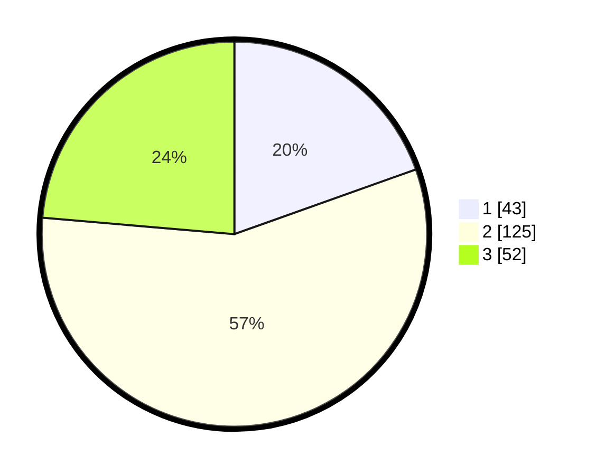

# Hasil

## Grafik

## Tabel

| No. | Nama Paslon    | Suara | Suara (raw) | Persentase |
|:--- |:-------------- | -----:| -----------:| ----------:|
| 1   | ANIES MUHAIMIN | 43    | [43][p-1]   | 19,55      |
| 2   | PRABOWO GIBRAN | 125   | [125][p-2]  | 56,82      |
| 3   | GANJAR MAHFUD  | 52    | [52][p-3]   | 23,64      |

[p-1]: https://github.com/gigit-pemilu/pemilu-2024/blob/main/pilpres/hitung-suara/sub/34-di-yogyakarta/sub/02-bantul/sub/15-sewon/sub/2001-pendowoharjo/sub/047-tps/sub/paslon-1.txt
[p-2]: https://github.com/gigit-pemilu/pemilu-2024/blob/main/pilpres/hitung-suara/sub/34-di-yogyakarta/sub/02-bantul/sub/15-sewon/sub/2001-pendowoharjo/sub/047-tps/sub/paslon-2.txt
[p-3]: https://github.com/gigit-pemilu/pemilu-2024/blob/main/pilpres/hitung-suara/sub/34-di-yogyakarta/sub/02-bantul/sub/15-sewon/sub/2001-pendowoharjo/sub/047-tps/sub/paslon-3.txt

## Foto C Plano

https://sirekap-obj-formc.kpu.go.id/eb00/pemilu/ppwp/34/02/15/20/01/3402152001047-20240214-195341--a9ae78b2-b966-4813-bc50-71bfd4018c51.jpg

https://sirekap-obj-formc.kpu.go.id/eb00/pemilu/ppwp/34/02/15/20/01/3402152001047-20240214-195626--32387893-ad4f-466d-bf7b-a4f0bb0d2daf.jpg

https://sirekap-obj-formc.kpu.go.id/eb00/pemilu/ppwp/34/02/15/20/01/3402152001047-20240214-200107--4c253909-0c95-4709-84d3-4d61fd4e11c9.jpg

## Metadata

| Key        | Value               |
| ---------- | ------------------- |
| Time Stamp | 2024-02-25 10:00:00 |

