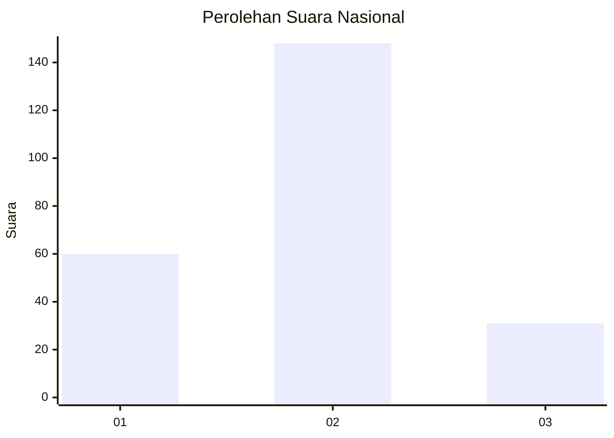
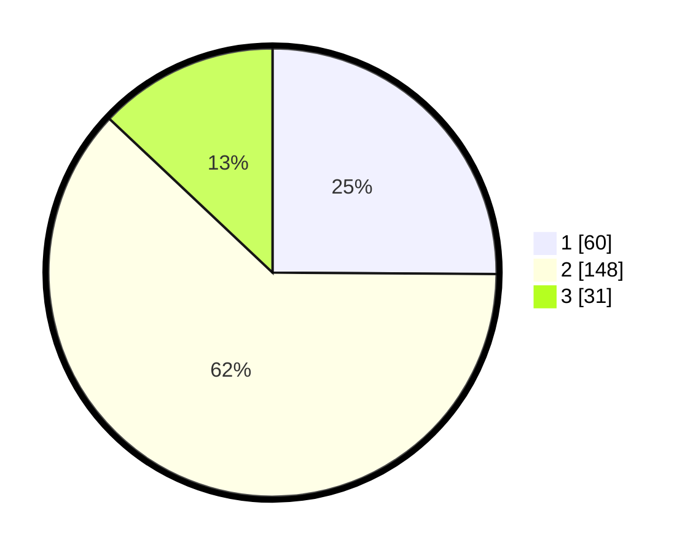

# Hasil

## Grafik

## Tabel

| No. | Nama Paslon    | Suara | Suara (raw) | Persentase |
|:--- |:-------------- | -----:| -----------:| ----------:|
| 1   | ANIES MUHAIMIN | 60    | [60][p-1]   | 25,10      |
| 2   | PRABOWO GIBRAN | 148   | [148][p-2]  | 61,92      |
| 3   | GANJAR MAHFUD  | 31    | [31][p-3]   | 12,97      |

[p-1]: https://github.com/gigit-pemilu/pemilu-2024/blob/main/pilpres/hitung-suara/sub/34-di-yogyakarta/sub/02-bantul/sub/15-sewon/sub/2001-pendowoharjo/sub/048-tps/sub/paslon-1.txt
[p-2]: https://github.com/gigit-pemilu/pemilu-2024/blob/main/pilpres/hitung-suara/sub/34-di-yogyakarta/sub/02-bantul/sub/15-sewon/sub/2001-pendowoharjo/sub/048-tps/sub/paslon-2.txt
[p-3]: https://github.com/gigit-pemilu/pemilu-2024/blob/main/pilpres/hitung-suara/sub/34-di-yogyakarta/sub/02-bantul/sub/15-sewon/sub/2001-pendowoharjo/sub/048-tps/sub/paslon-3.txt

## Foto C Plano

https://sirekap-obj-formc.kpu.go.id/5df6/pemilu/ppwp/34/02/15/20/01/3402152001048-20240214-220547--3cdafd89-abc0-4064-86db-04d9892fee81.jpg

https://sirekap-obj-formc.kpu.go.id/5df6/pemilu/ppwp/34/02/15/20/01/3402152001048-20240214-220218--f5257d8f-67f0-471c-8637-dd5a99eb4c3d.jpg

https://sirekap-obj-formc.kpu.go.id/5df6/pemilu/ppwp/34/02/15/20/01/3402152001048-20240214-215944--db095f18-df6e-4363-983f-52a3685413f5.jpg

## Metadata

| Key        | Value               |
| ---------- | ------------------- |
| Time Stamp | 2024-02-24 22:31:28 |

