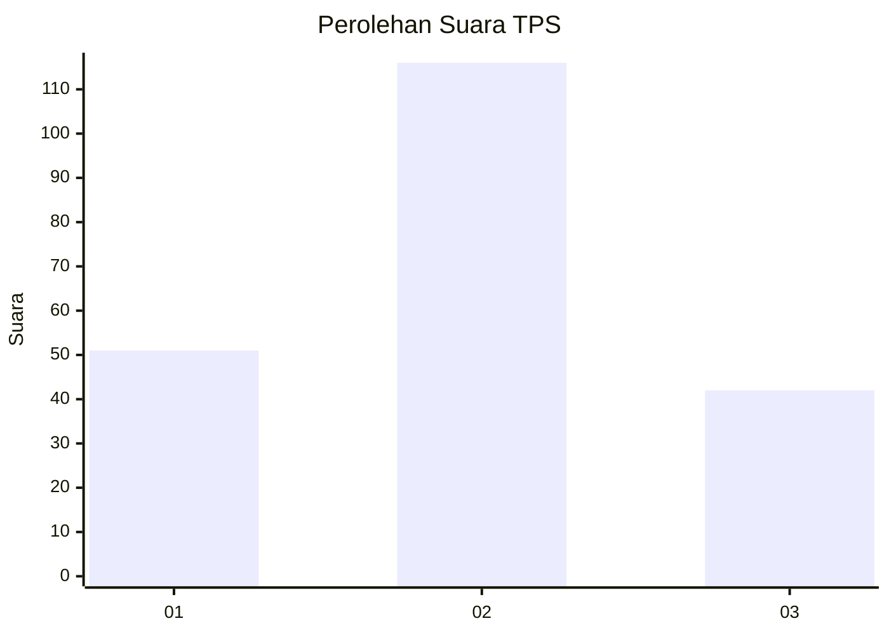
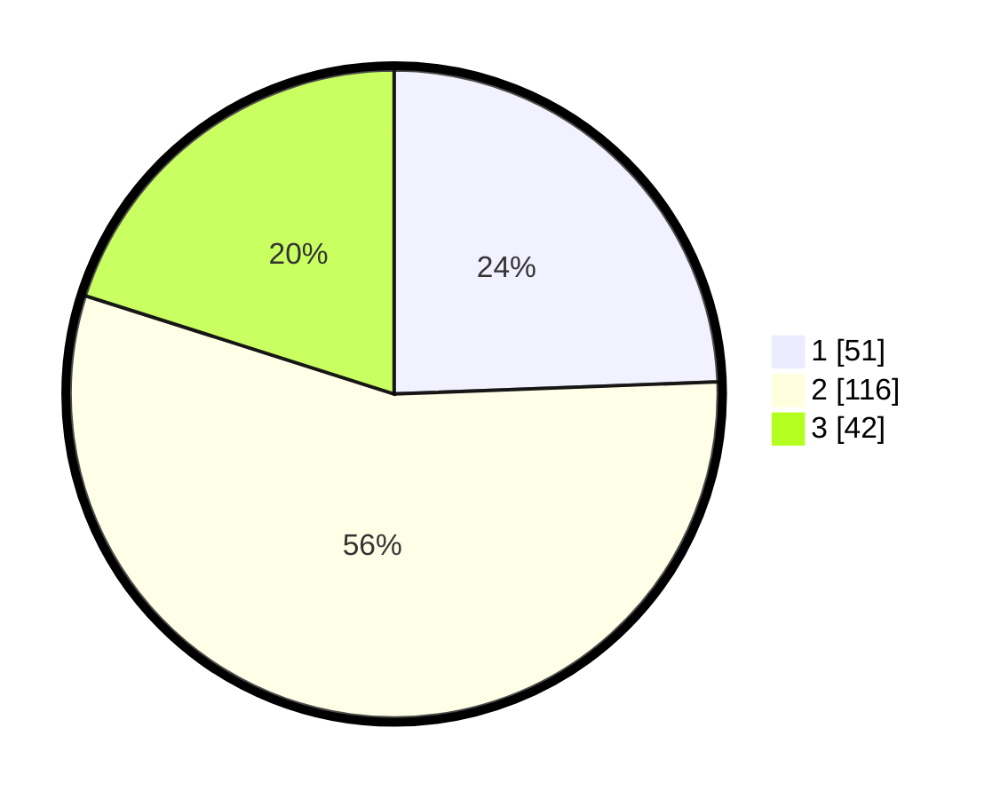

# Hasil

## Grafik

## Tabel

| No. | Nama Paslon    | Suara | Suara (raw) | Persentase |
|:--- |:-------------- | -----:| -----------:| ----------:|
| 1   | ANIES MUHAIMIN | 51    | [51][p-1]   | 24,40      |
| 2   | PRABOWO GIBRAN | 116   | [116][p-2]  | 55,50      |
| 3   | GANJAR MAHFUD  | 42    | [42][p-3]   | 20,10      |

[p-1]: https://github.com/gigit-pemilu/pemilu-2024-34-di-yogyakarta/blob/main/pilpres/hitung-suara/sub/34-di-yogyakarta/sub/02-bantul/sub/15-sewon/sub/2001-pendowoharjo/sub/049-tps/sub/paslon-1.txt
[p-2]: https://github.com/gigit-pemilu/pemilu-2024-34-di-yogyakarta/blob/main/pilpres/hitung-suara/sub/34-di-yogyakarta/sub/02-bantul/sub/15-sewon/sub/2001-pendowoharjo/sub/049-tps/sub/paslon-2.txt
[p-3]: https://github.com/gigit-pemilu/pemilu-2024-34-di-yogyakarta/blob/main/pilpres/hitung-suara/sub/34-di-yogyakarta/sub/02-bantul/sub/15-sewon/sub/2001-pendowoharjo/sub/049-tps/sub/paslon-3.txt

## Foto C Plano

https://sirekap-obj-formc.kpu.go.id/bfb4/pemilu/ppwp/34/02/15/20/01/3402152001049-20240215-050033--a67b6a6d-0770-49f6-b297-ce18ddc04c74.jpg

https://sirekap-obj-formc.kpu.go.id/bfb4/pemilu/ppwp/34/02/15/20/01/3402152001049-20240215-050234--2a8fce83-b7e0-4442-8acc-15879b605b09.jpg

https://sirekap-obj-formc.kpu.go.id/bfb4/pemilu/ppwp/34/02/15/20/01/3402152001049-20240215-051051--0ca48bee-26fe-45ab-89ce-b0a3a7e7b9f8.jpg

## Metadata

| Key        | Value               |
| ---------- | ------------------- |
| Time Stamp | 2024-02-25 12:00:00 |

