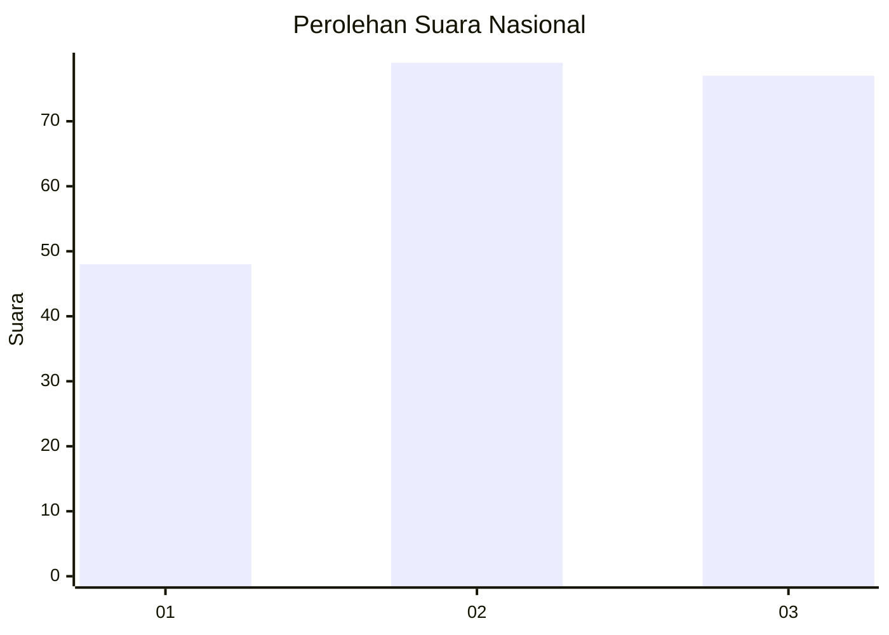
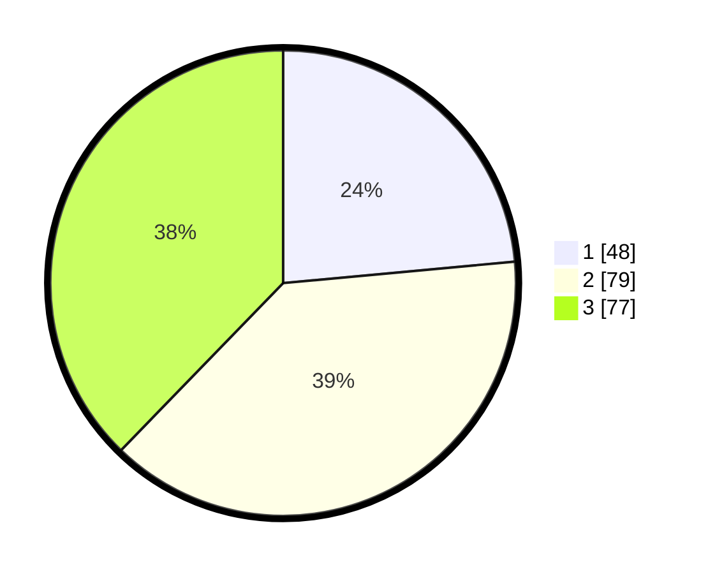

# Hasil

## Grafik

## Tabel

| No. | Nama Paslon    | Suara | Suara (raw) | Persentase |
|:--- |:-------------- | -----:| -----------:| ----------:|
| 1   | ANIES MUHAIMIN | 48    | [48][p-1]   | 23,53      |
| 2   | PRABOWO GIBRAN | 79    | [79][p-2]   | 38,73      |
| 3   | GANJAR MAHFUD  | 77    | [77][p-3]   | 37,75      |

[p-1]: https://github.com/gigit-pemilu/pemilu-2024/blob/main/pilpres/hitung-suara/sub/34-di-yogyakarta/sub/02-bantul/sub/15-sewon/sub/2001-pendowoharjo/sub/050-tps/sub/paslon-1.txt
[p-2]: https://github.com/gigit-pemilu/pemilu-2024/blob/main/pilpres/hitung-suara/sub/34-di-yogyakarta/sub/02-bantul/sub/15-sewon/sub/2001-pendowoharjo/sub/050-tps/sub/paslon-2.txt
[p-3]: https://github.com/gigit-pemilu/pemilu-2024/blob/main/pilpres/hitung-suara/sub/34-di-yogyakarta/sub/02-bantul/sub/15-sewon/sub/2001-pendowoharjo/sub/050-tps/sub/paslon-3.txt

## Foto C Plano

https://sirekap-obj-formc.kpu.go.id/c6ba/pemilu/ppwp/34/02/15/20/01/3402152001050-20240215-012637--05c4840d-8314-4e20-96bb-802b66cc280e.jpg

https://sirekap-obj-formc.kpu.go.id/c6ba/pemilu/ppwp/34/02/15/20/01/3402152001050-20240215-011931--f3ab9c0e-b256-405e-878f-0dd035e3abd3.jpg

https://sirekap-obj-formc.kpu.go.id/c6ba/pemilu/ppwp/34/02/15/20/01/3402152001050-20240215-012100--911030c9-bd9d-4006-88b2-3bb311dbbdd3.jpg

## Metadata

| Key        | Value               |
| ---------- | ------------------- |
| Time Stamp | 2024-02-24 22:31:28 |

