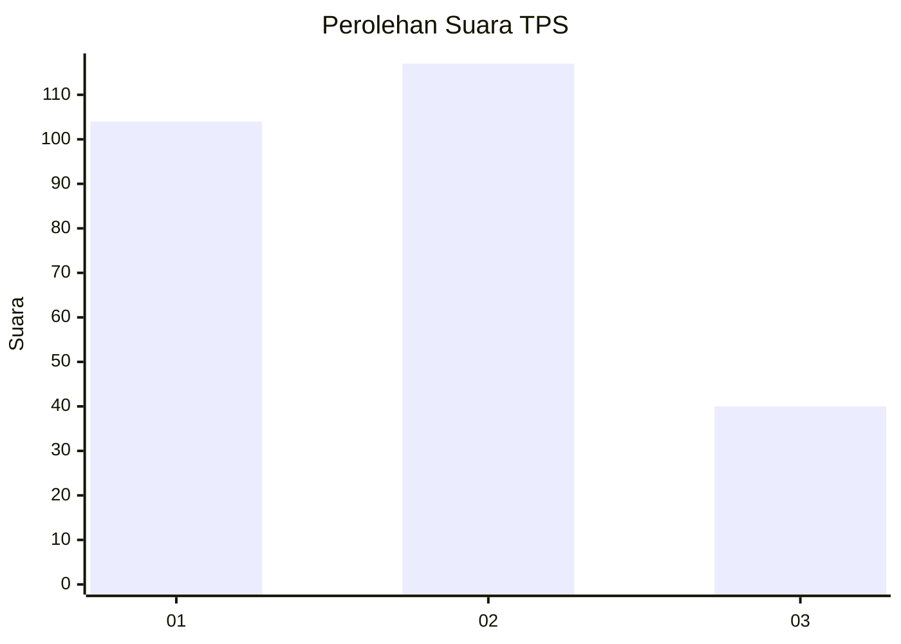
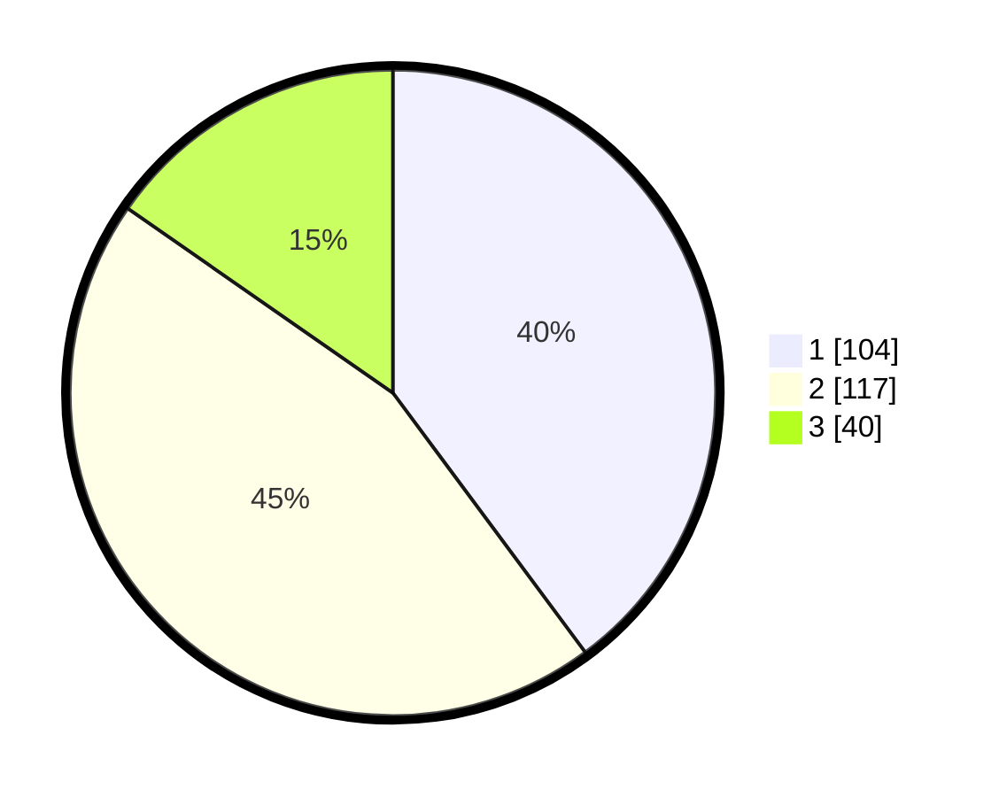

# Hasil

## Grafik

## Tabel

| No. | Nama Paslon    | Suara | Suara (raw) | Persentase |
|:--- |:-------------- | -----:| -----------:| ----------:|
| 1   | ANIES MUHAIMIN | 104   | [104][p-1]  | 39,85      |
| 2   | PRABOWO GIBRAN | 117   | [117][p-2]  | 44,83      |
| 3   | GANJAR MAHFUD  | 40    | [40][p-3]   | 15,33      |

[p-1]: https://github.com/gigit-pemilu/pemilu-2024-34-di-yogyakarta/blob/main/pilpres/hitung-suara/sub/34-di-yogyakarta/sub/02-bantul/sub/15-sewon/sub/2001-pendowoharjo/sub/051-tps/sub/paslon-1.txt
[p-2]: https://github.com/gigit-pemilu/pemilu-2024-34-di-yogyakarta/blob/main/pilpres/hitung-suara/sub/34-di-yogyakarta/sub/02-bantul/sub/15-sewon/sub/2001-pendowoharjo/sub/051-tps/sub/paslon-2.txt
[p-3]: https://github.com/gigit-pemilu/pemilu-2024-34-di-yogyakarta/blob/main/pilpres/hitung-suara/sub/34-di-yogyakarta/sub/02-bantul/sub/15-sewon/sub/2001-pendowoharjo/sub/051-tps/sub/paslon-3.txt

## Foto C Plano

https://sirekap-obj-formc.kpu.go.id/f865/pemilu/ppwp/34/02/15/20/01/3402152001051-20240215-003411--8888bb33-bef1-4a3d-8f27-140a50a1d686.jpg

https://sirekap-obj-formc.kpu.go.id/f865/pemilu/ppwp/34/02/15/20/01/3402152001051-20240214-211400--b876e293-a8df-449b-8e71-0b405564c5ed.jpg

https://sirekap-obj-formc.kpu.go.id/f865/pemilu/ppwp/34/02/15/20/01/3402152001051-20240215-003619--56e56734-f750-4dd4-a858-e16186573ccf.jpg

## Metadata

| Key        | Value               |
| ---------- | ------------------- |
| Time Stamp | 2024-02-15 00:41:44 |

