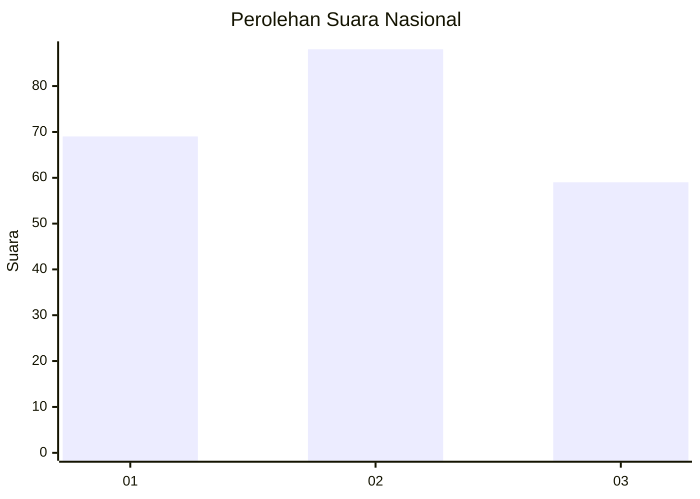
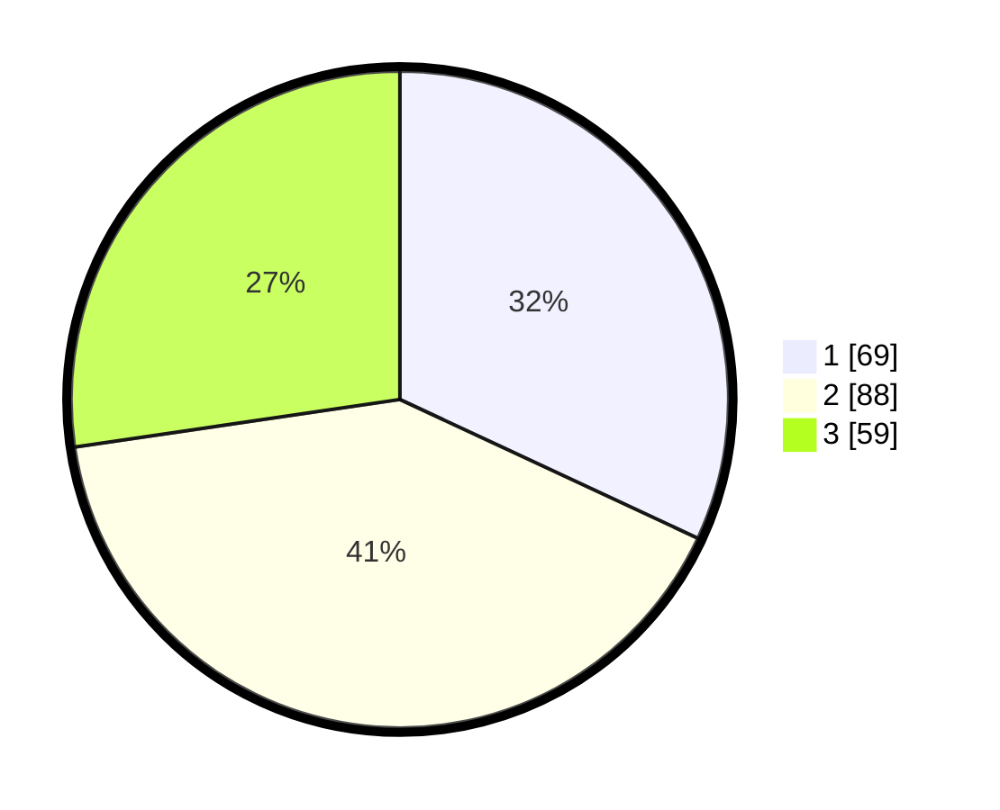

# Hasil

## Grafik

## Tabel

| No. | Nama Paslon    | Suara | Suara (raw) | Persentase |
|:--- |:-------------- | -----:| -----------:| ----------:|
| 1   | ANIES MUHAIMIN | 69    | [69][p-1]   | 31,94      |
| 2   | PRABOWO GIBRAN | 88    | [88][p-2]   | 40,74      |
| 3   | GANJAR MAHFUD  | 59    | [59][p-3]   | 27,31      |

[p-1]: https://github.com/gigit-pemilu/pemilu-2024/blob/main/pilpres/hitung-suara/sub/34-di-yogyakarta/sub/02-bantul/sub/15-sewon/sub/2001-pendowoharjo/sub/052-tps/sub/paslon-1.txt
[p-2]: https://github.com/gigit-pemilu/pemilu-2024/blob/main/pilpres/hitung-suara/sub/34-di-yogyakarta/sub/02-bantul/sub/15-sewon/sub/2001-pendowoharjo/sub/052-tps/sub/paslon-2.txt
[p-3]: https://github.com/gigit-pemilu/pemilu-2024/blob/main/pilpres/hitung-suara/sub/34-di-yogyakarta/sub/02-bantul/sub/15-sewon/sub/2001-pendowoharjo/sub/052-tps/sub/paslon-3.txt

## Foto C Plano

https://sirekap-obj-formc.kpu.go.id/6c34/pemilu/ppwp/34/02/15/20/01/3402152001052-20240215-000040--cbc925ed-093e-4914-86b8-973047b61138.jpg

https://sirekap-obj-formc.kpu.go.id/6c34/pemilu/ppwp/34/02/15/20/01/3402152001052-20240214-235817--7805ed41-ba24-4ed3-a2a5-d5394ecc3c94.jpg

https://sirekap-obj-formc.kpu.go.id/6c34/pemilu/ppwp/34/02/15/20/01/3402152001052-20240214-235750--2d7dd3bd-9f2a-490b-aa1e-aaa20df6a17a.jpg

## Metadata

| Key        | Value               |
| ---------- | ------------------- |
| Time Stamp | 2024-02-24 22:31:28 |

