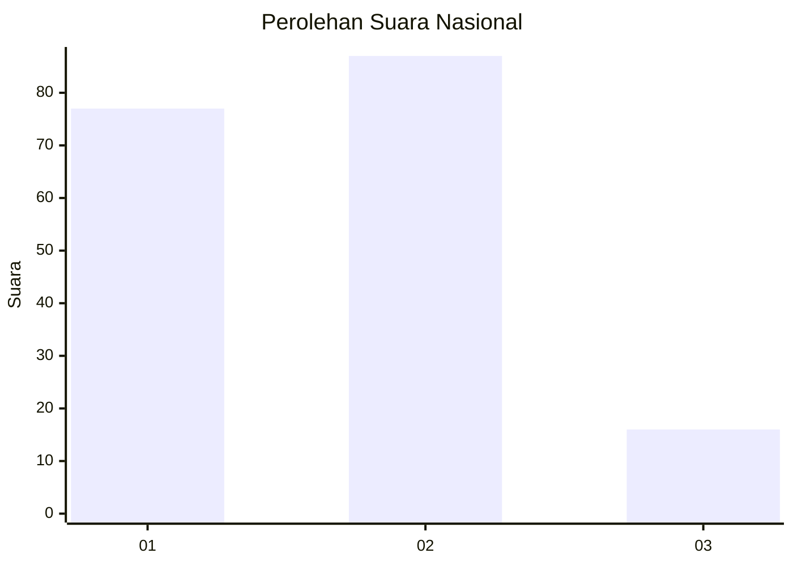
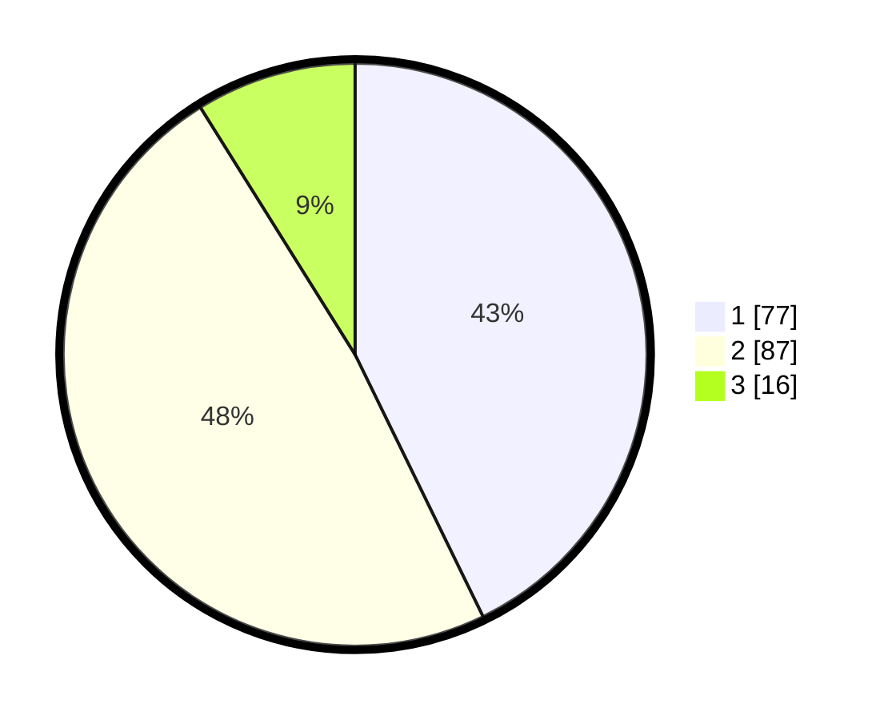

# Hasil

## Grafik

## Tabel

| No. | Nama Paslon    | Suara | Suara (raw) | Persentase |
|:--- |:-------------- | -----:| -----------:| ----------:|
| 1   | ANIES MUHAIMIN | 77    | [77][p-1]   | 42,78      |
| 2   | PRABOWO GIBRAN | 87    | [87][p-2]   | 48,33      |
| 3   | GANJAR MAHFUD  | 16    | [16][p-3]   | 8,89       |

[p-1]: https://github.com/gigit-pemilu/pemilu-2024/blob/main/pilpres/hitung-suara/sub/34-di-yogyakarta/sub/02-bantul/sub/15-sewon/sub/2001-pendowoharjo/sub/054-tps/sub/paslon-1.txt
[p-2]: https://github.com/gigit-pemilu/pemilu-2024/blob/main/pilpres/hitung-suara/sub/34-di-yogyakarta/sub/02-bantul/sub/15-sewon/sub/2001-pendowoharjo/sub/054-tps/sub/paslon-2.txt
[p-3]: https://github.com/gigit-pemilu/pemilu-2024/blob/main/pilpres/hitung-suara/sub/34-di-yogyakarta/sub/02-bantul/sub/15-sewon/sub/2001-pendowoharjo/sub/054-tps/sub/paslon-3.txt

## Foto C Plano

https://sirekap-obj-formc.kpu.go.id/4a8b/pemilu/ppwp/34/02/15/20/01/3402152001054-20240214-222454--74c04d79-9191-44f4-adf3-2ff0edaed7d0.jpg

https://sirekap-obj-formc.kpu.go.id/4a8b/pemilu/ppwp/34/02/15/20/01/3402152001054-20240214-222629--8256004f-c164-4910-ade5-413895107cd8.jpg

https://sirekap-obj-formc.kpu.go.id/4a8b/pemilu/ppwp/34/02/15/20/01/3402152001054-20240214-222742--1e6bde8b-a350-4edd-8367-51ef0029b90d.jpg

## Metadata

| Key        | Value               |
| ---------- | ------------------- |
| Time Stamp | 2024-02-25 11:00:00 |

