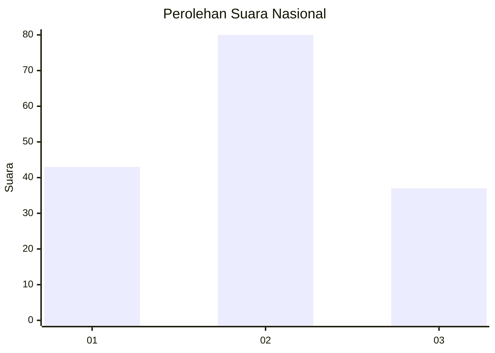
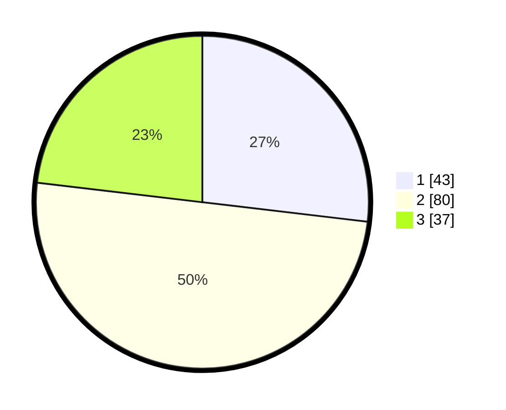

# Hasil

## Grafik

## Tabel

| No. | Nama Paslon    | Suara | Suara (raw) | Persentase |
|:--- |:-------------- | -----:| -----------:| ----------:|
| 1   | ANIES MUHAIMIN | 43    | [43][p-1]   | 26,88      |
| 2   | PRABOWO GIBRAN | 80    | [80][p-2]   | 50,00      |
| 3   | GANJAR MAHFUD  | 37    | [37][p-3]   | 23,13      |

[p-1]: https://github.com/gigit-pemilu/pemilu-2024/blob/main/pilpres/hitung-suara/sub/34-di-yogyakarta/sub/02-bantul/sub/15-sewon/sub/2001-pendowoharjo/sub/056-tps/sub/paslon-1.txt
[p-2]: https://github.com/gigit-pemilu/pemilu-2024/blob/main/pilpres/hitung-suara/sub/34-di-yogyakarta/sub/02-bantul/sub/15-sewon/sub/2001-pendowoharjo/sub/056-tps/sub/paslon-2.txt
[p-3]: https://github.com/gigit-pemilu/pemilu-2024/blob/main/pilpres/hitung-suara/sub/34-di-yogyakarta/sub/02-bantul/sub/15-sewon/sub/2001-pendowoharjo/sub/056-tps/sub/paslon-3.txt

## Foto C Plano

https://sirekap-obj-formc.kpu.go.id/6923/pemilu/ppwp/34/02/15/20/01/3402152001056-20240214-155715--ed21cb35-c303-452c-8f96-e847dd8f5c8e.jpg

https://sirekap-obj-formc.kpu.go.id/6923/pemilu/ppwp/34/02/15/20/01/3402152001056-20240214-155816--0e5159ac-3ae6-4c99-acd7-6f2bb3185130.jpg

https://sirekap-obj-formc.kpu.go.id/6923/pemilu/ppwp/34/02/15/20/01/3402152001056-20240214-155420--264f8d12-646f-454e-825e-e93277a750da.jpg

## Metadata

| Key        | Value               |
| ---------- | ------------------- |
| Time Stamp | 2024-02-15 20:30:46 |

## DATA PEMILIH TETAP

Jumlah pemilih dalam DPT: **201**.
 * L: **100**.
 * P: **101**.

## DATA PENGGUNA HAK PILIH

Jumlah pengguna hak pilih dalam DPT: **166**.
 * L: **84**.
 * P: **82**.

Jumlah pengguna hak pilih dalam DPTb: **0**.
 * L: **0**.
 * P: **0**.

Jumlah pengguna hak pilih dalam DPK: **0**.
 * L: **0**.
 * P: **0**.

Jumlah pengguna hak pilih: **166**.
 * L: **84**.
 * P: **82**.

## JUMLAH SUARA SAH DAN TIDAK SAH

