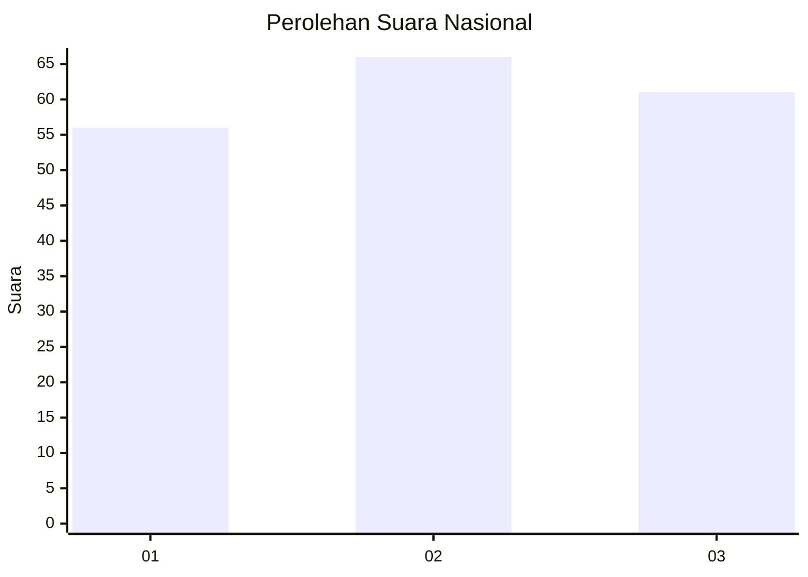
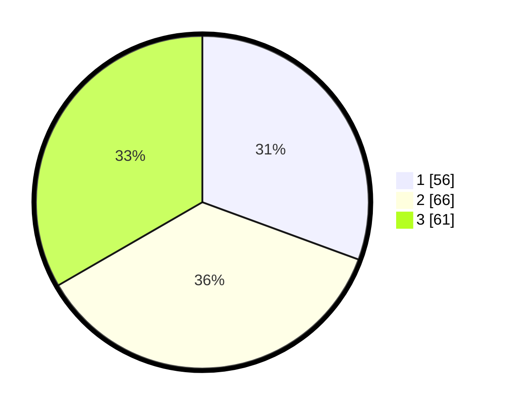

# Hasil

## Grafik

## Tabel

| No. | Nama Paslon    | Suara | Suara (raw) | Persentase |
|:--- |:-------------- | -----:| -----------:| ----------:|
| 1   | ANIES MUHAIMIN | 56    | [56][p-1]   | 30,60      |
| 2   | PRABOWO GIBRAN | 66    | [66][p-2]   | 36,07      |
| 3   | GANJAR MAHFUD  | 61    | [61][p-3]   | 33,33      |

[p-1]: https://github.com/gigit-pemilu/pemilu-2024/blob/main/pilpres/hitung-suara/sub/34-di-yogyakarta/sub/02-bantul/sub/15-sewon/sub/2001-pendowoharjo/sub/057-tps/sub/paslon-1.txt
[p-2]: https://github.com/gigit-pemilu/pemilu-2024/blob/main/pilpres/hitung-suara/sub/34-di-yogyakarta/sub/02-bantul/sub/15-sewon/sub/2001-pendowoharjo/sub/057-tps/sub/paslon-2.txt
[p-3]: https://github.com/gigit-pemilu/pemilu-2024/blob/main/pilpres/hitung-suara/sub/34-di-yogyakarta/sub/02-bantul/sub/15-sewon/sub/2001-pendowoharjo/sub/057-tps/sub/paslon-3.txt

## Foto C Plano

https://sirekap-obj-formc.kpu.go.id/e2ed/pemilu/ppwp/34/02/15/20/01/3402152001057-20240214-235327--eee5b166-3a91-4370-8cb1-b375ecbb06e7.jpg

https://sirekap-obj-formc.kpu.go.id/e2ed/pemilu/ppwp/34/02/15/20/01/3402152001057-20240214-235319--c994fa13-4f4d-4c34-a040-02e047c16214.jpg

https://sirekap-obj-formc.kpu.go.id/e2ed/pemilu/ppwp/34/02/15/20/01/3402152001057-20240214-235512--723b4ee2-587a-4c38-b355-887e2beb0dd8.jpg

## Metadata

| Key        | Value               |
| ---------- | ------------------- |
| Time Stamp | 2024-02-25 12:00:00 |

