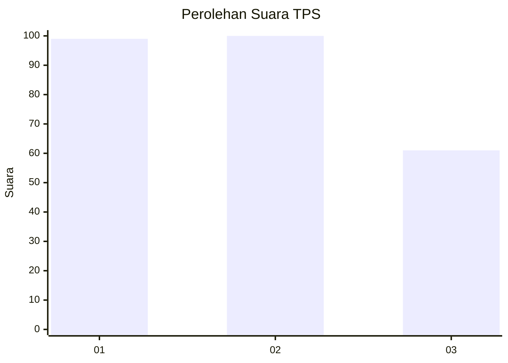
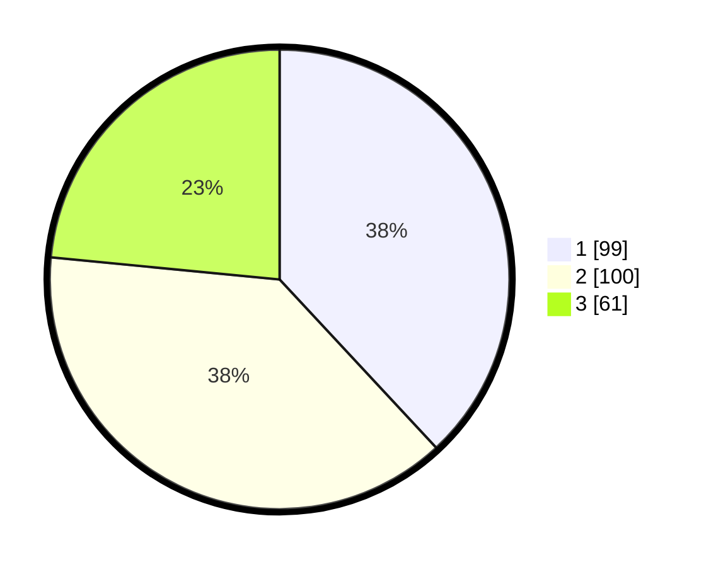

# Hasil

## Grafik

## Tabel

| No. | Nama Paslon    | Suara | Suara (raw) | Persentase |
|:--- |:-------------- | -----:| -----------:| ----------:|
| 1   | ANIES MUHAIMIN | 99    | [99][p-1]   | 38,08      |
| 2   | PRABOWO GIBRAN | 100   | [100][p-2]  | 38,46      |
| 3   | GANJAR MAHFUD  | 61    | [61][p-3]   | 23,46      |

[p-1]: https://github.com/gigit-pemilu/pemilu-2024-34-di-yogyakarta/blob/main/pilpres/hitung-suara/sub/34-di-yogyakarta/sub/02-bantul/sub/15-sewon/sub/2001-pendowoharjo/sub/058-tps/sub/paslon-1.txt
[p-2]: https://github.com/gigit-pemilu/pemilu-2024-34-di-yogyakarta/blob/main/pilpres/hitung-suara/sub/34-di-yogyakarta/sub/02-bantul/sub/15-sewon/sub/2001-pendowoharjo/sub/058-tps/sub/paslon-2.txt
[p-3]: https://github.com/gigit-pemilu/pemilu-2024-34-di-yogyakarta/blob/main/pilpres/hitung-suara/sub/34-di-yogyakarta/sub/02-bantul/sub/15-sewon/sub/2001-pendowoharjo/sub/058-tps/sub/paslon-3.txt

## Foto C Plano

https://sirekap-obj-formc.kpu.go.id/af00/pemilu/ppwp/34/02/15/20/01/3402152001058-20240214-214155--69ad3a33-a7d7-44e9-9a9e-4a6315a35bab.jpg

https://sirekap-obj-formc.kpu.go.id/af00/pemilu/ppwp/34/02/15/20/01/3402152001058-20240214-195253--b870dfe5-233b-4926-87ea-5f2fdbdd5770.jpg

https://sirekap-obj-formc.kpu.go.id/af00/pemilu/ppwp/34/02/15/20/01/3402152001058-20240214-214504--e7e76b6e-938c-419c-83db-4477af26bf36.jpg

## Metadata

| Key        | Value               |
| ---------- | ------------------- |
| Time Stamp | 2024-02-14 21:46:01 |

