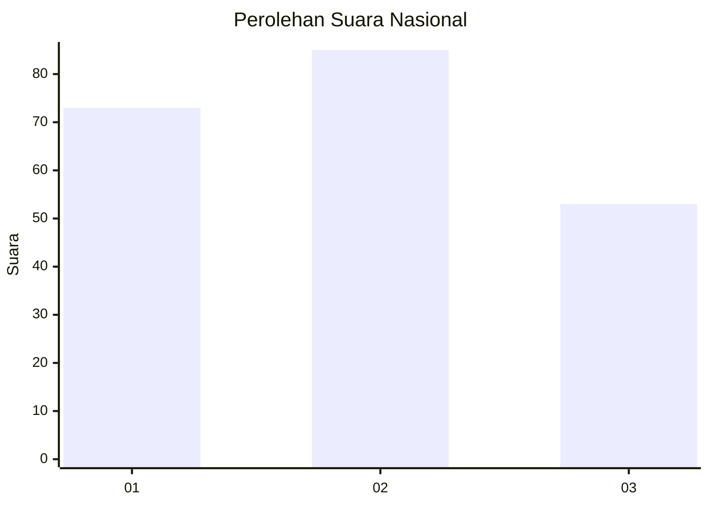
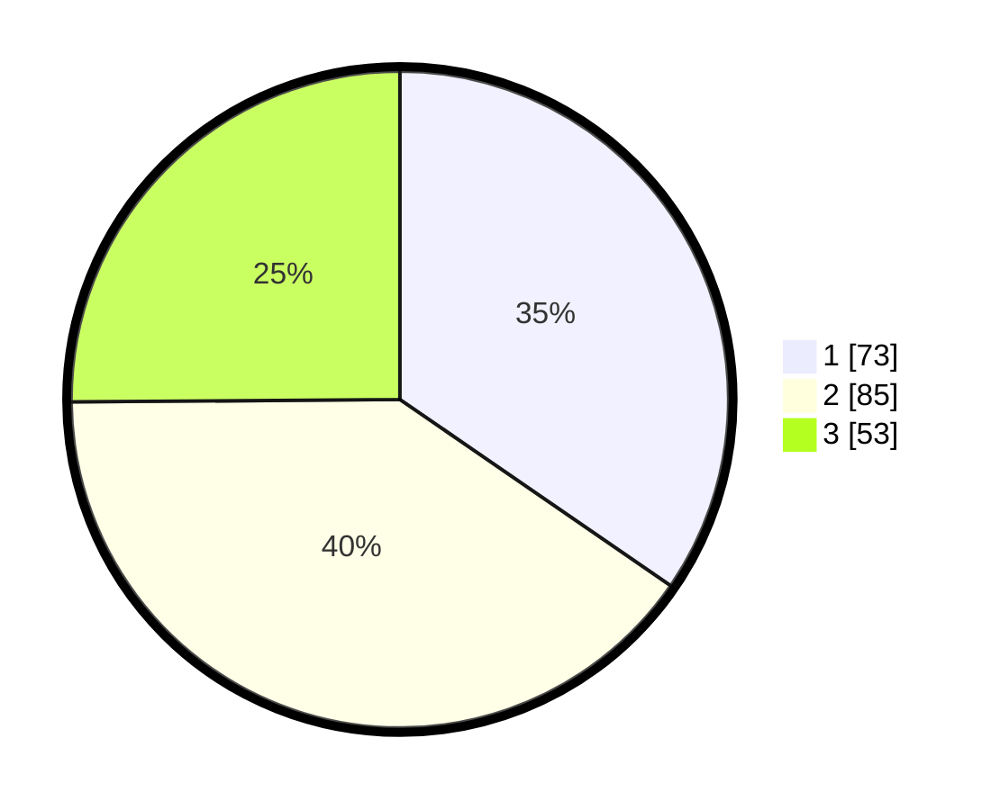

# Hasil

## Grafik

## Tabel

| No. | Nama Paslon    | Suara | Suara (raw) | Persentase |
|:--- |:-------------- | -----:| -----------:| ----------:|
| 1   | ANIES MUHAIMIN | 73    | [73][p-1]   | 34,60      |
| 2   | PRABOWO GIBRAN | 85    | [85][p-2]   | 40,28      |
| 3   | GANJAR MAHFUD  | 53    | [53][p-3]   | 25,12      |

[p-1]: https://github.com/gigit-pemilu/pemilu-2024/blob/main/pilpres/hitung-suara/sub/34-di-yogyakarta/sub/02-bantul/sub/15-sewon/sub/2001-pendowoharjo/sub/059-tps/sub/paslon-1.txt
[p-2]: https://github.com/gigit-pemilu/pemilu-2024/blob/main/pilpres/hitung-suara/sub/34-di-yogyakarta/sub/02-bantul/sub/15-sewon/sub/2001-pendowoharjo/sub/059-tps/sub/paslon-2.txt
[p-3]: https://github.com/gigit-pemilu/pemilu-2024/blob/main/pilpres/hitung-suara/sub/34-di-yogyakarta/sub/02-bantul/sub/15-sewon/sub/2001-pendowoharjo/sub/059-tps/sub/paslon-3.txt

## Foto C Plano

https://sirekap-obj-formc.kpu.go.id/6944/pemilu/ppwp/34/02/15/20/01/3402152001059-20240214-220916--6653561c-29d8-44ef-baac-a99e826f49fe.jpg

https://sirekap-obj-formc.kpu.go.id/6944/pemilu/ppwp/34/02/15/20/01/3402152001059-20240214-221012--12e3724d-844d-4d61-a25c-3cec28923c24.jpg

https://sirekap-obj-formc.kpu.go.id/6944/pemilu/ppwp/34/02/15/20/01/3402152001059-20240214-221106--91ef683d-dd7b-4393-bd70-da3a2a6d32db.jpg

## Metadata

| Key        | Value               |
| ---------- | ------------------- |
| Time Stamp | 2024-02-24 22:31:28 |

