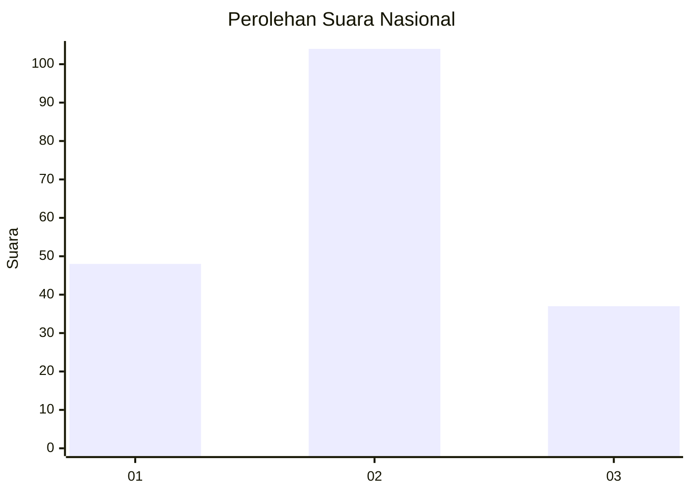
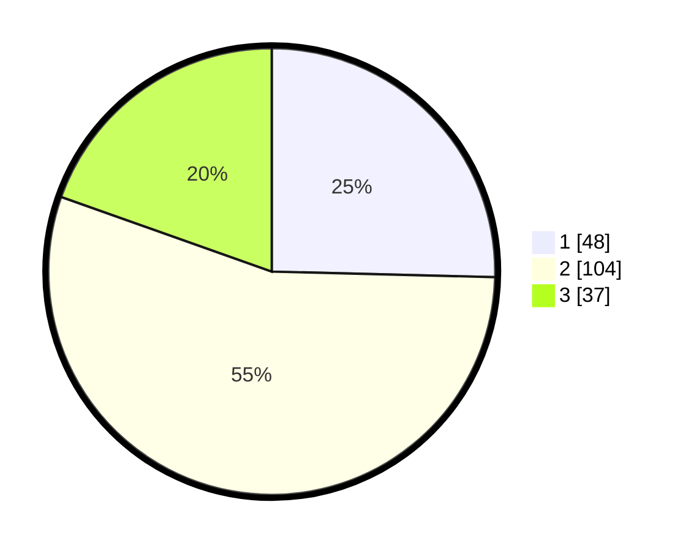

# Hasil

## Grafik

## Tabel

| No. | Nama Paslon    | Suara | Suara (raw) | Persentase |
|:--- |:-------------- | -----:| -----------:| ----------:|
| 1   | ANIES MUHAIMIN | 48    | [48][p-1]   | 25,40      |
| 2   | PRABOWO GIBRAN | 104   | [104][p-2]  | 55,03      |
| 3   | GANJAR MAHFUD  | 37    | [37][p-3]   | 19,58      |

[p-1]: https://github.com/gigit-pemilu/pemilu-2024/blob/main/pilpres/hitung-suara/sub/34-di-yogyakarta/sub/02-bantul/sub/15-sewon/sub/2001-pendowoharjo/sub/062-tps/sub/paslon-1.txt
[p-2]: https://github.com/gigit-pemilu/pemilu-2024/blob/main/pilpres/hitung-suara/sub/34-di-yogyakarta/sub/02-bantul/sub/15-sewon/sub/2001-pendowoharjo/sub/062-tps/sub/paslon-2.txt
[p-3]: https://github.com/gigit-pemilu/pemilu-2024/blob/main/pilpres/hitung-suara/sub/34-di-yogyakarta/sub/02-bantul/sub/15-sewon/sub/2001-pendowoharjo/sub/062-tps/sub/paslon-3.txt

## Foto C Plano

https://sirekap-obj-formc.kpu.go.id/0a8e/pemilu/ppwp/34/02/15/20/01/3402152001062-20240214-193647--fc32ff7a-a817-4b4d-be91-5d108b7abe86.jpg

https://sirekap-obj-formc.kpu.go.id/0a8e/pemilu/ppwp/34/02/15/20/01/3402152001062-20240214-193658--7436298c-c519-45bf-bf37-98191caad36e.jpg

https://sirekap-obj-formc.kpu.go.id/0a8e/pemilu/ppwp/34/02/15/20/01/3402152001062-20240214-203327--6154b9ee-f9c0-4f14-996e-0d96d6e754ef.jpg

## Metadata

| Key        | Value               |
| ---------- | ------------------- |
| Time Stamp | 2024-02-15 03:06:03 |

