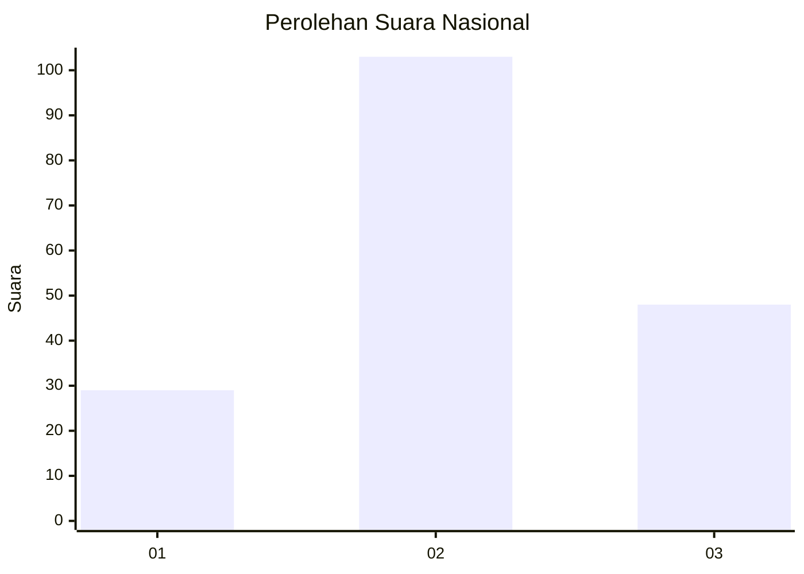
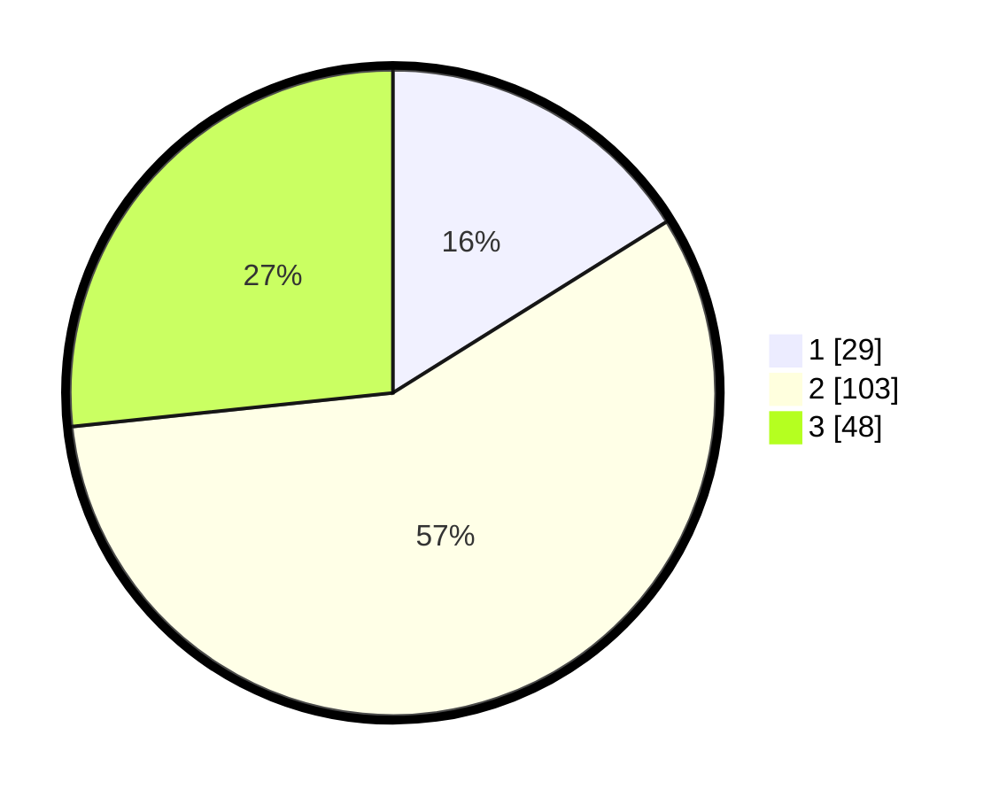

# Hasil

## Grafik

## Tabel

| No. | Nama Paslon    | Suara | Suara (raw) | Persentase |
|:--- |:-------------- | -----:| -----------:| ----------:|
| 1   | ANIES MUHAIMIN | 29    | [29][p-1]   | 16,11      |
| 2   | PRABOWO GIBRAN | 103   | [103][p-2]  | 57,22      |
| 3   | GANJAR MAHFUD  | 48    | [48][p-3]   | 26,67      |

[p-1]: https://github.com/gigit-pemilu/pemilu-2024/blob/main/pilpres/hitung-suara/sub/34-di-yogyakarta/sub/02-bantul/sub/15-sewon/sub/2001-pendowoharjo/sub/064-tps/sub/paslon-1.txt
[p-2]: https://github.com/gigit-pemilu/pemilu-2024/blob/main/pilpres/hitung-suara/sub/34-di-yogyakarta/sub/02-bantul/sub/15-sewon/sub/2001-pendowoharjo/sub/064-tps/sub/paslon-2.txt
[p-3]: https://github.com/gigit-pemilu/pemilu-2024/blob/main/pilpres/hitung-suara/sub/34-di-yogyakarta/sub/02-bantul/sub/15-sewon/sub/2001-pendowoharjo/sub/064-tps/sub/paslon-3.txt

## Foto C Plano

https://sirekap-obj-formc.kpu.go.id/81da/pemilu/ppwp/34/02/15/20/01/3402152001064-20240214-232404--13efaca8-ace7-453d-94a7-67792891f414.jpg

https://sirekap-obj-formc.kpu.go.id/81da/pemilu/ppwp/34/02/15/20/01/3402152001064-20240214-141510--4c08553a-9738-4303-814d-aec916f5e4c7.jpg

https://sirekap-obj-formc.kpu.go.id/81da/pemilu/ppwp/34/02/15/20/01/3402152001064-20240214-232616--02a58845-237c-4275-aa17-4acc947eb986.jpg

## Metadata

| Key        | Value               |
| ---------- | ------------------- |
| Time Stamp | 2024-02-25 00:00:00 |

