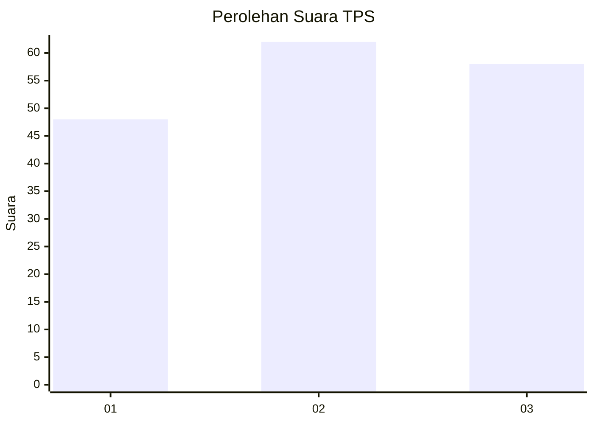
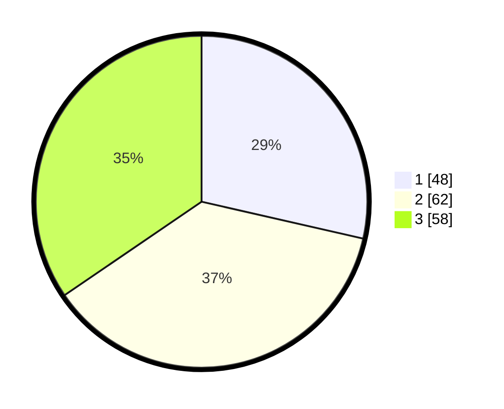

# Hasil

## Grafik

## Tabel

| No. | Nama Paslon    | Suara | Suara (raw) | Persentase |
|:--- |:-------------- | -----:| -----------:| ----------:|
| 1   | ANIES MUHAIMIN | 48    | [48][p-1]   | 28,57      |
| 2   | PRABOWO GIBRAN | 62    | [62][p-2]   | 36,90      |
| 3   | GANJAR MAHFUD  | 58    | [58][p-3]   | 34,52      |

[p-1]: https://github.com/gigit-pemilu/pemilu-2024-34-di-yogyakarta/blob/main/pilpres/hitung-suara/sub/34-di-yogyakarta/sub/02-bantul/sub/15-sewon/sub/2001-pendowoharjo/sub/065-tps/sub/paslon-1.txt
[p-2]: https://github.com/gigit-pemilu/pemilu-2024-34-di-yogyakarta/blob/main/pilpres/hitung-suara/sub/34-di-yogyakarta/sub/02-bantul/sub/15-sewon/sub/2001-pendowoharjo/sub/065-tps/sub/paslon-2.txt
[p-3]: https://github.com/gigit-pemilu/pemilu-2024-34-di-yogyakarta/blob/main/pilpres/hitung-suara/sub/34-di-yogyakarta/sub/02-bantul/sub/15-sewon/sub/2001-pendowoharjo/sub/065-tps/sub/paslon-3.txt

## Foto C Plano

https://sirekap-obj-formc.kpu.go.id/5926/pemilu/ppwp/34/02/15/20/01/3402152001065-20240214-232053--5d87e54f-d532-4b24-9f9b-e52fcd590a79.jpg

https://sirekap-obj-formc.kpu.go.id/5926/pemilu/ppwp/34/02/15/20/01/3402152001065-20240214-232142--7ca14ae5-2613-4a1e-a646-73bf81e9dc78.jpg

https://sirekap-obj-formc.kpu.go.id/5926/pemilu/ppwp/34/02/15/20/01/3402152001065-20240214-232233--926652ee-c59f-40eb-a390-6f929e4c6adb.jpg

## Metadata

| Key        | Value               |
| ---------- | ------------------- |
| Time Stamp | 2024-02-24 22:31:28 |

