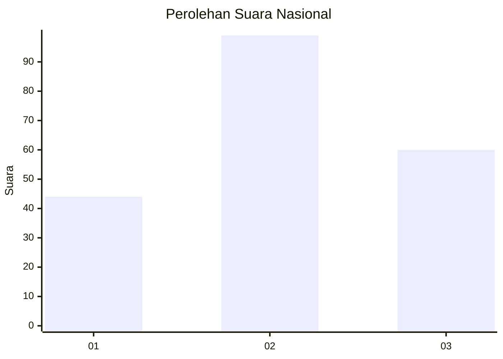
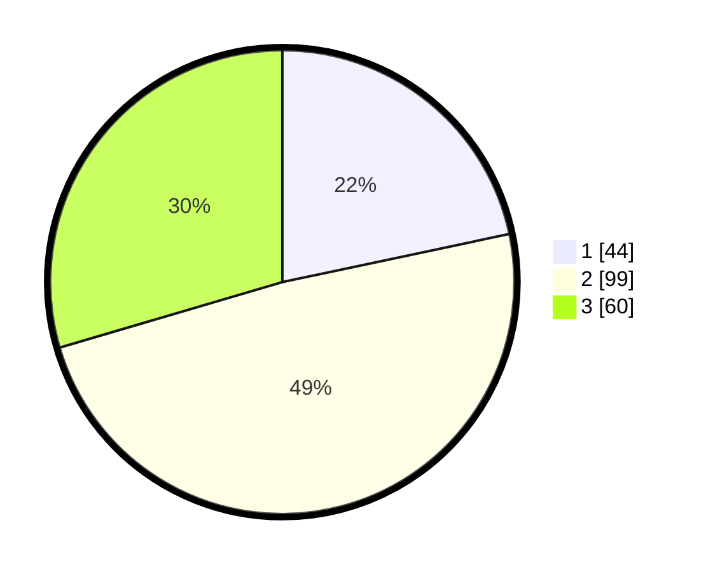

# Hasil

## Grafik

## Tabel

| No. | Nama Paslon    | Suara | Suara (raw) | Persentase |
|:--- |:-------------- | -----:| -----------:| ----------:|
| 1   | ANIES MUHAIMIN | 44    | [44][p-1]   | 21,67      |
| 2   | PRABOWO GIBRAN | 99    | [99][p-2]   | 48,77      |
| 3   | GANJAR MAHFUD  | 60    | [60][p-3]   | 29,56      |

[p-1]: https://github.com/gigit-pemilu/pemilu-2024/blob/main/pilpres/hitung-suara/sub/34-di-yogyakarta/sub/02-bantul/sub/15-sewon/sub/2001-pendowoharjo/sub/066-tps/sub/paslon-1.txt
[p-2]: https://github.com/gigit-pemilu/pemilu-2024/blob/main/pilpres/hitung-suara/sub/34-di-yogyakarta/sub/02-bantul/sub/15-sewon/sub/2001-pendowoharjo/sub/066-tps/sub/paslon-2.txt
[p-3]: https://github.com/gigit-pemilu/pemilu-2024/blob/main/pilpres/hitung-suara/sub/34-di-yogyakarta/sub/02-bantul/sub/15-sewon/sub/2001-pendowoharjo/sub/066-tps/sub/paslon-3.txt

## Foto C Plano

https://sirekap-obj-formc.kpu.go.id/9500/pemilu/ppwp/34/02/15/20/01/3402152001066-20240214-224130--5f9de3ef-9db3-4222-a187-2af40bb4f575.jpg

https://sirekap-obj-formc.kpu.go.id/9500/pemilu/ppwp/34/02/15/20/01/3402152001066-20240214-224155--4d68c91d-c8c0-4705-be0a-3197da73a1ac.jpg

https://sirekap-obj-formc.kpu.go.id/9500/pemilu/ppwp/34/02/15/20/01/3402152001066-20240214-224315--96656bdd-e0a7-472c-8761-cb74c52abbee.jpg

## Metadata

| Key        | Value               |
| ---------- | ------------------- |
| Time Stamp | 2024-02-24 22:31:28 |

