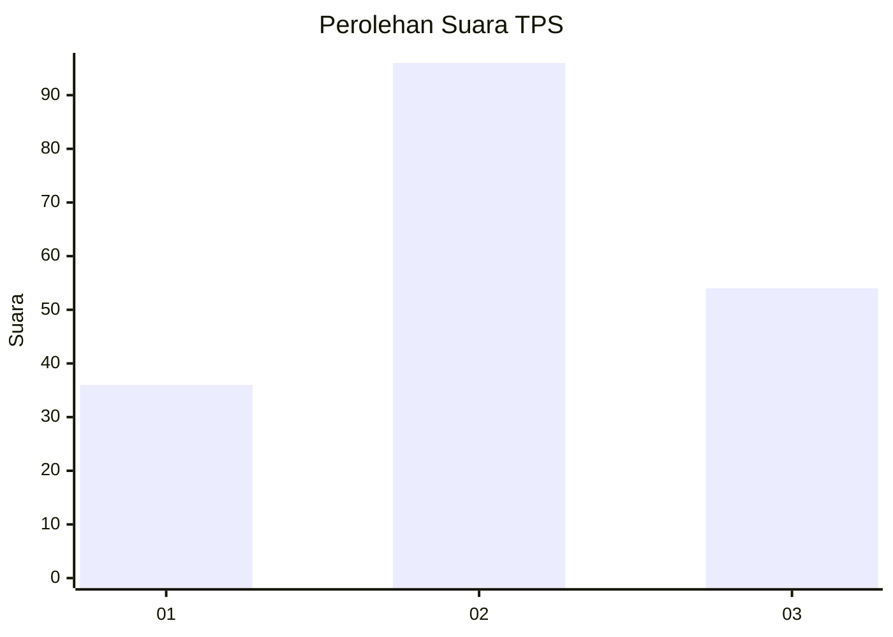
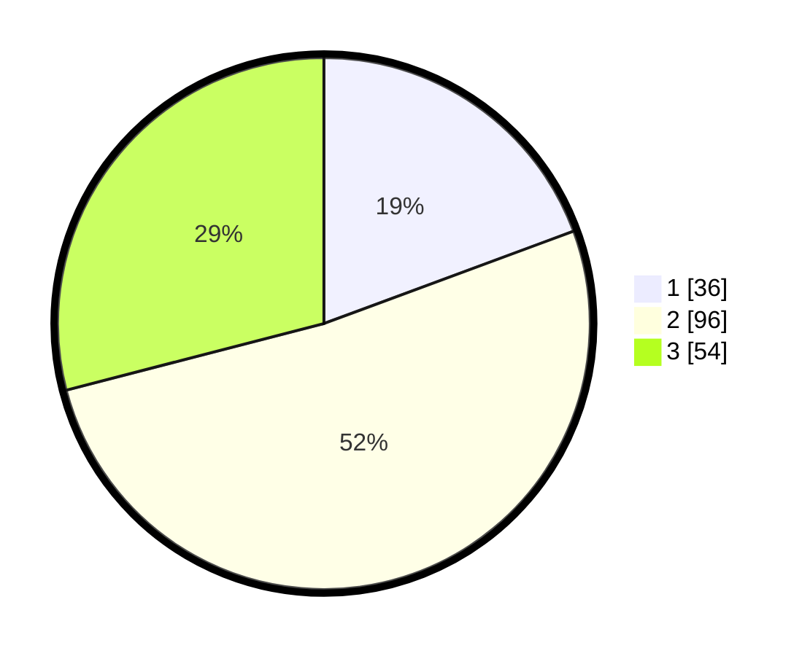

# Hasil

## Grafik

## Tabel

| No. | Nama Paslon    | Suara | Suara (raw) | Persentase |
|:--- |:-------------- | -----:| -----------:| ----------:|
| 1   | ANIES MUHAIMIN | 36    | [36][p-1]   | 19,35      |
| 2   | PRABOWO GIBRAN | 96    | [96][p-2]   | 51,61      |
| 3   | GANJAR MAHFUD  | 54    | [54][p-3]   | 29,03      |

[p-1]: https://github.com/gigit-pemilu/pemilu-2024-34-di-yogyakarta/blob/main/pilpres/hitung-suara/sub/34-di-yogyakarta/sub/02-bantul/sub/15-sewon/sub/2001-pendowoharjo/sub/067-tps/sub/paslon-1.txt
[p-2]: https://github.com/gigit-pemilu/pemilu-2024-34-di-yogyakarta/blob/main/pilpres/hitung-suara/sub/34-di-yogyakarta/sub/02-bantul/sub/15-sewon/sub/2001-pendowoharjo/sub/067-tps/sub/paslon-2.txt
[p-3]: https://github.com/gigit-pemilu/pemilu-2024-34-di-yogyakarta/blob/main/pilpres/hitung-suara/sub/34-di-yogyakarta/sub/02-bantul/sub/15-sewon/sub/2001-pendowoharjo/sub/067-tps/sub/paslon-3.txt

## Foto C Plano

https://sirekap-obj-formc.kpu.go.id/c66e/pemilu/ppwp/34/02/15/20/01/3402152001067-20240214-213554--c774276b-9da5-4701-a562-609843399e3d.jpg

https://sirekap-obj-formc.kpu.go.id/c66e/pemilu/ppwp/34/02/15/20/01/3402152001067-20240214-213732--bfdb4118-371a-4448-90c7-4a37d1f8ea0b.jpg

https://sirekap-obj-formc.kpu.go.id/c66e/pemilu/ppwp/34/02/15/20/01/3402152001067-20240214-205448--5c75c376-8b4b-4973-8572-1495c42c4ef0.jpg

## Metadata

| Key        | Value               |
| ---------- | ------------------- |
| Time Stamp | 2024-02-24 22:31:28 |

