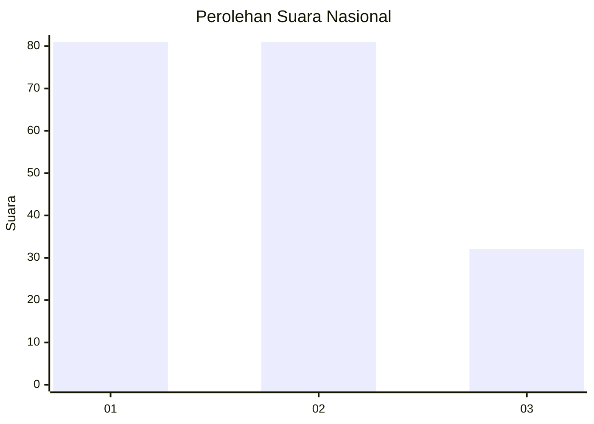
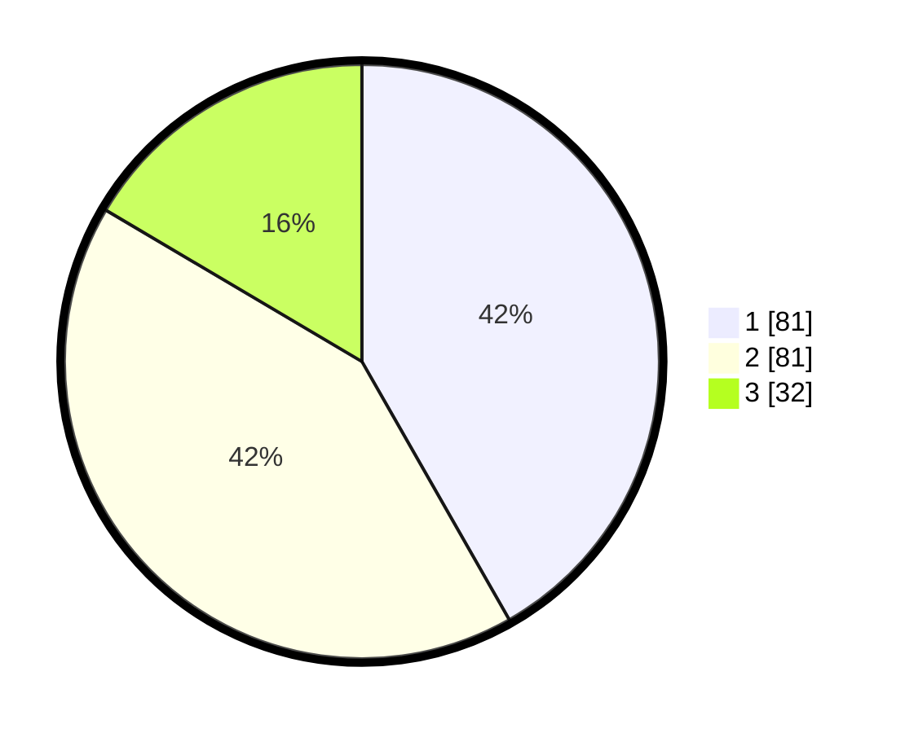

# Hasil

## Grafik

## Tabel

| No. | Nama Paslon    | Suara | Suara (raw) | Persentase |
|:--- |:-------------- | -----:| -----------:| ----------:|
| 1   | ANIES MUHAIMIN | 81    | [81][p-1]   | 41,75      |
| 2   | PRABOWO GIBRAN | 81    | [81][p-2]   | 41,75      |
| 3   | GANJAR MAHFUD  | 32    | [32][p-3]   | 16,49      |

[p-1]: https://github.com/gigit-pemilu/pemilu-2024/blob/main/pilpres/hitung-suara/sub/34-di-yogyakarta/sub/02-bantul/sub/15-sewon/sub/2001-pendowoharjo/sub/072-tps/sub/paslon-1.txt
[p-2]: https://github.com/gigit-pemilu/pemilu-2024/blob/main/pilpres/hitung-suara/sub/34-di-yogyakarta/sub/02-bantul/sub/15-sewon/sub/2001-pendowoharjo/sub/072-tps/sub/paslon-2.txt
[p-3]: https://github.com/gigit-pemilu/pemilu-2024/blob/main/pilpres/hitung-suara/sub/34-di-yogyakarta/sub/02-bantul/sub/15-sewon/sub/2001-pendowoharjo/sub/072-tps/sub/paslon-3.txt

## Foto C Plano

https://sirekap-obj-formc.kpu.go.id/816b/pemilu/ppwp/34/02/15/20/01/3402152001072-20240214-213305--23e4d007-6726-4a69-bb13-8ec68ba189fe.jpg

https://sirekap-obj-formc.kpu.go.id/816b/pemilu/ppwp/34/02/15/20/01/3402152001072-20240214-213400--be130411-31f4-4992-a6f1-a34316a681cd.jpg

https://sirekap-obj-formc.kpu.go.id/816b/pemilu/ppwp/34/02/15/20/01/3402152001072-20240214-213441--d298bf3c-9b13-4f42-ad1f-b655c2027048.jpg

## Metadata

| Key        | Value               |
| ---------- | ------------------- |
| Time Stamp | 2024-02-24 22:31:28 |

