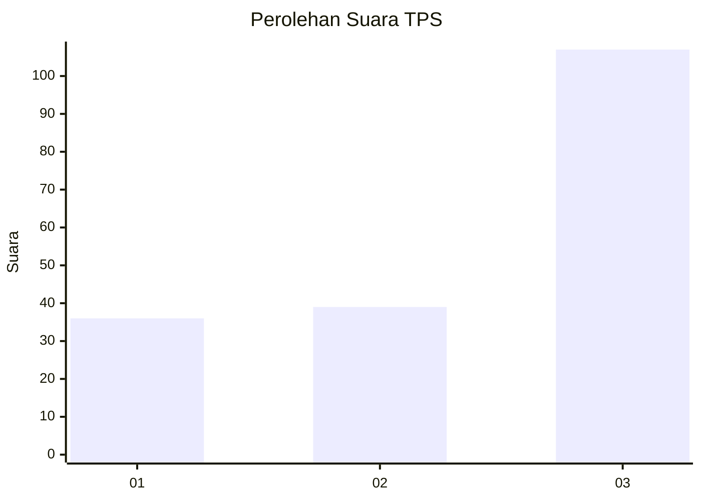
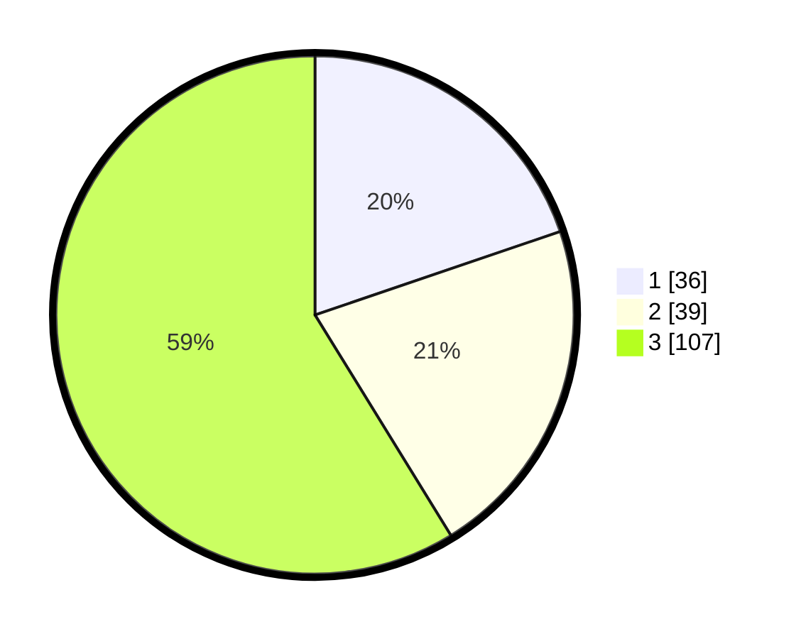

# Hasil

## Grafik

## Tabel

| No. | Nama Paslon    | Suara | Suara (raw) | Persentase |
|:--- |:-------------- | -----:| -----------:| ----------:|
| 1   | ANIES MUHAIMIN | 36    | [36][p-1]   | 19,78      |
| 2   | PRABOWO GIBRAN | 39    | [39][p-2]   | 21,43      |
| 3   | GANJAR MAHFUD  | 107   | [107][p-3]  | 58,79      |

[p-1]: https://github.com/gigit-pemilu/pemilu-2024-34-di-yogyakarta/blob/main/pilpres/hitung-suara/sub/34-di-yogyakarta/sub/02-bantul/sub/15-sewon/sub/2001-pendowoharjo/sub/904-tps/sub/paslon-1.txt
[p-2]: https://github.com/gigit-pemilu/pemilu-2024-34-di-yogyakarta/blob/main/pilpres/hitung-suara/sub/34-di-yogyakarta/sub/02-bantul/sub/15-sewon/sub/2001-pendowoharjo/sub/904-tps/sub/paslon-2.txt
[p-3]: https://github.com/gigit-pemilu/pemilu-2024-34-di-yogyakarta/blob/main/pilpres/hitung-suara/sub/34-di-yogyakarta/sub/02-bantul/sub/15-sewon/sub/2001-pendowoharjo/sub/904-tps/sub/paslon-3.txt

## Foto C Plano

https://sirekap-obj-formc.kpu.go.id/727d/pemilu/ppwp/34/02/15/20/01/3402152001904-20240214-185914--65b41006-9ada-40b2-956b-da2bd45e5d0a.jpg

https://sirekap-obj-formc.kpu.go.id/727d/pemilu/ppwp/34/02/15/20/01/3402152001904-20240214-190257--eb68e905-3c46-4094-885a-b2855a9dc1e4.jpg

https://sirekap-obj-formc.kpu.go.id/727d/pemilu/ppwp/34/02/15/20/01/3402152001904-20240214-213539--764f04c8-1853-4f49-b1a0-0cfc5d0967ad.jpg

## Metadata

| Key        | Value               |
| ---------- | ------------------- |
| Time Stamp | 2024-02-14 21:46:01 |

