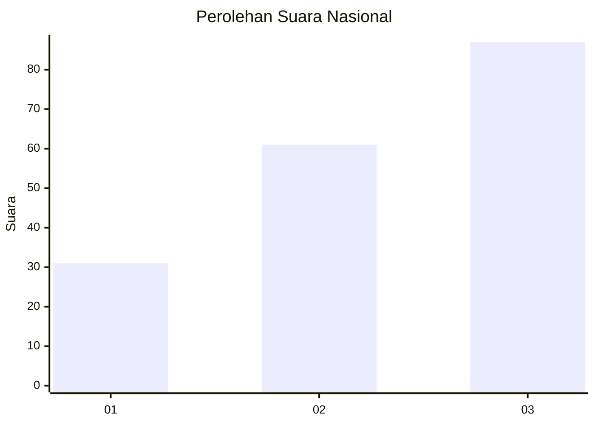
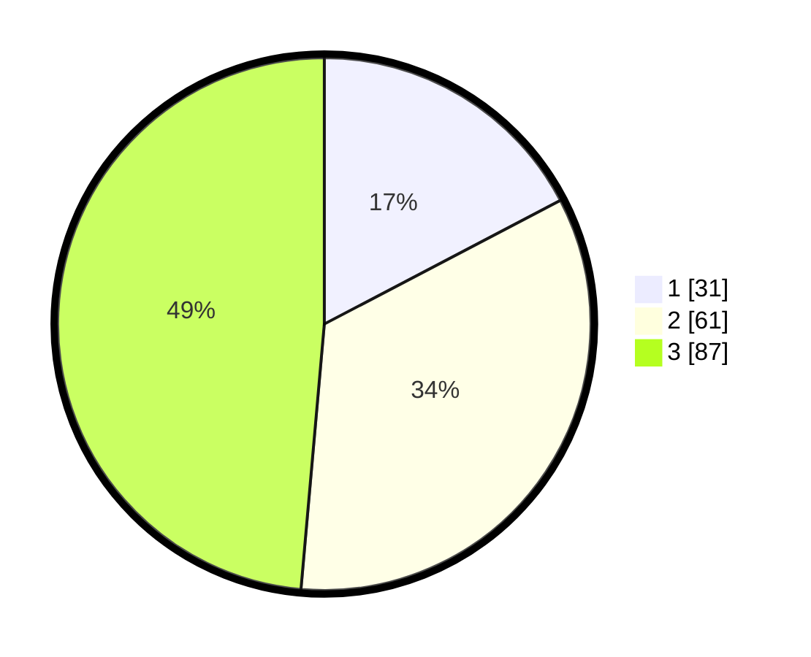

# Hasil

## Grafik

## Tabel

| No. | Nama Paslon    | Suara | Suara (raw) | Persentase |
|:--- |:-------------- | -----:| -----------:| ----------:|
| 1   | ANIES MUHAIMIN | 31    | [31][p-1]   | 17,32      |
| 2   | PRABOWO GIBRAN | 61    | [61][p-2]   | 34,08      |
| 3   | GANJAR MAHFUD  | 87    | [87][p-3]   | 48,60      |

[p-1]: https://github.com/gigit-pemilu/pemilu-2024/blob/main/pilpres/hitung-suara/sub/34-di-yogyakarta/sub/02-bantul/sub/15-sewon/sub/2001-pendowoharjo/sub/905-tps/sub/paslon-1.txt
[p-2]: https://github.com/gigit-pemilu/pemilu-2024/blob/main/pilpres/hitung-suara/sub/34-di-yogyakarta/sub/02-bantul/sub/15-sewon/sub/2001-pendowoharjo/sub/905-tps/sub/paslon-2.txt
[p-3]: https://github.com/gigit-pemilu/pemilu-2024/blob/main/pilpres/hitung-suara/sub/34-di-yogyakarta/sub/02-bantul/sub/15-sewon/sub/2001-pendowoharjo/sub/905-tps/sub/paslon-3.txt

## Foto C Plano

https://sirekap-obj-formc.kpu.go.id/a478/pemilu/ppwp/34/02/15/20/01/3402152001905-20240214-212701--355848a0-e2e2-4145-add2-cab9db9882ee.jpg

https://sirekap-obj-formc.kpu.go.id/a478/pemilu/ppwp/34/02/15/20/01/3402152001905-20240214-212707--7b54a1bd-175f-4306-8410-5545b0d92229.jpg

https://sirekap-obj-formc.kpu.go.id/a478/pemilu/ppwp/34/02/15/20/01/3402152001905-20240214-212722--3a0e2891-860e-4c90-b81e-081f73534ca5.jpg

## Metadata

| Key        | Value               |
| ---------- | ------------------- |
| Time Stamp | 2024-02-24 22:31:28 |

