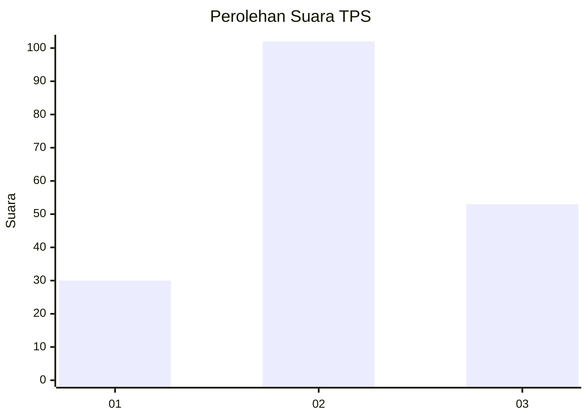
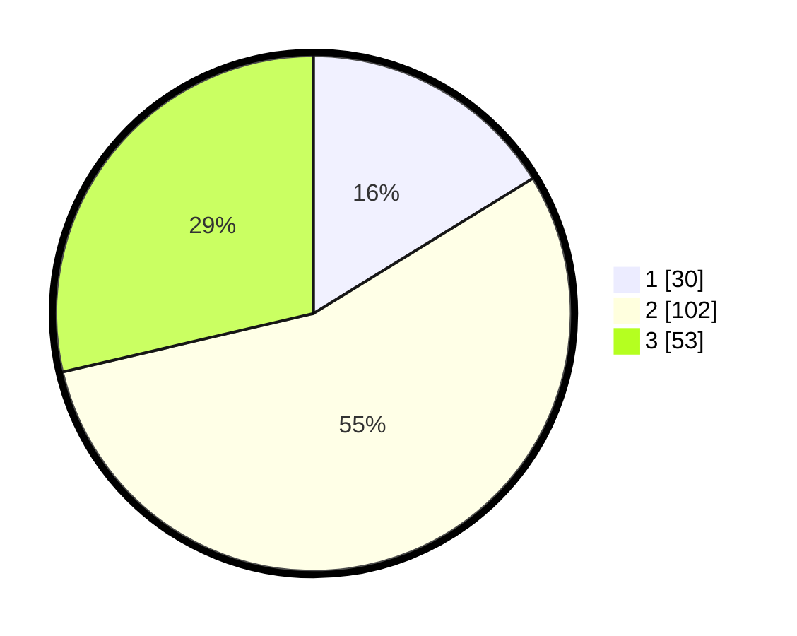

# Hasil

## Grafik

## Tabel

| No. | Nama Paslon    | Suara | Suara (raw) | Persentase |
|:--- |:-------------- | -----:| -----------:| ----------:|
| 1   | ANIES MUHAIMIN | 30    | [30][p-1]   | 16,22      |
| 2   | PRABOWO GIBRAN | 102   | [102][p-2]  | 55,14      |
| 3   | GANJAR MAHFUD  | 53    | [53][p-3]   | 28,65      |

[p-1]: https://github.com/gigit-pemilu/pemilu-2024-34-di-yogyakarta/blob/main/pilpres/hitung-suara/sub/34-di-yogyakarta/sub/02-bantul/sub/15-sewon/sub/2002-timbulharjo/sub/001-tps/sub/paslon-1.txt
[p-2]: https://github.com/gigit-pemilu/pemilu-2024-34-di-yogyakarta/blob/main/pilpres/hitung-suara/sub/34-di-yogyakarta/sub/02-bantul/sub/15-sewon/sub/2002-timbulharjo/sub/001-tps/sub/paslon-2.txt
[p-3]: https://github.com/gigit-pemilu/pemilu-2024-34-di-yogyakarta/blob/main/pilpres/hitung-suara/sub/34-di-yogyakarta/sub/02-bantul/sub/15-sewon/sub/2002-timbulharjo/sub/001-tps/sub/paslon-3.txt

## Foto C Plano

https://sirekap-obj-formc.kpu.go.id/0ee1/pemilu/ppwp/34/02/15/20/02/3402152002001-20240214-215634--586ef23c-182d-4319-b8a5-205ac984f650.jpg

https://sirekap-obj-formc.kpu.go.id/0ee1/pemilu/ppwp/34/02/15/20/02/3402152002001-20240214-220043--f0b40111-1d99-4dac-aaf2-4c71b65da450.jpg

https://sirekap-obj-formc.kpu.go.id/0ee1/pemilu/ppwp/34/02/15/20/02/3402152002001-20240214-220319--2a5c92b2-d980-4551-871b-c2820221d67a.jpg

## Metadata

| Key        | Value               |
| ---------- | ------------------- |
| Time Stamp | 2024-02-24 22:31:28 |

