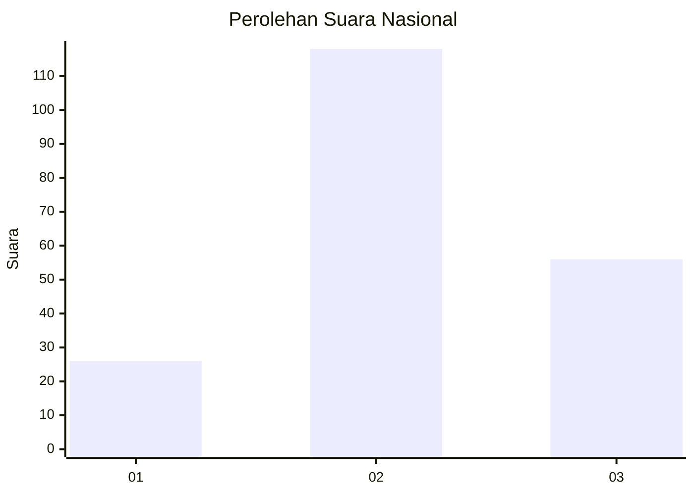
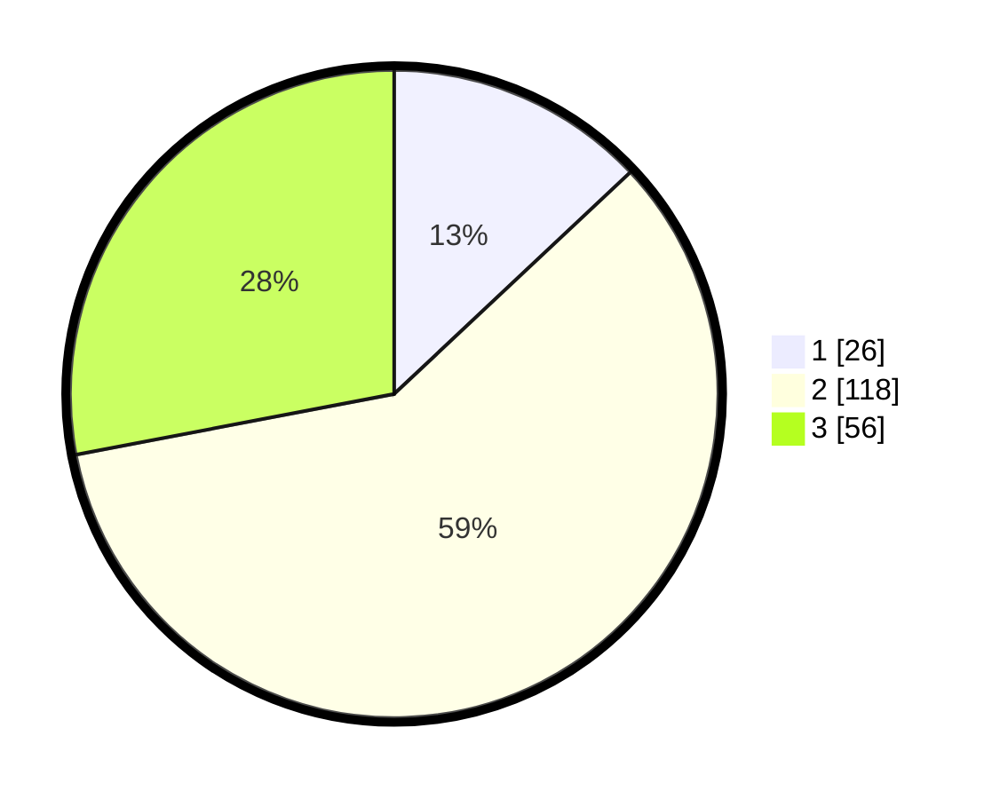

# Hasil

## Grafik

## Tabel

| No. | Nama Paslon    | Suara | Suara (raw) | Persentase |
|:--- |:-------------- | -----:| -----------:| ----------:|
| 1   | ANIES MUHAIMIN | 26    | [26][p-1]   | 13,00      |
| 2   | PRABOWO GIBRAN | 118   | [118][p-2]  | 59,00      |
| 3   | GANJAR MAHFUD  | 56    | [56][p-3]   | 28,00      |

[p-1]: https://github.com/gigit-pemilu/pemilu-2024/blob/main/pilpres/hitung-suara/sub/34-di-yogyakarta/sub/02-bantul/sub/15-sewon/sub/2002-timbulharjo/sub/003-tps/sub/paslon-1.txt
[p-2]: https://github.com/gigit-pemilu/pemilu-2024/blob/main/pilpres/hitung-suara/sub/34-di-yogyakarta/sub/02-bantul/sub/15-sewon/sub/2002-timbulharjo/sub/003-tps/sub/paslon-2.txt
[p-3]: https://github.com/gigit-pemilu/pemilu-2024/blob/main/pilpres/hitung-suara/sub/34-di-yogyakarta/sub/02-bantul/sub/15-sewon/sub/2002-timbulharjo/sub/003-tps/sub/paslon-3.txt

## Foto C Plano

https://sirekap-obj-formc.kpu.go.id/b086/pemilu/ppwp/34/02/15/20/02/3402152002003-20240214-213302--bc2c1e73-00a3-4f9e-8635-57b5d8991d04.jpg

https://sirekap-obj-formc.kpu.go.id/b086/pemilu/ppwp/34/02/15/20/02/3402152002003-20240214-215012--952aa558-d3f9-43bd-bfe5-c8c30142bec4.jpg

https://sirekap-obj-formc.kpu.go.id/b086/pemilu/ppwp/34/02/15/20/02/3402152002003-20240214-214857--656067a8-0116-4408-b1d8-3bf03b33ef70.jpg

## Metadata

| Key        | Value               |
| ---------- | ------------------- |
| Time Stamp | 2024-02-24 22:31:28 |

