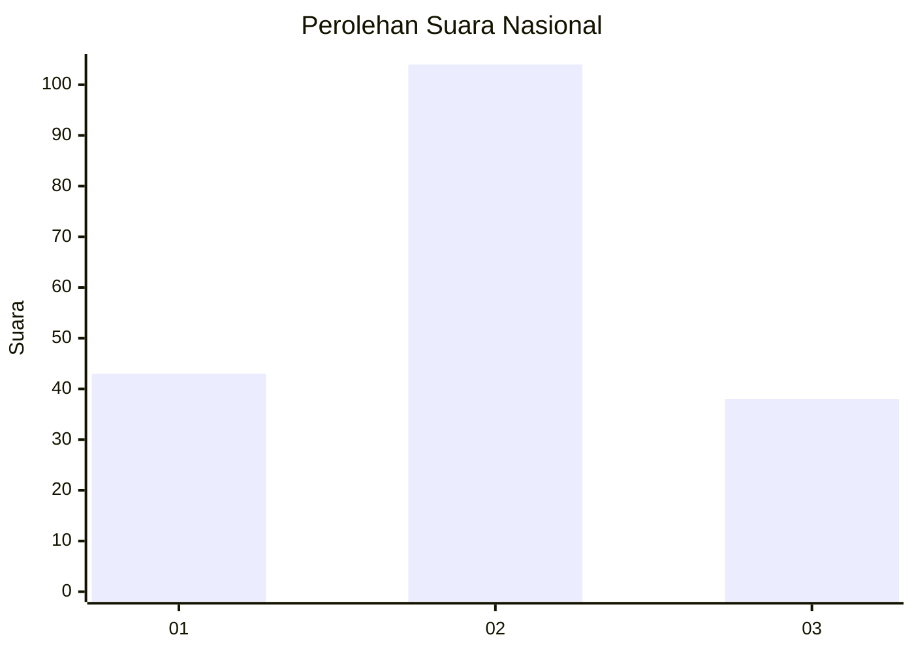
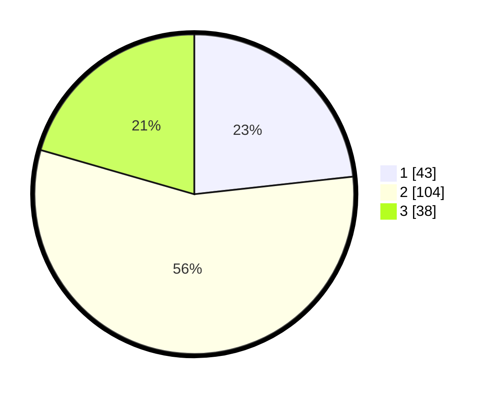

# Hasil

## Grafik

## Tabel

| No. | Nama Paslon    | Suara | Suara (raw) | Persentase |
|:--- |:-------------- | -----:| -----------:| ----------:|
| 1   | ANIES MUHAIMIN | 43    | [43][p-1]   | 23,24      |
| 2   | PRABOWO GIBRAN | 104   | [104][p-2]  | 56,22      |
| 3   | GANJAR MAHFUD  | 38    | [38][p-3]   | 20,54      |

[p-1]: https://github.com/gigit-pemilu/pemilu-2024/blob/main/pilpres/hitung-suara/sub/34-di-yogyakarta/sub/02-bantul/sub/15-sewon/sub/2002-timbulharjo/sub/004-tps/sub/paslon-1.txt
[p-2]: https://github.com/gigit-pemilu/pemilu-2024/blob/main/pilpres/hitung-suara/sub/34-di-yogyakarta/sub/02-bantul/sub/15-sewon/sub/2002-timbulharjo/sub/004-tps/sub/paslon-2.txt
[p-3]: https://github.com/gigit-pemilu/pemilu-2024/blob/main/pilpres/hitung-suara/sub/34-di-yogyakarta/sub/02-bantul/sub/15-sewon/sub/2002-timbulharjo/sub/004-tps/sub/paslon-3.txt

## Foto C Plano

https://sirekap-obj-formc.kpu.go.id/3633/pemilu/ppwp/34/02/15/20/02/3402152002004-20240214-231034--42404c0b-5869-4dc7-9958-671453535dfa.jpg

https://sirekap-obj-formc.kpu.go.id/3633/pemilu/ppwp/34/02/15/20/02/3402152002004-20240214-231054--b7ea40f6-902d-45e3-a576-8058b212a1ac.jpg

https://sirekap-obj-formc.kpu.go.id/3633/pemilu/ppwp/34/02/15/20/02/3402152002004-20240214-231356--774e1cca-660b-416a-9fa7-f1b82674ec36.jpg

## Metadata

| Key        | Value               |
| ---------- | ------------------- |
| Time Stamp | 2024-02-24 22:31:28 |

