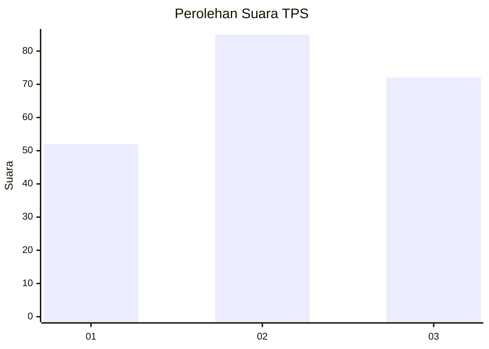
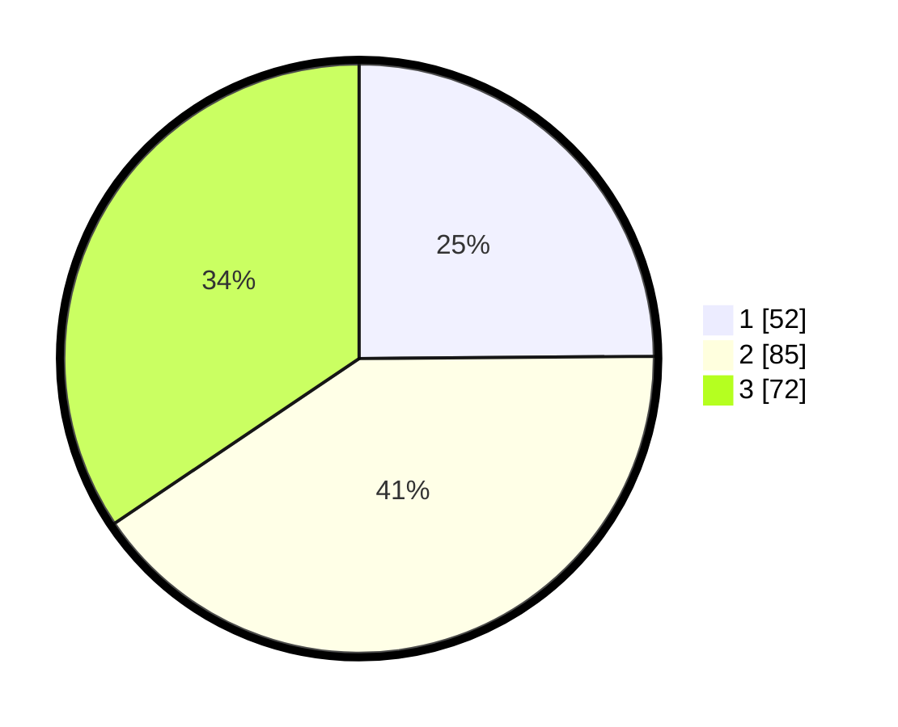

# Hasil

## Grafik

## Tabel

| No. | Nama Paslon    | Suara | Suara (raw) | Persentase |
|:--- |:-------------- | -----:| -----------:| ----------:|
| 1   | ANIES MUHAIMIN | 52    | [52][p-1]   | 24,88      |
| 2   | PRABOWO GIBRAN | 85    | [85][p-2]   | 40,67      |
| 3   | GANJAR MAHFUD  | 72    | [72][p-3]   | 34,45      |

[p-1]: https://github.com/gigit-pemilu/pemilu-2024-34-di-yogyakarta/blob/main/pilpres/hitung-suara/sub/34-di-yogyakarta/sub/02-bantul/sub/15-sewon/sub/2002-timbulharjo/sub/005-tps/sub/paslon-1.txt
[p-2]: https://github.com/gigit-pemilu/pemilu-2024-34-di-yogyakarta/blob/main/pilpres/hitung-suara/sub/34-di-yogyakarta/sub/02-bantul/sub/15-sewon/sub/2002-timbulharjo/sub/005-tps/sub/paslon-2.txt
[p-3]: https://github.com/gigit-pemilu/pemilu-2024-34-di-yogyakarta/blob/main/pilpres/hitung-suara/sub/34-di-yogyakarta/sub/02-bantul/sub/15-sewon/sub/2002-timbulharjo/sub/005-tps/sub/paslon-3.txt

## Foto C Plano

https://sirekap-obj-formc.kpu.go.id/dffd/pemilu/ppwp/34/02/15/20/02/3402152002005-20240215-050712--98991aee-fad9-438e-8738-7c5e6f2fb29f.jpg

https://sirekap-obj-formc.kpu.go.id/dffd/pemilu/ppwp/34/02/15/20/02/3402152002005-20240215-050800--b4eb0c03-8cac-436b-807f-de95875d144c.jpg

https://sirekap-obj-formc.kpu.go.id/dffd/pemilu/ppwp/34/02/15/20/02/3402152002005-20240215-050911--cbfb5c8c-8a35-4f6d-87f8-ca13cb98eba4.jpg

## Metadata

| Key        | Value               |
| ---------- | ------------------- |
| Time Stamp | 2024-02-25 15:00:00 |

