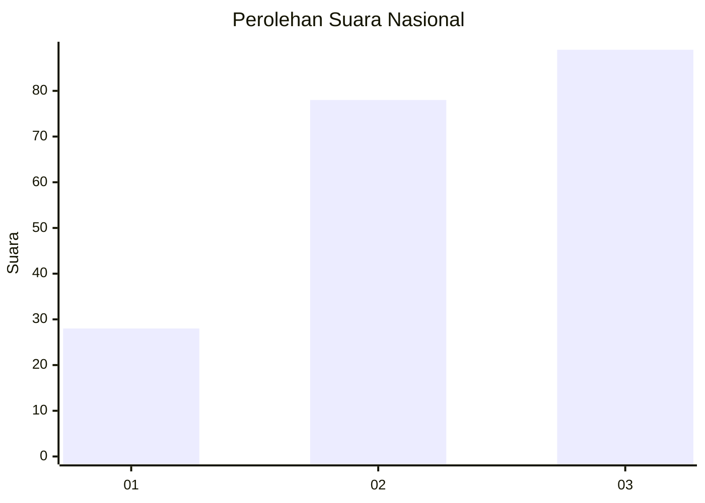
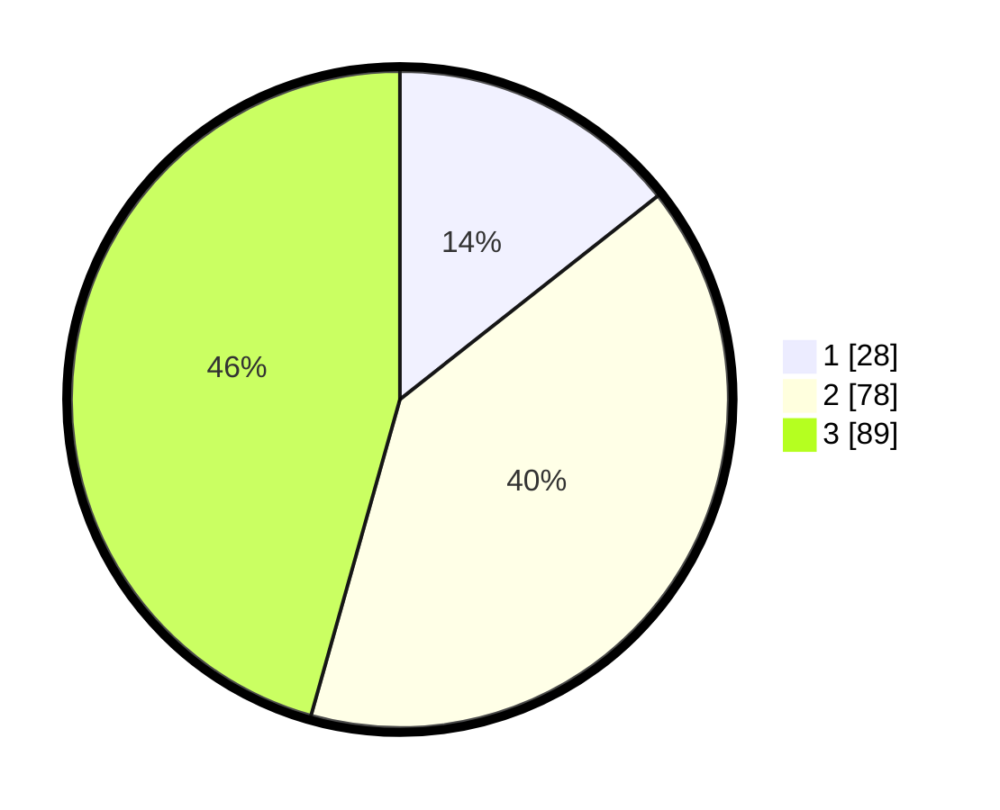

# Hasil

## Grafik

## Tabel

| No. | Nama Paslon    | Suara | Suara (raw) | Persentase |
|:--- |:-------------- | -----:| -----------:| ----------:|
| 1   | ANIES MUHAIMIN | 28    | [28][p-1]   | 14,36      |
| 2   | PRABOWO GIBRAN | 78    | [78][p-2]   | 40,00      |
| 3   | GANJAR MAHFUD  | 89    | [89][p-3]   | 45,64      |

[p-1]: https://github.com/gigit-pemilu/pemilu-2024/blob/main/pilpres/hitung-suara/sub/34-di-yogyakarta/sub/02-bantul/sub/15-sewon/sub/2002-timbulharjo/sub/006-tps/sub/paslon-1.txt
[p-2]: https://github.com/gigit-pemilu/pemilu-2024/blob/main/pilpres/hitung-suara/sub/34-di-yogyakarta/sub/02-bantul/sub/15-sewon/sub/2002-timbulharjo/sub/006-tps/sub/paslon-2.txt
[p-3]: https://github.com/gigit-pemilu/pemilu-2024/blob/main/pilpres/hitung-suara/sub/34-di-yogyakarta/sub/02-bantul/sub/15-sewon/sub/2002-timbulharjo/sub/006-tps/sub/paslon-3.txt

## Foto C Plano

https://sirekap-obj-formc.kpu.go.id/cf4e/pemilu/ppwp/34/02/15/20/02/3402152002006-20240214-212649--91891806-8413-418b-a205-49d6cbacba1e.jpg

https://sirekap-obj-formc.kpu.go.id/cf4e/pemilu/ppwp/34/02/15/20/02/3402152002006-20240214-212711--d6662b30-5ed6-4555-9587-791529cc3a12.jpg

https://sirekap-obj-formc.kpu.go.id/cf4e/pemilu/ppwp/34/02/15/20/02/3402152002006-20240214-212724--348546fd-934c-43e2-91ea-976a65f67108.jpg

## Metadata

| Key        | Value               |
| ---------- | ------------------- |
| Time Stamp | 2024-02-24 22:31:28 |

