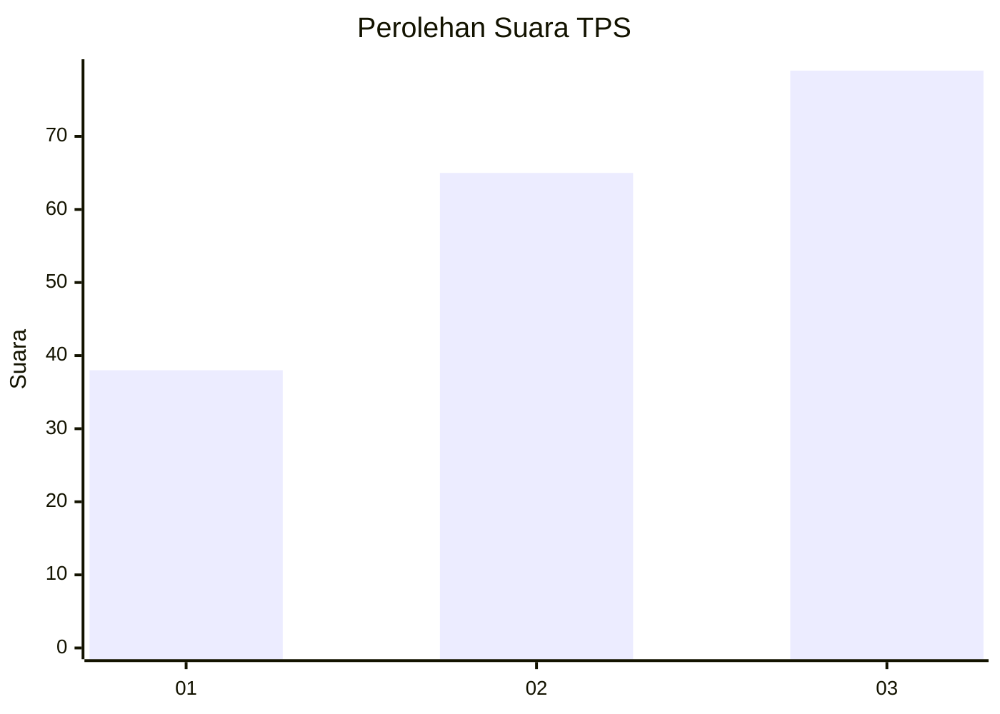
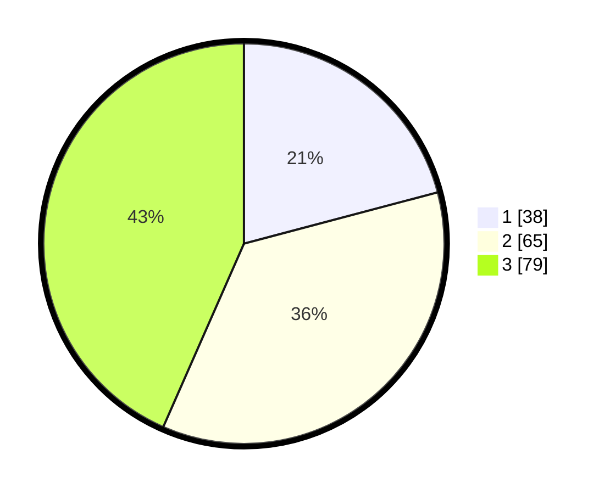

# Hasil

## Grafik

## Tabel

| No. | Nama Paslon    | Suara | Suara (raw) | Persentase |
|:--- |:-------------- | -----:| -----------:| ----------:|
| 1   | ANIES MUHAIMIN | 38    | [38][p-1]   | 20,88      |
| 2   | PRABOWO GIBRAN | 65    | [65][p-2]   | 35,71      |
| 3   | GANJAR MAHFUD  | 79    | [79][p-3]   | 43,41      |

[p-1]: https://github.com/gigit-pemilu/pemilu-2024-34-di-yogyakarta/blob/main/pilpres/hitung-suara/sub/34-di-yogyakarta/sub/02-bantul/sub/15-sewon/sub/2002-timbulharjo/sub/009-tps/sub/paslon-1.txt
[p-2]: https://github.com/gigit-pemilu/pemilu-2024-34-di-yogyakarta/blob/main/pilpres/hitung-suara/sub/34-di-yogyakarta/sub/02-bantul/sub/15-sewon/sub/2002-timbulharjo/sub/009-tps/sub/paslon-2.txt
[p-3]: https://github.com/gigit-pemilu/pemilu-2024-34-di-yogyakarta/blob/main/pilpres/hitung-suara/sub/34-di-yogyakarta/sub/02-bantul/sub/15-sewon/sub/2002-timbulharjo/sub/009-tps/sub/paslon-3.txt

## Foto C Plano

https://sirekap-obj-formc.kpu.go.id/86bf/pemilu/ppwp/34/02/15/20/02/3402152002009-20240215-030048--37b97c79-c1a4-4b1a-a3eb-fcf44cd98fdd.jpg

https://sirekap-obj-formc.kpu.go.id/86bf/pemilu/ppwp/34/02/15/20/02/3402152002009-20240215-030155--239af313-691d-473b-9370-e0305f44be77.jpg

https://sirekap-obj-formc.kpu.go.id/86bf/pemilu/ppwp/34/02/15/20/02/3402152002009-20240215-030231--e1f88fa0-db03-437d-9547-6bc87aae7c51.jpg

## Metadata

| Key        | Value               |
| ---------- | ------------------- |
| Time Stamp | 2024-02-24 22:31:28 |

