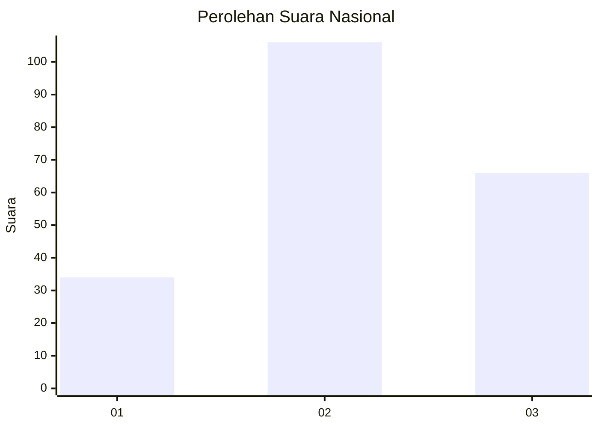
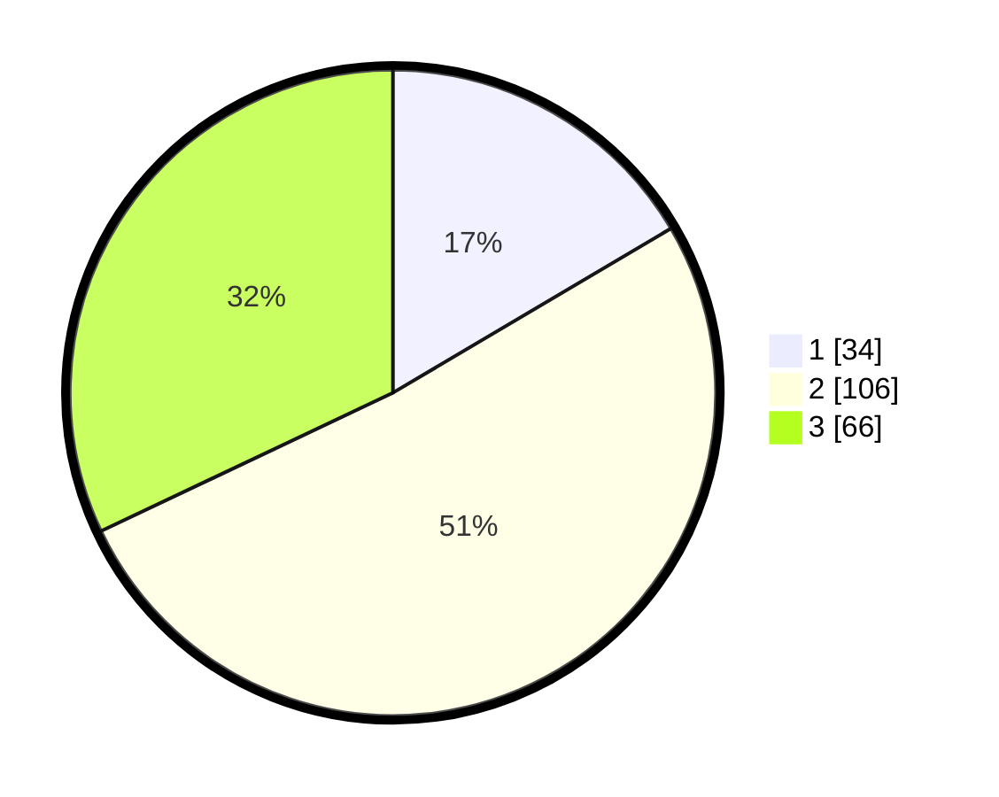

# Hasil

## Grafik

## Tabel

| No. | Nama Paslon    | Suara | Suara (raw) | Persentase |
|:--- |:-------------- | -----:| -----------:| ----------:|
| 1   | ANIES MUHAIMIN | 34    | [34][p-1]   | 16,50      |
| 2   | PRABOWO GIBRAN | 106   | [106][p-2]  | 51,46      |
| 3   | GANJAR MAHFUD  | 66    | [66][p-3]   | 32,04      |

[p-1]: https://github.com/gigit-pemilu/pemilu-2024/blob/main/pilpres/hitung-suara/sub/34-di-yogyakarta/sub/02-bantul/sub/15-sewon/sub/2002-timbulharjo/sub/011-tps/sub/paslon-1.txt
[p-2]: https://github.com/gigit-pemilu/pemilu-2024/blob/main/pilpres/hitung-suara/sub/34-di-yogyakarta/sub/02-bantul/sub/15-sewon/sub/2002-timbulharjo/sub/011-tps/sub/paslon-2.txt
[p-3]: https://github.com/gigit-pemilu/pemilu-2024/blob/main/pilpres/hitung-suara/sub/34-di-yogyakarta/sub/02-bantul/sub/15-sewon/sub/2002-timbulharjo/sub/011-tps/sub/paslon-3.txt

## Foto C Plano

https://sirekap-obj-formc.kpu.go.id/6d84/pemilu/ppwp/34/02/15/20/02/3402152002011-20240214-205423--5302f47e-2671-4d15-89cd-6f0b1c7cd168.jpg

https://sirekap-obj-formc.kpu.go.id/6d84/pemilu/ppwp/34/02/15/20/02/3402152002011-20240214-205548--16b293c6-2fca-40f3-b02c-f7b020e7be81.jpg

https://sirekap-obj-formc.kpu.go.id/6d84/pemilu/ppwp/34/02/15/20/02/3402152002011-20240214-205659--647449c4-b19c-4279-9cb2-05bb6f06c3a6.jpg

## Metadata

| Key        | Value               |
| ---------- | ------------------- |
| Time Stamp | 2024-02-24 22:31:28 |

