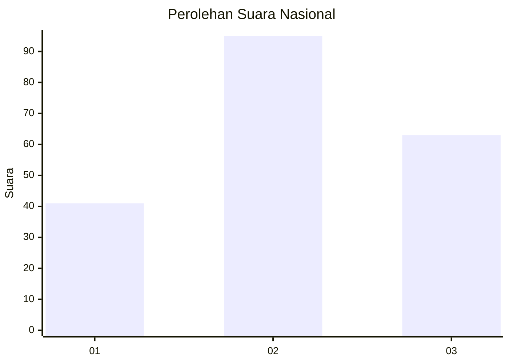
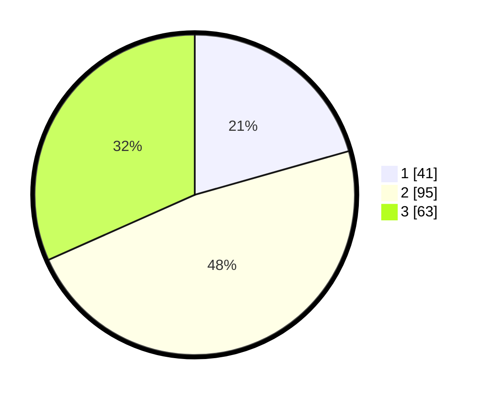

# Hasil

## Grafik

## Tabel

| No. | Nama Paslon    | Suara | Suara (raw) | Persentase |
|:--- |:-------------- | -----:| -----------:| ----------:|
| 1   | ANIES MUHAIMIN | 41    | [41][p-1]   | 20,60      |
| 2   | PRABOWO GIBRAN | 95    | [95][p-2]   | 47,74      |
| 3   | GANJAR MAHFUD  | 63    | [63][p-3]   | 31,66      |

[p-1]: https://github.com/gigit-pemilu/pemilu-2024/blob/main/pilpres/hitung-suara/sub/34-di-yogyakarta/sub/02-bantul/sub/15-sewon/sub/2002-timbulharjo/sub/012-tps/sub/paslon-1.txt
[p-2]: https://github.com/gigit-pemilu/pemilu-2024/blob/main/pilpres/hitung-suara/sub/34-di-yogyakarta/sub/02-bantul/sub/15-sewon/sub/2002-timbulharjo/sub/012-tps/sub/paslon-2.txt
[p-3]: https://github.com/gigit-pemilu/pemilu-2024/blob/main/pilpres/hitung-suara/sub/34-di-yogyakarta/sub/02-bantul/sub/15-sewon/sub/2002-timbulharjo/sub/012-tps/sub/paslon-3.txt

## Foto C Plano

https://sirekap-obj-formc.kpu.go.id/a7ae/pemilu/ppwp/34/02/15/20/02/3402152002012-20240214-192954--5b668e2a-5cdd-46ff-a04b-5dae35a961fa.jpg

https://sirekap-obj-formc.kpu.go.id/a7ae/pemilu/ppwp/34/02/15/20/02/3402152002012-20240214-193319--d1c5899c-518f-455f-b589-f1c5ca88c4e5.jpg

https://sirekap-obj-formc.kpu.go.id/a7ae/pemilu/ppwp/34/02/15/20/02/3402152002012-20240214-204145--8d22f921-641d-4e09-a9d2-c9d7941832ab.jpg

## Metadata

| Key        | Value               |
| ---------- | ------------------- |
| Time Stamp | 2024-02-14 21:46:01 |

