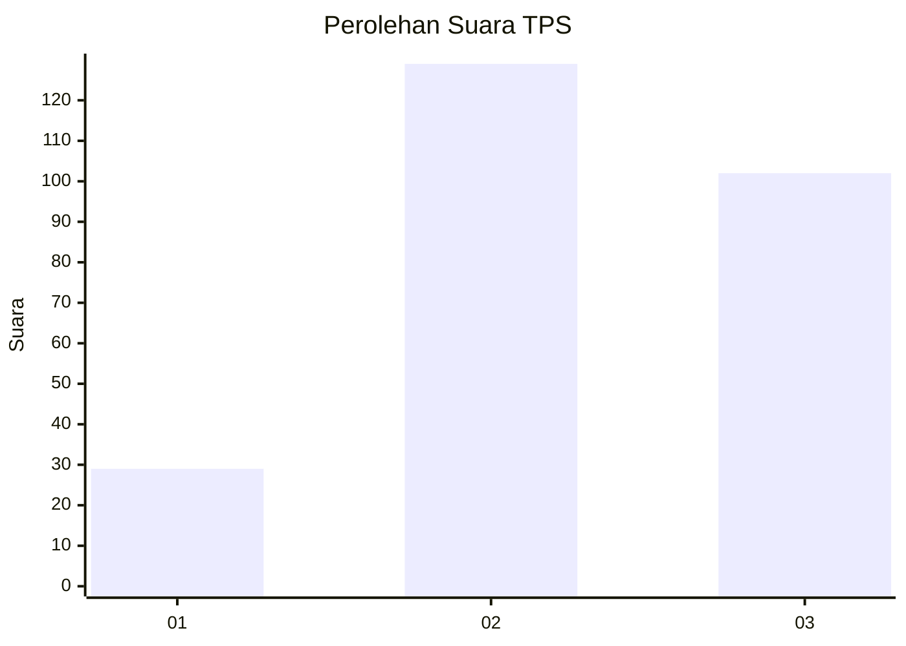
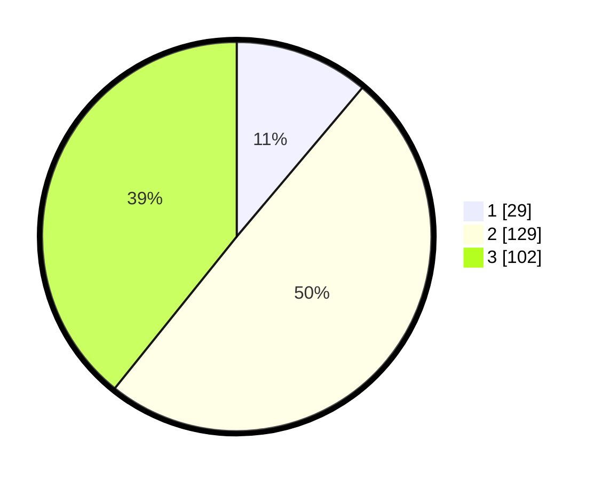

# Hasil

## Grafik

## Tabel

| No. | Nama Paslon    | Suara | Suara (raw) | Persentase |
|:--- |:-------------- | -----:| -----------:| ----------:|
| 1   | ANIES MUHAIMIN | 29    | [29][p-1]   | 11,15      |
| 2   | PRABOWO GIBRAN | 129   | [129][p-2]  | 49,62      |
| 3   | GANJAR MAHFUD  | 102   | [102][p-3]  | 39,23      |

[p-1]: https://github.com/gigit-pemilu/pemilu-2024-34-di-yogyakarta/blob/main/pilpres/hitung-suara/sub/34-di-yogyakarta/sub/02-bantul/sub/15-sewon/sub/2002-timbulharjo/sub/013-tps/sub/paslon-1.txt
[p-2]: https://github.com/gigit-pemilu/pemilu-2024-34-di-yogyakarta/blob/main/pilpres/hitung-suara/sub/34-di-yogyakarta/sub/02-bantul/sub/15-sewon/sub/2002-timbulharjo/sub/013-tps/sub/paslon-2.txt
[p-3]: https://github.com/gigit-pemilu/pemilu-2024-34-di-yogyakarta/blob/main/pilpres/hitung-suara/sub/34-di-yogyakarta/sub/02-bantul/sub/15-sewon/sub/2002-timbulharjo/sub/013-tps/sub/paslon-3.txt

## Foto C Plano

https://sirekap-obj-formc.kpu.go.id/964a/pemilu/ppwp/34/02/15/20/02/3402152002013-20240214-155643--78d718fc-7071-497b-acf6-960044360889.jpg

https://sirekap-obj-formc.kpu.go.id/964a/pemilu/ppwp/34/02/15/20/02/3402152002013-20240214-155617--0ef68da2-8819-46bc-ad60-e76f1748cbff.jpg

https://sirekap-obj-formc.kpu.go.id/964a/pemilu/ppwp/34/02/15/20/02/3402152002013-20240214-155712--beabef36-37f4-451e-a186-42c0870c59b8.jpg

## Metadata

| Key        | Value               |
| ---------- | ------------------- |
| Time Stamp | 2024-02-24 22:31:28 |

