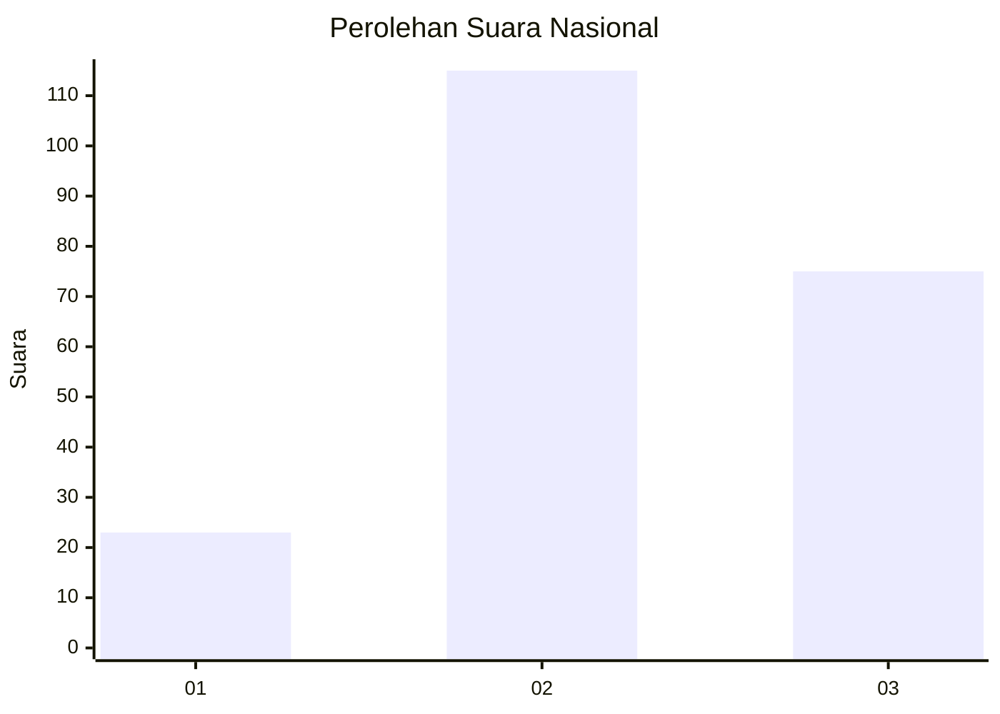
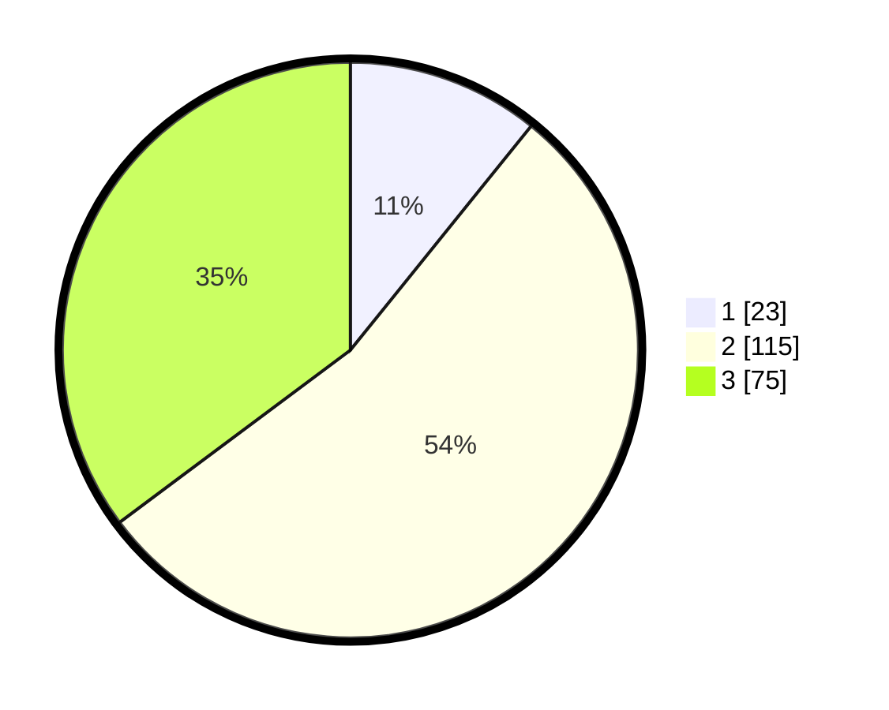

# Hasil

## Grafik

## Tabel

| No. | Nama Paslon    | Suara | Suara (raw) | Persentase |
|:--- |:-------------- | -----:| -----------:| ----------:|
| 1   | ANIES MUHAIMIN | 23    | [23][p-1]   | 10,80      |
| 2   | PRABOWO GIBRAN | 115   | [115][p-2]  | 53,99      |
| 3   | GANJAR MAHFUD  | 75    | [75][p-3]   | 35,21      |

[p-1]: https://github.com/gigit-pemilu/pemilu-2024/blob/main/pilpres/hitung-suara/sub/34-di-yogyakarta/sub/02-bantul/sub/15-sewon/sub/2002-timbulharjo/sub/015-tps/sub/paslon-1.txt
[p-2]: https://github.com/gigit-pemilu/pemilu-2024/blob/main/pilpres/hitung-suara/sub/34-di-yogyakarta/sub/02-bantul/sub/15-sewon/sub/2002-timbulharjo/sub/015-tps/sub/paslon-2.txt
[p-3]: https://github.com/gigit-pemilu/pemilu-2024/blob/main/pilpres/hitung-suara/sub/34-di-yogyakarta/sub/02-bantul/sub/15-sewon/sub/2002-timbulharjo/sub/015-tps/sub/paslon-3.txt

## Foto C Plano

https://sirekap-obj-formc.kpu.go.id/2a1b/pemilu/ppwp/34/02/15/20/02/3402152002015-20240214-232749--9af0a7e6-fb9d-4e8b-8c2f-691df58e0580.jpg

https://sirekap-obj-formc.kpu.go.id/2a1b/pemilu/ppwp/34/02/15/20/02/3402152002015-20240214-232846--7a09c1fd-e2ef-4bcb-a592-9c2a2b7f5649.jpg

https://sirekap-obj-formc.kpu.go.id/2a1b/pemilu/ppwp/34/02/15/20/02/3402152002015-20240214-233013--ec7be62c-92f7-4d8b-ab77-e6be1b5eba20.jpg

## Metadata

| Key        | Value               |
| ---------- | ------------------- |
| Time Stamp | 2024-02-24 22:31:28 |

