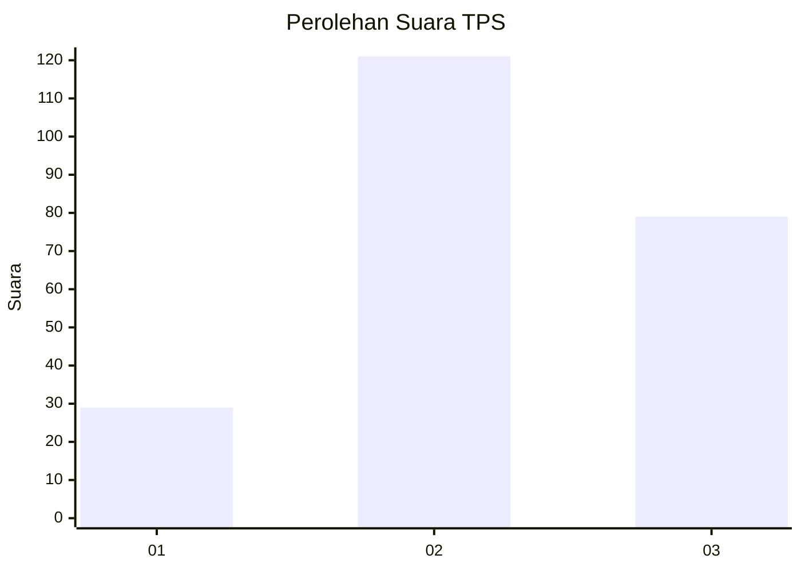
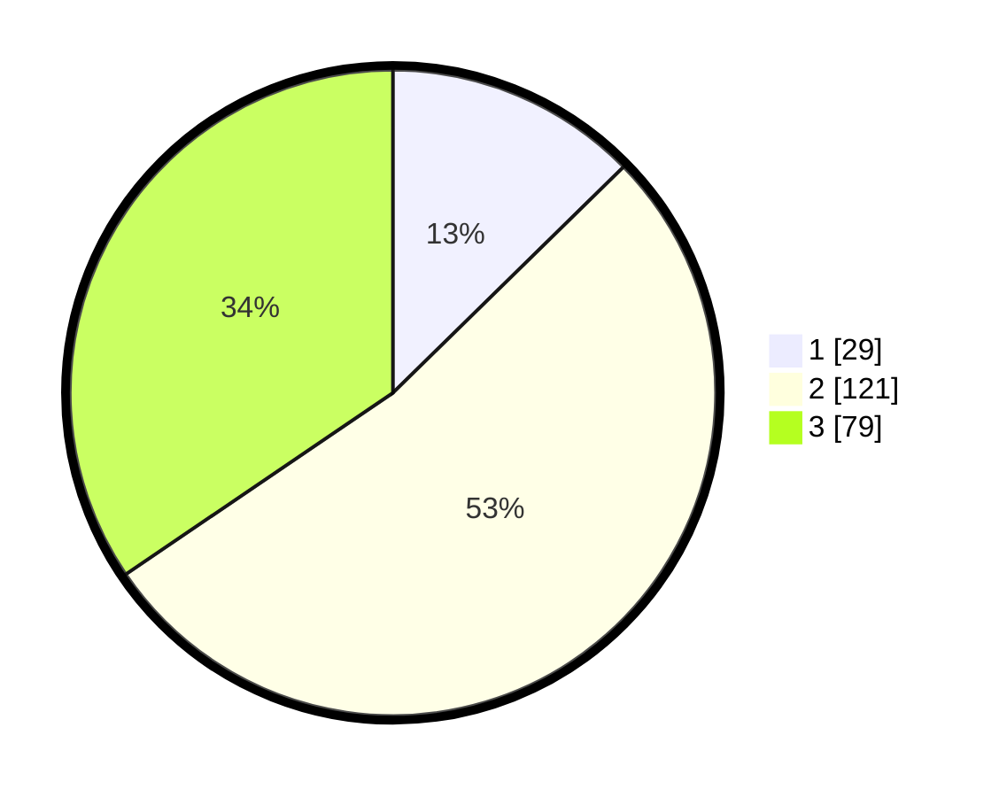

# Hasil

## Grafik

## Tabel

| No. | Nama Paslon    | Suara | Suara (raw) | Persentase |
|:--- |:-------------- | -----:| -----------:| ----------:|
| 1   | ANIES MUHAIMIN | 29    | [29][p-1]   | 12,66      |
| 2   | PRABOWO GIBRAN | 121   | [121][p-2]  | 52,84      |
| 3   | GANJAR MAHFUD  | 79    | [79][p-3]   | 34,50      |

[p-1]: https://github.com/gigit-pemilu/pemilu-2024-34-di-yogyakarta/blob/main/pilpres/hitung-suara/sub/34-di-yogyakarta/sub/02-bantul/sub/15-sewon/sub/2002-timbulharjo/sub/019-tps/sub/paslon-1.txt
[p-2]: https://github.com/gigit-pemilu/pemilu-2024-34-di-yogyakarta/blob/main/pilpres/hitung-suara/sub/34-di-yogyakarta/sub/02-bantul/sub/15-sewon/sub/2002-timbulharjo/sub/019-tps/sub/paslon-2.txt
[p-3]: https://github.com/gigit-pemilu/pemilu-2024-34-di-yogyakarta/blob/main/pilpres/hitung-suara/sub/34-di-yogyakarta/sub/02-bantul/sub/15-sewon/sub/2002-timbulharjo/sub/019-tps/sub/paslon-3.txt

## Foto C Plano

https://sirekap-obj-formc.kpu.go.id/0bf2/pemilu/ppwp/34/02/15/20/02/3402152002019-20240214-184952--91ad0a62-ecea-4f0a-b215-21e0ae7708d4.jpg

https://sirekap-obj-formc.kpu.go.id/0bf2/pemilu/ppwp/34/02/15/20/02/3402152002019-20240214-185012--ea432afd-872f-40fe-932a-da5ad054fbac.jpg

https://sirekap-obj-formc.kpu.go.id/0bf2/pemilu/ppwp/34/02/15/20/02/3402152002019-20240214-185029--6335ea80-0c97-40ff-9861-b960f0e58db3.jpg

## Metadata

| Key        | Value               |
| ---------- | ------------------- |
| Time Stamp | 2024-02-14 21:46:01 |

