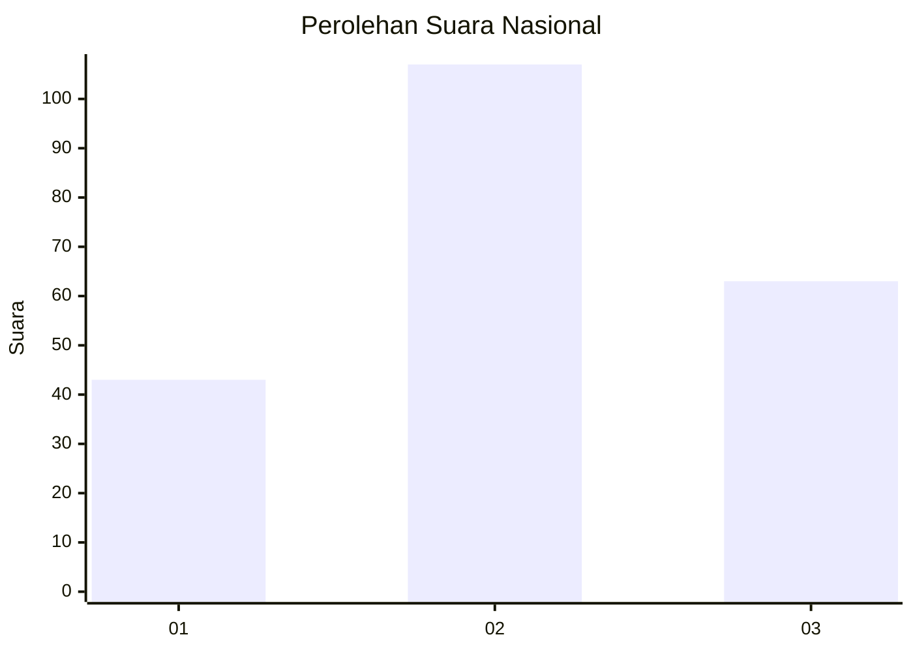
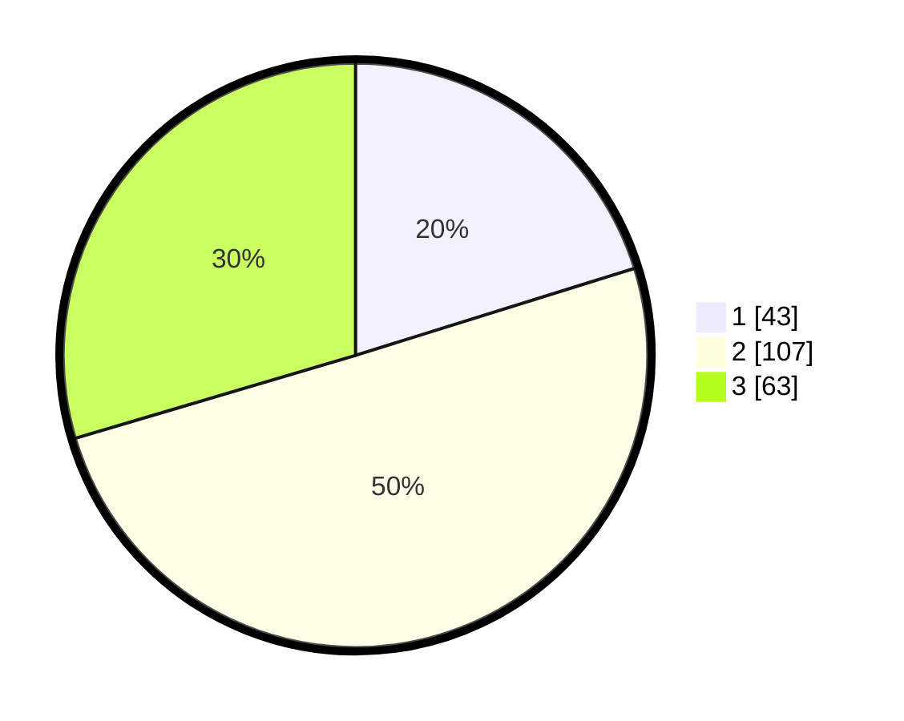

# Hasil

## Grafik

## Tabel

| No. | Nama Paslon    | Suara | Suara (raw) | Persentase |
|:--- |:-------------- | -----:| -----------:| ----------:|
| 1   | ANIES MUHAIMIN | 43    | [43][p-1]   | 20,19      |
| 2   | PRABOWO GIBRAN | 107   | [107][p-2]  | 50,23      |
| 3   | GANJAR MAHFUD  | 63    | [63][p-3]   | 29,58      |

[p-1]: https://github.com/gigit-pemilu/pemilu-2024/blob/main/pilpres/hitung-suara/sub/34-di-yogyakarta/sub/02-bantul/sub/15-sewon/sub/2002-timbulharjo/sub/022-tps/sub/paslon-1.txt
[p-2]: https://github.com/gigit-pemilu/pemilu-2024/blob/main/pilpres/hitung-suara/sub/34-di-yogyakarta/sub/02-bantul/sub/15-sewon/sub/2002-timbulharjo/sub/022-tps/sub/paslon-2.txt
[p-3]: https://github.com/gigit-pemilu/pemilu-2024/blob/main/pilpres/hitung-suara/sub/34-di-yogyakarta/sub/02-bantul/sub/15-sewon/sub/2002-timbulharjo/sub/022-tps/sub/paslon-3.txt

## Foto C Plano

https://sirekap-obj-formc.kpu.go.id/9fa6/pemilu/ppwp/34/02/15/20/02/3402152002022-20240215-011315--ce806760-f3c3-47bb-bd27-0c19ef730239.jpg

https://sirekap-obj-formc.kpu.go.id/9fa6/pemilu/ppwp/34/02/15/20/02/3402152002022-20240215-011509--c68835ec-8d97-44e2-8a0a-64d07f491f7a.jpg

https://sirekap-obj-formc.kpu.go.id/9fa6/pemilu/ppwp/34/02/15/20/02/3402152002022-20240215-011521--7708a4da-1112-431b-8b8a-18612e21fb47.jpg

## Metadata

| Key        | Value               |
| ---------- | ------------------- |
| Time Stamp | 2024-02-24 22:31:28 |

