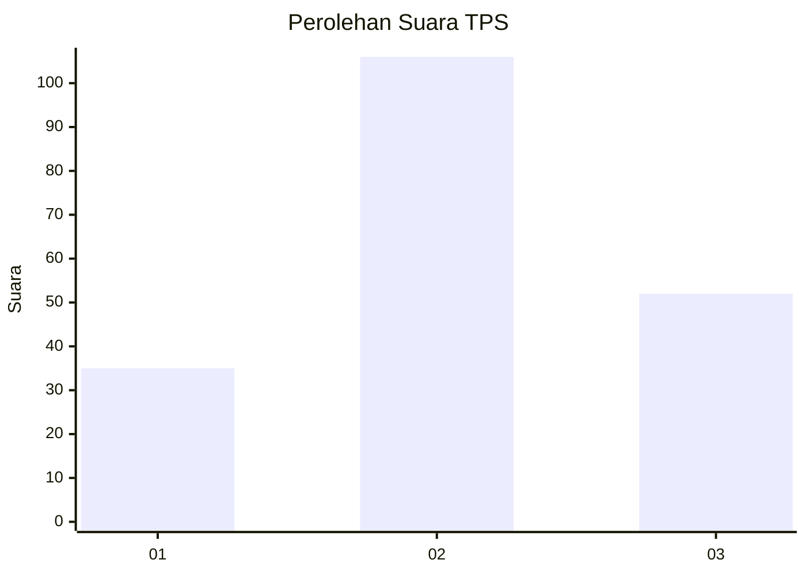
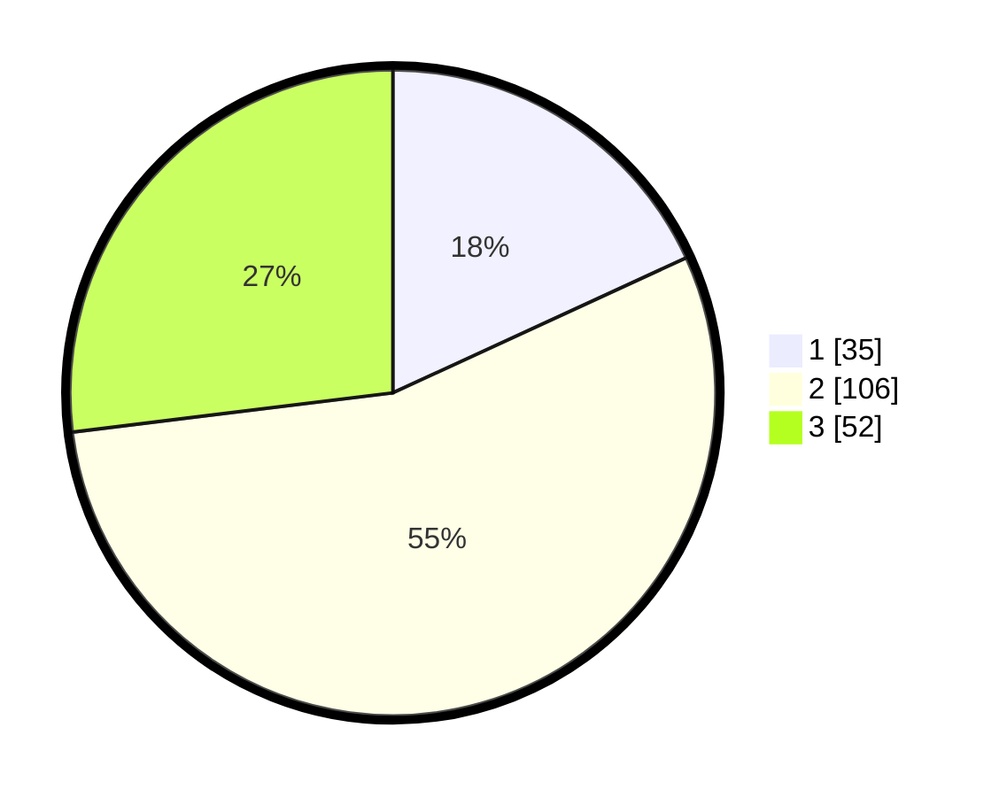

# Hasil

## Grafik

## Tabel

| No. | Nama Paslon    | Suara | Suara (raw) | Persentase |
|:--- |:-------------- | -----:| -----------:| ----------:|
| 1   | ANIES MUHAIMIN | 35    | [35][p-1]   | 18,13      |
| 2   | PRABOWO GIBRAN | 106   | [106][p-2]  | 54,92      |
| 3   | GANJAR MAHFUD  | 52    | [52][p-3]   | 26,94      |

[p-1]: https://github.com/gigit-pemilu/pemilu-2024-34-di-yogyakarta/blob/main/pilpres/hitung-suara/sub/34-di-yogyakarta/sub/02-bantul/sub/15-sewon/sub/2002-timbulharjo/sub/024-tps/sub/paslon-1.txt
[p-2]: https://github.com/gigit-pemilu/pemilu-2024-34-di-yogyakarta/blob/main/pilpres/hitung-suara/sub/34-di-yogyakarta/sub/02-bantul/sub/15-sewon/sub/2002-timbulharjo/sub/024-tps/sub/paslon-2.txt
[p-3]: https://github.com/gigit-pemilu/pemilu-2024-34-di-yogyakarta/blob/main/pilpres/hitung-suara/sub/34-di-yogyakarta/sub/02-bantul/sub/15-sewon/sub/2002-timbulharjo/sub/024-tps/sub/paslon-3.txt

## Foto C Plano

https://sirekap-obj-formc.kpu.go.id/b8ed/pemilu/ppwp/34/02/15/20/02/3402152002024-20240214-160059--504de774-2f88-44b1-92c2-7e1d7c47d08c.jpg

https://sirekap-obj-formc.kpu.go.id/b8ed/pemilu/ppwp/34/02/15/20/02/3402152002024-20240214-155826--f4126886-86cd-4cf7-8da3-6e7efeaa2662.jpg

https://sirekap-obj-formc.kpu.go.id/b8ed/pemilu/ppwp/34/02/15/20/02/3402152002024-20240214-160058--9ff32282-b6bc-4eb2-b25d-d708b9114de1.jpg

## Metadata

| Key        | Value               |
| ---------- | ------------------- |
| Time Stamp | 2024-02-25 12:00:00 |

