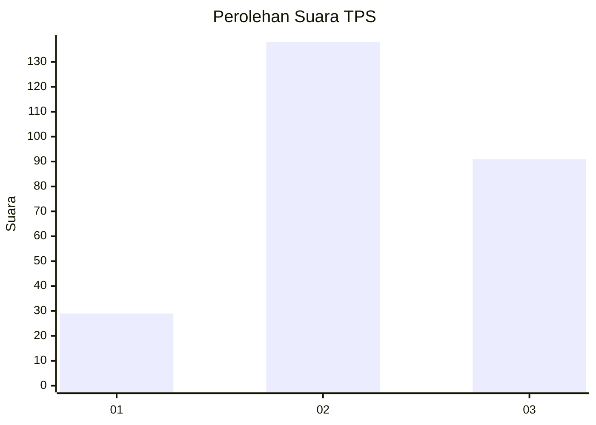
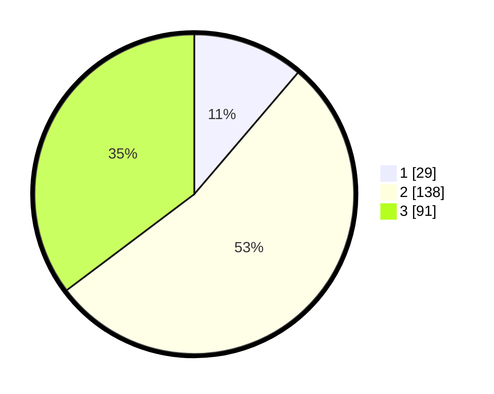

# Hasil

## Grafik

## Tabel

| No. | Nama Paslon    | Suara | Suara (raw) | Persentase |
|:--- |:-------------- | -----:| -----------:| ----------:|
| 1   | ANIES MUHAIMIN | 29    | [29][p-1]   | 11,24      |
| 2   | PRABOWO GIBRAN | 138   | [138][p-2]  | 53,49      |
| 3   | GANJAR MAHFUD  | 91    | [91][p-3]   | 35,27      |

[p-1]: https://github.com/gigit-pemilu/pemilu-2024-34-di-yogyakarta/blob/main/pilpres/hitung-suara/sub/34-di-yogyakarta/sub/02-bantul/sub/15-sewon/sub/2002-timbulharjo/sub/026-tps/sub/paslon-1.txt
[p-2]: https://github.com/gigit-pemilu/pemilu-2024-34-di-yogyakarta/blob/main/pilpres/hitung-suara/sub/34-di-yogyakarta/sub/02-bantul/sub/15-sewon/sub/2002-timbulharjo/sub/026-tps/sub/paslon-2.txt
[p-3]: https://github.com/gigit-pemilu/pemilu-2024-34-di-yogyakarta/blob/main/pilpres/hitung-suara/sub/34-di-yogyakarta/sub/02-bantul/sub/15-sewon/sub/2002-timbulharjo/sub/026-tps/sub/paslon-3.txt

## Foto C Plano

https://sirekap-obj-formc.kpu.go.id/03f4/pemilu/ppwp/34/02/15/20/02/3402152002026-20240214-232117--a6cf65b1-554e-4586-8e66-a98fc6b08c3c.jpg

https://sirekap-obj-formc.kpu.go.id/03f4/pemilu/ppwp/34/02/15/20/02/3402152002026-20240214-232414--b86027dd-fbbf-46f0-b276-0bd4b929daa5.jpg

https://sirekap-obj-formc.kpu.go.id/03f4/pemilu/ppwp/34/02/15/20/02/3402152002026-20240214-232543--d587ad5c-45ad-4345-aed0-bbd911a0fb10.jpg

## Metadata

| Key        | Value               |
| ---------- | ------------------- |
| Time Stamp | 2024-02-15 20:30:46 |

