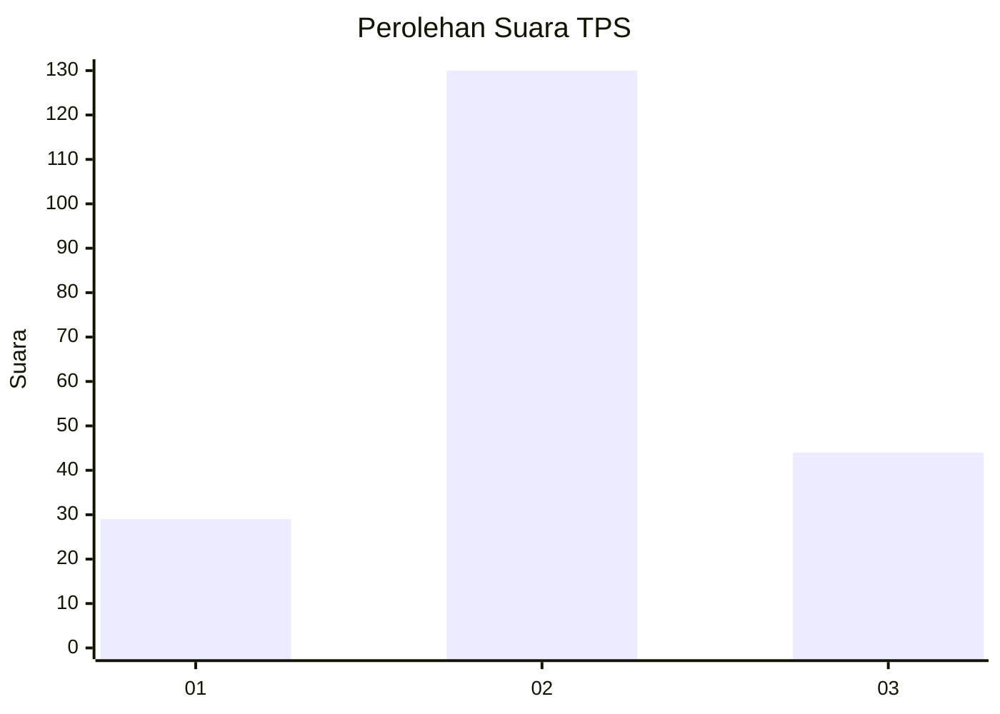
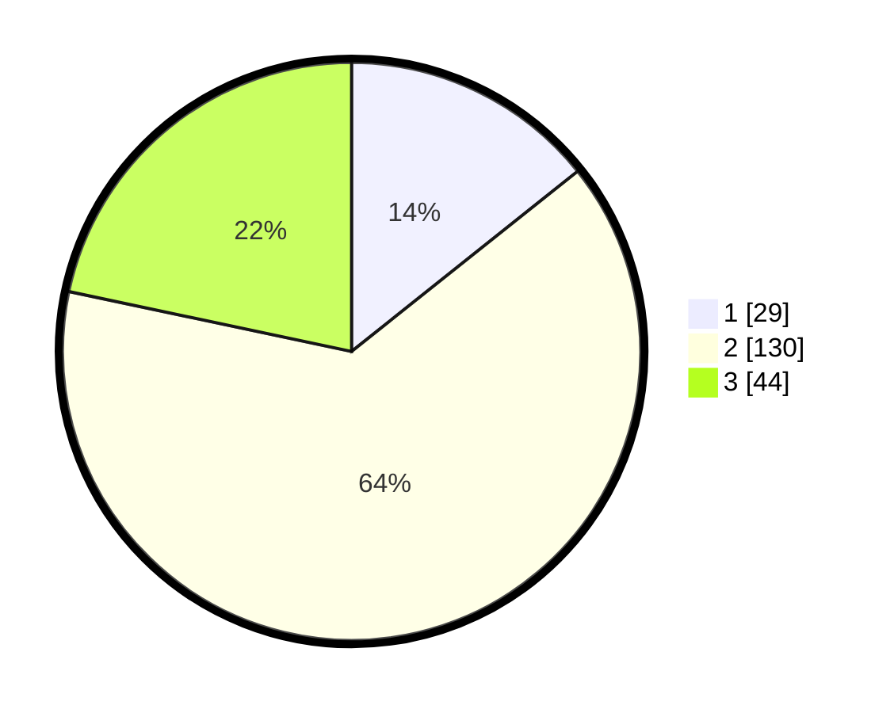

# Hasil

## Grafik

## Tabel

| No. | Nama Paslon    | Suara | Suara (raw) | Persentase |
|:--- |:-------------- | -----:| -----------:| ----------:|
| 1   | ANIES MUHAIMIN | 29    | [29][p-1]   | 14,29      |
| 2   | PRABOWO GIBRAN | 130   | [130][p-2]  | 64,04      |
| 3   | GANJAR MAHFUD  | 44    | [44][p-3]   | 21,67      |

[p-1]: https://github.com/gigit-pemilu/pemilu-2024-34-di-yogyakarta/blob/main/pilpres/hitung-suara/sub/34-di-yogyakarta/sub/02-bantul/sub/15-sewon/sub/2002-timbulharjo/sub/028-tps/sub/paslon-1.txt
[p-2]: https://github.com/gigit-pemilu/pemilu-2024-34-di-yogyakarta/blob/main/pilpres/hitung-suara/sub/34-di-yogyakarta/sub/02-bantul/sub/15-sewon/sub/2002-timbulharjo/sub/028-tps/sub/paslon-2.txt
[p-3]: https://github.com/gigit-pemilu/pemilu-2024-34-di-yogyakarta/blob/main/pilpres/hitung-suara/sub/34-di-yogyakarta/sub/02-bantul/sub/15-sewon/sub/2002-timbulharjo/sub/028-tps/sub/paslon-3.txt

## Foto C Plano

https://sirekap-obj-formc.kpu.go.id/c2ba/pemilu/ppwp/34/02/15/20/02/3402152002028-20240215-012820--d72da64a-097a-4a82-8bef-4e10f99160f2.jpg

https://sirekap-obj-formc.kpu.go.id/c2ba/pemilu/ppwp/34/02/15/20/02/3402152002028-20240215-012849--c9adffdd-a84c-433a-9438-ecf1bf6063b4.jpg

https://sirekap-obj-formc.kpu.go.id/c2ba/pemilu/ppwp/34/02/15/20/02/3402152002028-20240215-012906--032eaf21-3ab9-42b0-ac6f-10f3100a705d.jpg

## Metadata

| Key        | Value               |
| ---------- | ------------------- |
| Time Stamp | 2024-02-24 22:31:28 |

